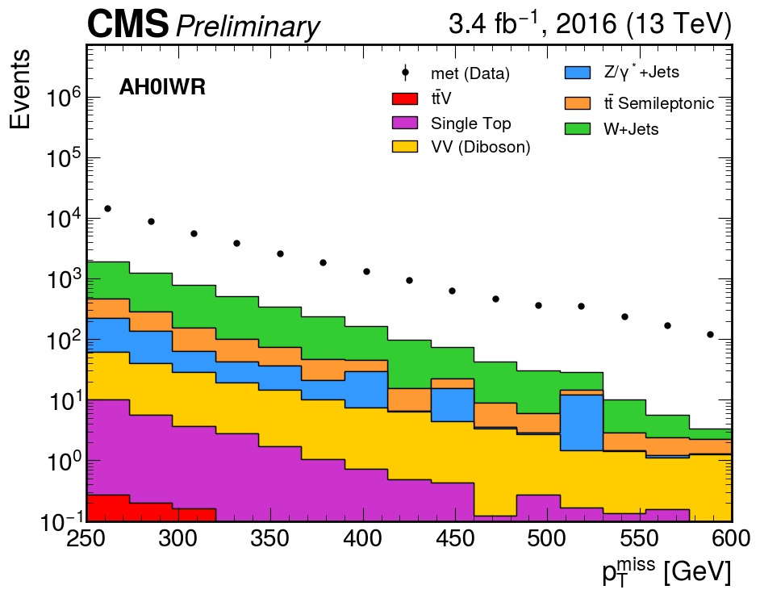

# Guide: All Hadronic Optimization Analysis for CMS Open Data

## Overview
This guide provides step-by-step instructions to generate the All-Hadronic (AH) optimization plots using CMS Open Data. The analysis processes TTToSemiLeptonic Monte Carlo events to produce distributions of key kinematic variables for signal region optimization.

# Physics Motivation and Channel Strategy: All-Hadronic Channel

The Large Hadron Collider (LHC) collides protons at center-of-mass energies high enough to probe physics beyond the Standard Model. In the context of simplified dark matter models, partonic interactions can produce top quarks together with a new mediator particle that decays invisibly into dark matter candidates (χχ̄). At the detector level, this results in events with multiple top quarks plus significant missing transverse momentum (p_T^miss).

The production mechanisms of interest include:
- **Gluon fusion:** $$gg → tt̄φ → tt̄ + χχ̄ $$
- **Single top associated production:** $$gb → tφ → t + χχ̄  $$
- **t-channel production:** $$qq' → tbφ → tb + χχ̄ $$

In all cases, the top quarks decay via $t \to W b$. In the **all-hadronic (AH) channel**, both W bosons decay hadronically $(W → qq̄')$, resulting in a fully hadronic final state with no isolated leptons.

## Channel Characteristics

The all-hadronic channel is defined by:
- **No isolated leptons** (lepton veto applied)
- **Multiple jets** (≥3 jets with ≥1 b-tagged jet)
- **Large missing transverse energy** from dark matter particles and detector resolution

**Advantages:**
- Highest branching fraction (~46% for tt̄ → all hadronic)
- Largest raw event yield
- Sensitive to highly boosted topologies

**Challenges:**
- Overwhelming QCD multijet background
- Instrumental MET from jet mismeasurements
- Requires sophisticated background estimation techniques

The all-hadronic channel complements lepton channels by providing additional sensitivity in high-MET regions where QCD background can be controlled through kinematic selections.

## Prerequisites

### 1. System Requirements
- Python 3.8 or higher
- 8+ GB RAM recommended
- Stable internet connection (for XRootD access)
- 5+ GB free disk space

### 2. Python Package Installation

```bash
# Create and activate virtual environment (optional but recommended)
python -m venv cms_analysis
source cms_analysis/bin/activate  # On Windows: cms_analysis\Scripts\activate

# Install required packages
pip install uproot awkward numpy matplotlib vector hist mplhep dpoa_workshop
```

## Selection Criteria

### 1. Trigger Requirements (HLT)
Events must fire at least one of the following MET-based triggers:
- `HLT_PFMETNoMu120`
- `HLT_PFMETNoMu90_PFMHTNoMu90_IDTight`
- `HLT_PFMETNoMu110_PFMHTNoMu110_IDTight`
- `HLT_PFMETNoMu120_PFMHTNoMu120_IDTight`
- `HLT_PFMETNoMu90_JetIdCleaned_PFMHTNoMu90_IDTight`
- `HLT_PFMETNoMu120_JetIdCleaned_PFMHTNoMu120_IDTight`
- `HLT_PFMET120_PFMHT120`
- `HLT_PFMET110_PFMHT110_IDTight`
- `HLT_PFMET120_PFMHT120_IDTight`
- `HLT_PFMET170`
- `HLT_PFMET170_NoiseCleaned`
- `HLT_PFMET170_HBHECleaned`
- `HLT_PFMET170_HBHE_BeamHaloCleaned`

**Motivation:** These MET-based triggers are efficient for hadronic final states with genuine missing energy.

### 2. Event Cleaning Flags
**Applied to both data and MC:**
- HBHENoiseFilter
- HBHENoiseIsoFilter
- ECALDeadCellFilter
- GlobalTightHalo2016Filter
- BadPFMuonFilter
- BadChargedHadronFilter

**Applied to data only:**
- EEBadScFilter

### 3. Lepton Veto
**No veto leptons allowed:**
- **Electrons:** No electrons with pT > 10 GeV, |η| < 2.5
- **Muons:** No muons with pT > 10 GeV, |η| < 2.4

### 4. Jet Selection
- **pT:** > 30 GeV
- **|η|:** < 2.4 (central jets)
- **Jet ID:** Loose working point
- **Overlap removal:** Jets within ΔR < 0.4 of tight leptons are removed

### 5. Event-Level Requirements
- **Number of jets:** ≥ 3
- **b-tagged jets:** ≥ 1 (DeepCSV medium WP: 0.6321)
- **Missing ET:** pT^miss ≥ 250 GeV
- **Δφ(jet1,2, MET):** > 0.4 (baseline), > 1.0 (optimized)

### 6. Additional Kinematic Variables (Optimized Selection)
- **Transverse bottom mass:** M_bT > 180 GeV
- **Jet fraction:** pT(j1)/HT ≤ 0.5 (for n_b ≥ 2 category)

---

## Step-by-Step Analysis

### Step 1: Import Libraries and Setup

```python
%load_ext autoreload
%autoreload 2

import numpy as np
import pandas as pd
import matplotlib.pyplot as plt
import hist

import requests
import os
import time
import json

import awkward as ak
import uproot
import vector
vector.register_awkward()
```

---

### Step 2: Load the Dataset Registry

The `dpoa_workshop_utilities` module provides access to the datasets. Key functions:

- `nanoaod_filenames`: dictionary with URLs to file indexes of ROOT files for every dataset.
- `pretty_print(fields, fmt='40s', require=None, ignore=None)`: prints subsets of keys based on strings.
- `build_lumi_mask(lumifile, tree, verbose=False)`: helps mask (select) data collected from collisions.

```python
import dpoa_workshop
from dpoa_workshop import (
    nanoaod_filenames,
    get_files_for_dataset,
    pretty_print,
    build_lumi_mask
)
```

---

### Step 3: Build the Ntuple File Index

CMS Open Data provides **file index text files** (`file_index.txt`) for each dataset, containing the XRootD paths to the NanoAOD `.root` files, along with metadata such as the number of events per file.

```python
def download_files(url):
    r = requests.get(url)
    lines = [ln.strip() for ln in r.text.splitlines() if ln.strip()]
    paths = [ln.split()[0] for ln in lines]
    return paths

ntuples = {}

print(f"{'Dataset':<30} | {'Part':<5} | {'Files'}")
print("-" * 50)

for dataset, urls in nanoaod_filenames.items():
    all_paths = []
    for i, url in enumerate(urls):
        try:
            paths = download_files(url)
            print(f"{dataset[:30]:<30} | {i:<5} | {len(paths)}")
            all_paths.extend(paths)
        except Exception as e:
            print(f"[warn] {dataset} {url}--{e}")

    ntuples[dataset] = all_paths

with open("ntuples.json", "w") as f:
    json.dump(ntuples, f, indent=2)

print("-" * 50)
print("ntuples.json creado. Keys:", list(ntuples.keys()))
```

---

### Step 4: Download the Luminosity File

```bash
wget https://opendata.cern.ch/record/14220/files/Cert_271036-284044_13TeV_Legacy2016_Collisions16_JSON.txt
```

---

### Step 5: Define Cross Sections

```python
XSEC_PB = {

    ##### Top Quark
    "ttbar-semileptonic": 364.35,
    "t-channel-top":      136.02,
    "t-channel-antitop":  80.95,
    "ttW":                0.2043,

    ##### WJets
    "WJets-HT70to100":    1372.0,
    "WJets-HT100to200":   1345.0,
    "WJets-HT200to400":   359.7,
    "WJets-HT400to600":   48.91,

    # --- Electroweak / Bosons ---
    "DYJets-Zpt200":      1.27,
    "WW":                 118.7,
    "ZZ":                 16.6,
    "Zvv":                77.3,
}
```

---

### Step 6: Construct the Fileset

This function builds the fileset for the analysis. It reads the JSON inventory of ntuples, identifies which samples are data or MC, applies an optional file limit for fast debugging, and attaches minimal metadata such as cross section and number of files.

```python
def construct_fileset(ntuples_json="ntuples.json", limit=None, verbose=True):
    """
    Parses the input JSON inventory and assigns metadata (xsec, is_data).

    Args:
        ntuples_json (str): Path to the JSON file containing the file lists.
        limit (int or None): Max number of files to load per process.
                             Useful for quick debugging (e.g., limit=1).
                             If None, loads all files (production mode).
        verbose (bool): If True, prints a summary table of loaded samples.

    Returns:
        dict: A dictionary structured for the processor (Coffea/UpRoot).
    """

    with open(ntuples_json) as f:
        info = json.load(f)

    fileset = {}

    if verbose:
        print(f"\n{'Name':30} {'Type':>6} {'N Files':>10} {'XSEC [pb]':>12}")
        print("-" * 65)

    for process_name, file_list in info.items():

        if limit is not None:
            files_to_use = file_list[:limit]
        else:
            files_to_use = file_list

        if process_name in XSEC_PB:
            is_data = False
            xsec_value = XSEC_PB[process_name]
            proc_type = "MC"
        else:
            is_data = True
            xsec_value = None
            proc_type = "DATA"

        fileset[process_name] = {
            "files": files_to_use,
            "metadata": {
                "is_data": is_data,
                "xsec": xsec_value,
                "n_files_loaded": len(files_to_use)
            }
        }

        if verbose:
            xsec_str = f"{xsec_value:.2f}" if xsec_value else "-"
            print(f"{process_name:30} {proc_type:>6} {len(files_to_use):>10} {xsec_str:>12}")

    return fileset
```

Initialize the full fileset:

```python
fileset = construct_fileset(
    ntuples_json="ntuples.json",
    limit=None,
    verbose=True
)
```

---

### Step 7: Inspect a Sample ROOT File

```python
dataset = "met"  # just for training

for i, fpath in enumerate(fileset[dataset]["files"][:10]):
    print(f"{i+1:2d}. {fpath}")
```

```python
sample = "ttbar-semileptonic"

root_path = fileset[sample]["files"][0]
print("Open:", root_path)

f = uproot.open(root_path)
events = f["Events"]

print("# events:", events.num_entries)

all_keys = events.keys()
print(f"Total branches: {len(all_keys)}")
```

```python
if "genWeight" in events.keys():
    gw = events["genWeight"].array(entry_stop=100_000, library="np")
    print(f"genWeight: mean={gw.mean():.3f}, std={gw.std():.3f}, negativos={(gw<0).mean():.2%}")
else:
    print("There is no genWeight")
```

> **Golden rule:** because `std > 0` and `negativos > 0`, you must **never count events** directly. Always use `sum(events.genWeight)` instead of `len(events)`.

---

### Step 8: Define the AH Event Selection Function

The following function implements the full 0-lepton (All-Hadronic) baseline selection: lepton veto, MET cut, jet cleaning, and jet multiplicity requirement.

```python
def process_file_0lep(filename, dataset="Unknown", IS_DATA=False):
    try:
        with uproot.open(f"{filename}:Events") as tree:
            muons = ak.zip({
                "pt":      tree["Muon_pt"].array(),
                "eta":     tree["Muon_eta"].array(),
                "phi":     tree["Muon_phi"].array(),
                "mass":    tree["Muon_mass"].array(),
                "iso":     tree["Muon_pfRelIso04_all"].array(),
                "looseId": tree["Muon_looseId"].array(),
            }, with_name="Momentum4D")

            electrons = ak.zip({
                "pt":       tree["Electron_pt"].array(),
                "eta":      tree["Electron_eta"].array(),
                "phi":      tree["Electron_phi"].array(),
                "mass":     tree["Electron_mass"].array(),
                "cutBased": tree["Electron_cutBased"].array(),
            }, with_name="Momentum4D")

            jets = ak.zip({
                "pt":    tree["Jet_pt"].array(),
                "eta":   tree["Jet_eta"].array(),
                "phi":   tree["Jet_phi"].array(),
                "mass":  tree["Jet_mass"].array(),
                "jetId": tree["Jet_jetId"].array(),
                "btag":  tree["Jet_btagDeepFlavB"].array(),
            }, with_name="Momentum4D")

            met_pt  = tree["MET_pt"].array()
            met_phi = tree["MET_phi"].array()
            gen_weight = tree["genWeight"].array() if not IS_DATA else ak.ones_like(met_pt)

        # ── 2. LEPTON VETO ────────────────────────────────────────────────────
        mu_veto_mask  = (muons.pt > 10) & (abs(muons.eta) < 2.4) & (muons.looseId) & (muons.iso < 0.25)
        ele_veto_mask = (electrons.pt > 10) & (abs(electrons.eta) < 2.5) & (electrons.cutBased >= 1)

        veto_muons     = muons[mu_veto_mask]
        veto_electrons = electrons[ele_veto_mask]

        pass_lepton_veto = (ak.num(veto_muons) == 0) & (ak.num(veto_electrons) == 0)
        pass_met         = met_pt > 240

        event_mask = pass_lepton_veto & pass_met

        # ── 3. APPLY MASK ─────────────────────────────────────────────────────
        jets       = jets[event_mask]
        met_pt     = met_pt[event_mask]
        met_phi    = met_phi[event_mask]
        gen_weight = gen_weight[event_mask]

        # ── 4. JET CLEANING ───────────────────────────────────────────────────
        jet_clean_mask = (jets.pt > 30) & (jets.jetId >= 1)
        all_clean_jets = jets[jet_clean_mask]

        central_jets = all_clean_jets[abs(all_clean_jets.eta) < 2.4]
        forward_jets = all_clean_jets[(abs(all_clean_jets.eta) >= 2.4) & (abs(all_clean_jets.eta) < 5.0)]

        has_3_central = ak.num(central_jets) >= 3

        # ── 5. FINAL SELECTION ────────────────────────────────────────────────
        f_met        = met_pt[has_3_central]
        f_met_phi    = met_phi[has_3_central]
        f_central    = central_jets[has_3_central]
        f_forward    = forward_jets[has_3_central]
        f_gen_weight = gen_weight[has_3_central]

        # ... (kinematic variable computation continues)
```

---

### Step 9: Process MC Datasets (AH Channel)

```python
vector.register_awkward()

# BLOCK 1 — DATASET LIST (AH Channel)
datasets_AH_channel = [
    'ttbar-semileptonic',   # Main background
    'ttW', 'WW', 'ZZ', 'Zvv',
    'DYJets-Zpt200',
    't-channel-top',
    'WJets-HT400to600',
    'WJets-HT100to200',
    'WJets-HT200to400',
    't-channel-antitop',
    'WJets-HT70to100'
]

# BLOCK 2 — ORCHESTRATOR FUNCTION
def process_dataset_0lep_raw(dataset, n_files=5):
    """
    High-level orchestrator:
    - Determines if dataset is Data or MC
    - Retrieves ROOT files
    - Calls the AH-physics function (process_file_0lep)
    - Converts results to DataFrames
    - Concatenates them and saves as a Parquet file
    """

    is_data = "met" in dataset

    print(f" Processing RAW {dataset} (Is Data: {is_data})...")

    if dataset not in fileset:
        print(f" {dataset} not found in fileset. Skipping.")
        return None

    files = fileset[dataset]["files"][:n_files]
    dfs = []

    for f in files:
        try:
            data_dict = process_file_0lep(f, dataset=dataset, IS_DATA=is_data)
            df = pd.DataFrame(data_dict)
            dfs.append(df)
        except Exception as e:
            print(f" Error in file {f}: {e}")

    if len(dfs) == 0:
        print(f" No valid events produced for {dataset}")
        return None

    full_df = pd.concat(dfs, ignore_index=True)
    os.makedirs("output_raw", exist_ok=True)
    output_path = f"output_raw/{dataset}_raw.parquet"

    full_df.to_parquet(output_path, index=False)
    print(f" Saved: {output_path} with {len(full_df)} events.")

    return full_df

# BLOCK 3 — EXECUTION
N_FILES = 20  # Increase to 20+ for proper statistics

print(f"=== STARTING AH PROCESSING ({N_FILES} files per dataset) ===")

for ds in datasets_AH_channel:
    process_dataset_0lep_raw(ds, n_files=N_FILES)
```

### Step 9b: Process MET Data

```python
vector.register_awkward()

datasets_AH_channel = [
    'met',
]

def process_dataset_0lep_raw(dataset, n_files=5):

    is_data = "met" in dataset

    print(f" Processing RAW {dataset} (Is Data: {is_data})...")

    if dataset not in fileset:
        print(f" {dataset} not found in fileset. Skipping.")
        return None

    files = fileset[dataset]["files"][:n_files]
    dfs = []

    for f in files:
        try:
            data_dict = process_file_0lep(f, dataset=dataset, IS_DATA=is_data)
            df = pd.DataFrame(data_dict)
            dfs.append(df)
        except Exception as e:
            print(f" Error in file {f}: {e}")

    if len(dfs) == 0:
        print(f" No valid events produced for {dataset}")
        return None

    full_df = pd.concat(dfs, ignore_index=True)
    os.makedirs("output_raw", exist_ok=True)
    output_path = f"output_raw/{dataset}_raw.parquet"

    full_df.to_parquet(output_path, index=False)
    print(f" Saved: {output_path} with {len(full_df)} events.")

    return full_df


N_FILES = 20

print(f"=== STARTING AH PROCESSING ({N_FILES} files per dataset) ===")

for ds in datasets_AH_channel:
    process_dataset_0lep_raw(ds, n_files=N_FILES)
```

---

## Why Normalization Is Needed

Data and MC cannot be compared directly because:
- Data reflects what the detector *actually recorded*.
- MC is generated with arbitrary numbers of events and must be rescaled.

MC must be weighted so that its event yields match the luminosity of the data sample:

$$w = \frac{\sigma \cdot L}{N_{\text{gen}}}$$

### Step 10: Extract Total Generated Weights (`sumGenWeights`)

```python
# Ensure this number is IDENTICAL to the one used in your processing script
N_FILES_MC = 20

sum_weights_map = {}

print(f"{'Dataset':<30} | {'SumW (Subset)':<20} | {'Files Read'}")
print("-" * 70)

for dataset_name, info in fileset.items():

    # Skip Real Data
    if "SingleMuon" in dataset_name or "SingleElectron" in dataset_name or "met" in dataset_name:
        sum_weights_map[dataset_name] = 1.0
        continue

    total_sum_w = 0.0

    # KEY STEP: SLICE THE FILE LIST
    file_list = info["files"][:N_FILES_MC]

    for filename in file_list:
        try:
            with uproot.open(f"{filename}:Runs") as runs:
                if "genEventSumw" in runs:
                    w = runs["genEventSumw"].array(library="np")
                    total_sum_w += np.sum(w)
        except Exception as e:
            print(f" Error reading {filename}: {e}")

    sum_weights_map[dataset_name] = total_sum_w
    print(f"{dataset_name:<30} | {total_sum_w:.2e}           | {len(file_list)}")
```

---

### Step 11: Define Physics Metadata and Scale Factors

```python
import pandas as pd

LUM = 35.9  # pb^-1

DATA_SL = {"met"}

COLOR_MAP = {
    "ttbar":     "#FF9933",
    "WJets":     "#33CC33",
    "ZJets":     "#3399FF",
    "SingleTop": "#CC33CC",
    "Diboson":   "#FFCC00",
    "Rare":      "#FF0000",
    "Other":     "#999999"
}

def get_group_info(name):
    if "ttW" in name or "ttZ" in name: return "Rare", r"$t\bar{t}V$", COLOR_MAP["Rare"]
    if "ttbar" in name: return "ttbar", r"$t\bar{t}$ Semileptonic", COLOR_MAP["ttbar"]
    if "channel" in name or "tW" in name: return "SingleTop", r"Single Top", COLOR_MAP["SingleTop"]
    if "WJets" in name: return "WJets", r"W+Jets", COLOR_MAP["WJets"]
    if "DY" in name or "Zvv" in name: return "ZJets", r"Z/$\gamma^*$+Jets", COLOR_MAP["ZJets"]
    if name in ["WW", "ZZ", "WZ"]: return "Diboson", r"VV (Diboson)", COLOR_MAP["Diboson"]
    return "Other", "Other", COLOR_MAP["Other"]


print(f"{'Dataset':<25} | {'Xsec [pb]':<10} "
      f"| {'SumGenWeights':<15} | {'Scale Factor':<12}")
print("-" * 70)

datasets_general_check = list(fileset.keys())

for ds in datasets_general_check:

    if ds in DATA_SL:
        print(f"{ds:<25} | {'-':<10} | {'-':<15} | {'1.00':<12}")
        continue

    if ds not in fileset:
        print(f"{ds:<25} | {'No fileset':<10} | -")
        continue

    xsec = fileset[ds]["metadata"]["xsec"]
    sum_w = sum_weights_map.get(ds, 0.0)

    if sum_w > 0 and xsec is not None:
        scale = (xsec * LUM) / sum_w
        scale_str = f"{scale:.2e}"
        if scale > 10.0:
            scale_str += " HIGH"
        print(f"{ds:<25} | {xsec:<10.2f} | {sum_w:<15.2e} | {scale_str:<12}")
    else:
        reason = "SumW=0" if sum_w == 0 else "Xsec=None"
        print(f"{ds:<25} | {str(xsec):<10} | {sum_w:<15.2e} | ERROR ({reason})")
```

---

### Step 12: CMS-Style Stacked Histogram Function

To produce publication-quality plots—like those found in CMS analyses—this function builds histograms for each MC process, groups them by physics category, stacks the MC contributions, overlays real DATA with error bars, and applies CMS styling.

```python
import mplhep as hep
import matplotlib.pyplot as plt
plt.style.use(hep.style.CMS)


def plot_grouped_stack(var_name, x_label, x_range, channel_data="met",
                       n_bins=30, log_scale=False):

    # 1. Bins
    bins = np.linspace(x_range[0], x_range[1], n_bins + 1)

    grouped_counts = {}
    grouped_info   = {}

    for name, df in all_dfs.items():

        if name in DATA_SL:
            continue

        group_key, label, color = get_group_info(name)

        counts, _ = np.histogram(df[var_name], bins=bins, weights=df["final_weight"])

        if group_key not in grouped_counts:
            grouped_counts[group_key] = counts
            grouped_info[group_key]   = {"label": label, "color": color, "yield": np.sum(counts)}
        else:
            grouped_counts[group_key] += counts
            grouped_info[group_key]["yield"] += np.sum(counts)

    # 3. ORDER GROUPS (by yield)
    active_groups = list(grouped_info.keys())
    active_groups.sort(key=lambda g: grouped_info[g]["yield"])

    mc_counts = []
    mc_colors = []
    mc_labels = []
    total_mc = np.zeros(n_bins)

    for g in active_groups:
        mc_counts.append(grouped_counts[g])
        mc_colors.append(grouped_info[g]["color"])
        mc_labels.append(grouped_info[g]["label"])
        total_mc += grouped_counts[g]

    # 4. DATA
    df_data = all_dfs.get(channel_data)
    if df_data is None:
        print(f"ERROR: No DATA found for channel {channel_data}")
        return

    data_counts, _ = np.histogram(df_data[var_name], bins=bins)

    # 5. PLOT
    fig, ax = plt.subplots(figsize=(10, 8))

    if len(mc_counts) > 0:
        hep.histplot(
            mc_counts, bins=bins, stack=True, histtype="fill",
            color=mc_colors, label=mc_labels,
            edgecolor="black", linewidth=1, ax=ax
        )

    hep.histplot(
        data_counts, bins=bins, histtype="errorbar",
        color="black", label=f"{channel_data} (Data)",
        yerr=True, marker="o", markersize=5, ax=ax
    )

    hep.cms.label("Preliminary", data=True, lumi=3.4, year=2016, ax=ax)

    handles, labels = ax.get_legend_handles_labels()
    ax.legend(handles[::-1], labels[::-1], fontsize=16, ncol=2, loc="upper right")
    ax.set_xlabel(x_label, fontsize=24)
    ax.set_ylabel("Events", fontsize=24)
    ax.set_xlim(x_range)

    if log_scale:
        ax.set_yscale("log")
        ax.set_ylim(0.1, max(np.max(data_counts), np.max(total_mc)) * 500)
    else:
        ax.set_ylim(0, max(np.max(data_counts), np.max(total_mc)) * 1.5)

    plt.tight_layout()
    plt.show()
```

---

### Step 13: Load Datasets, Apply Normalization, and Generate Baseline Plots

This block loads every AH-channel dataset from the previously generated `_raw.parquet` files, applies correct normalization, assigns a final per-event weight, and stores everything in a unified dictionary (`all_dfs`).

```python
loaded_dfs = {}

datasets_AH_channel = [
    'met',                  # Data
    'ttbar-semileptonic',   # Top
    'ttW', 'WW', 'ZZ', 'Zvv', 'DYJets-Zpt200',
    't-channel-top',
    't-channel-antitop',
    'WJets-HT400to600',
    'WJets-HT100to200',
    'WJets-HT200to400',
    'WJets-HT70to100'
]

LUM = 3400.0  # pb^-1 (best fit for the fraction of 2016 data used)

for dataset in datasets_AH_channel:

    path = f"output_raw/{dataset}_raw.parquet"

    try:
        df = pd.read_parquet(path)

        # Normalization
        if dataset in DATA_SL:
            df["final_weight"] = 1.0
        else:
            xsec = fileset[dataset]["metadata"]["xsec"]
            sum_w = sum_weights_map.get(dataset, 1.0)
            if sum_w == 0:
                sum_w = 1.0
            scale = (xsec * LUM) / sum_w

            if "genWeight" in df.columns:
                df["final_weight"] = df["genWeight"] * scale
            else:
                df["final_weight"] = scale

        loaded_dfs[dataset] = df
        print(f" Loaded: {dataset}")

    except FileNotFoundError:
        continue

olep_dfs_clean = loaded_dfs
all_dfs = olep_dfs_clean

if len(olep_dfs_clean) > 0:
    mi_canal = "met"

    plot_grouped_stack("met",   r"$p_T^{miss}$ [GeV]", (250, 500), mi_canal, log_scale=True)
    plot_grouped_stack("nJet",  r"$N_{jets}$",          (2, 10),    mi_canal, n_bins=8, log_scale=True)
    plot_grouped_stack("nBTag", r"$N_{b-tags}$",        (0, 5),     mi_canal, n_bins=5, log_scale=True)

else:
    print(" No data loaded. Check if the _raw.parquet files exist.")
```

### Expected Output Plots — Baseline Distributions

The following plots show stacked MC vs. Data distributions after the AH baseline selection:

**Missing Transverse Momentum ($p_T^{miss}$):**


**Jet Multiplicity ($N_{jets}$):**


**b-tag Multiplicity ($N_{b\text{-tags}}$):**


> **Note on WJets:** The $m_T$ distribution shows a distinct peak in Data at ~80 GeV corresponding to the W boson resonance. This arises because the HT-100to200 and HT-200to400 WJets datasets populate the resonance region. Using only HT-400to600 would cut out these low-energy events.

---

## Signal Region Definition

Signal regions are classified according to number of b-jets and forward jets, with final cuts on MET, MT, and minΔφ.

### Step 14: Define Signal Region Cuts

```python
def signal_regions(df):

    if df is None or len(df) == 0: return {}

    pass_common = (
        (df["met"] > 250) &
        (df["min_dphi"] > 1.0)
    )

    df_sr = df[pass_common]
    if len(df_sr) == 0: return {}

    # Definition of the 3 Regions (Categories)
    mask_1b_0f = (df_sr["nBTag"] == 1) & (df_sr["nForwardJets"] == 0)
    mask_1b_1f = (df_sr["nBTag"] == 1) & (df_sr["nForwardJets"] >= 1)
    mask_2b    = (df_sr["nBTag"] >= 2)

    return {
        "SR_1b_0f": df_sr[mask_1b_0f],
        "SR_1b_1f": df_sr[mask_1b_1f],
        "SR_2b":    df_sr[mask_2b]
    }
```

---

### Step 15: Signal Region Stacked Histogram Function

```python
def plot_region_stack(dfs_dict, region_name, var_name, x_label, x_range, channel_label, n_bins=10):

    bins = np.linspace(x_range[0], x_range[1], n_bins + 1)

    grouped_counts = {}
    grouped_info = {}

    for name, df in dfs_dict.items():
        if name in DATA_SL: continue

        counts, _ = np.histogram(df[var_name], bins=bins, weights=df["final_weight"])
        g_key, label, color = get_group_info(name)

        if g_key not in grouped_counts:
            grouped_counts[g_key] = counts
            grouped_info[g_key] = {"label": label, "color": color, "yield": np.sum(counts)}
        else:
            grouped_counts[g_key] += counts
            grouped_info[g_key]["yield"] += np.sum(counts)

    active_groups = sorted(grouped_info.keys(), key=lambda k: grouped_info[k]["yield"])

    mc_counts = []
    mc_colors = []
    mc_labels = []
    total_mc = np.zeros(n_bins)

    for g in active_groups:
        mc_counts.append(grouped_counts[g])
        mc_colors.append(grouped_info[g]["color"])
        mc_labels.append(grouped_info[g]["label"])
        total_mc += grouped_counts[g]

    df_data = dfs_dict.get(channel_label)
    data_counts = np.zeros(n_bins)
    if df_data is not None:
        data_counts, _ = np.histogram(df_data[var_name], bins=bins)

    fig, ax = plt.subplots(figsize=(10, 8))

    if len(mc_counts) > 0:
        hep.histplot(mc_counts, bins=bins, stack=True, histtype="fill",
                     color=mc_colors, label=mc_labels, edgecolor="black", linewidth=1, ax=ax)

    hep.histplot(data_counts, bins=bins, histtype="errorbar", color="black",
                 label=f"{channel_label} (Data)", yerr=True, marker='o', markersize=5, ax=ax)

    hep.cms.label("Preliminary", data=True, lumi=3.4, year=2016, ax=ax)

    handles, labels = ax.get_legend_handles_labels()
    by_label = OrderedDict(zip(labels[::-1], handles[::-1]))
    ax.legend(by_label.values(), by_label.keys(), fontsize=15, ncol=2, loc='upper right')

    ax.text(0.05, 0.93, f"{region_name}", transform=ax.transAxes,
            fontsize=20, fontweight='bold', va='top')

    ax.set_xlabel(x_label, fontsize=24)
    ax.set_ylabel("Events", fontsize=24)
    ax.set_xlim(x_range)
    ax.set_yscale("log")

    max_y = max(np.max(data_counts), np.max(total_mc))
    ax.set_ylim(0.1, max_y * 500)

    plt.tight_layout()
    plt.show()
```

---

### Step 16: Load Data and Run Signal Region Analysis

```python
def load_data(channel="met"):
    loaded_dfs = {}

    datasets_to_load = [
        'met' if channel == 'met' else 'SingleMuon',
        'ttbar-semileptonic', 'ttW', 'WW', 'ZZ', 'Zvv',
        'DYJets-Zpt200', 't-channel-top', 't-channel-antitop',
        'WJets-HT400to600', 'WJets-HT100to200', 'WJets-HT70to100', 'WJets-HT200to400'
    ]

    LUM = 3400.0
    suffix = "_raw.parquet" if channel == "met" else "_electron_raw.parquet"

    for ds in datasets_to_load:
        path = f"output_raw/{ds}{suffix}"
        try:
            df = pd.read_parquet(path)

            if ds in DATA_SL:
                df["final_weight"] = 1.0
            else:
                if ds not in fileset: continue
                xsec = fileset[ds]["metadata"]["xsec"]
                sum_w = sum_weights_map.get(ds, 1.0)
                if sum_w == 0: sum_w = 1.0

                scale = (xsec * LUM) / sum_w

                if "genWeight" in df.columns:
                    df["final_weight"] = df["genWeight"] * scale
                else:
                    df["final_weight"] = scale

            loaded_dfs[ds] = df

        except FileNotFoundError:
            continue

    return loaded_dfs
```

```python
def run_analysis_for_channel(channel_mode):

    raw_dfs = load_data(channel_mode)
    if not raw_dfs: return

    regions_db = {"SR_1b_0f": {}, "SR_1b_1f": {}, "SR_2b": {}}
    for name, df in raw_dfs.items():
        sub_regions = signal_regions(df)
        for reg, df_reg in sub_regions.items():
            regions_db[reg][name] = df_reg

    d_label = "met" if channel_mode == "met" else "SingleMuon"

    plot_region_stack(regions_db["SR_2b"],    "SR 2b",             "met", r"$p_T^{miss}$ [GeV]", (250, 600), d_label)
    plot_region_stack(regions_db["SR_1b_1f"], r"SR 1b $\geq$1f",  "met", r"$p_T^{miss}$ [GeV]", (250, 600), d_label)
    plot_region_stack(regions_db["SR_1b_0f"], "SR 1b 0f",          "met", r"$p_T^{miss}$ [GeV]", (250, 600), d_label)
```

```python
from collections import OrderedDict

if 'sum_weights_map' in globals():
    run_analysis_for_channel("met")
else:
    print(" Error: sum_weights_map not defined.")
```

### Expected Output Plots — Signal Regions

**Signal Region SR 2b — $p_T^{miss}$:**


**Signal Region SR 1b ≥1f — $p_T^{miss}$:**


**Signal Region SR 1b 0f — $p_T^{miss}$:**


---

## Control Region Definition

Control Regions (CRs) are used to calibrate and validate the main background processes. They constrain and normalize simulated background yields, compare MC predictions against real data, and reduce systematic uncertainties.

### Step 17: Define CR W(lν) and Stacked Histogram Function

```python
def filter_cr_wlnu(df):
    """
    Control Region: CR W(lν)
    Official names from Table 14:
        - SL1eWR  (electron)
        - SL1mWR  (muon)
        - AH0lWR  (all-hadronic / MET)
    """
    if df is None or len(df) == 0:
        return {}

    mask = (
        (df["met"] >= 250) &
        (df["nBTag"] == 0) &
        (df["nJet"] >= 3)
    )

    df_cr = df[mask]
    if len(df_cr) == 0:
        return {}

    return {"CR_Wlnu": df_cr}
```

```python
def plot_cr_stack(dfs_dict, region_label, var_name, x_label, x_range, data_label, n_bins=15):

    bins = np.linspace(x_range[0], x_range[1], n_bins + 1)
    grouped_counts = {}
    grouped_info = {}

    # A) MC
    for name, df in dfs_dict.items():
        if name in DATA_SL:
            continue

        counts, _ = np.histogram(df[var_name], bins=bins, weights=df["final_weight"])
        g_key, label, color = get_group_info(name)

        if g_key not in grouped_counts:
            grouped_counts[g_key] = counts
            grouped_info[g_key] = {"label": label, "color": color, "yield": np.sum(counts)}
        else:
            grouped_counts[g_key] += counts
            grouped_info[g_key]["yield"] += np.sum(counts)

    active_groups = sorted(grouped_info.keys(), key=lambda k: grouped_info[k]["yield"])

    mc_counts = []
    mc_colors = []
    mc_labels = []
    total_mc = np.zeros(n_bins)

    for g in active_groups:
        mc_counts.append(grouped_counts[g])
        mc_colors.append(grouped_info[g]["color"])
        mc_labels.append(grouped_info[g]["label"])
        total_mc += grouped_counts[g]

    # B) DATA
    df_data = dfs_dict.get(data_label)
    if df_data is not None:
        data_counts, _ = np.histogram(df_data[var_name], bins=bins)
    else:
        data_counts = np.zeros(n_bins)

    # === Plot ===
    fig, ax = plt.subplots(figsize=(10, 8))

    hep.histplot(mc_counts, bins=bins, stack=True, histtype="fill",
                 color=mc_colors, label=mc_labels, edgecolor="black", linewidth=1, ax=ax)

    hep.histplot(data_counts, bins=bins, histtype="errorbar", color="black",
                 label=f"{data_label} (Data)", yerr=True, marker='o', markersize=5, ax=ax)

    hep.cms.label("Preliminary", data=True, lumi=3.4, year=2016, ax=ax)

    ax.text(0.05, 0.93, region_label, transform=ax.transAxes,
            fontsize=20, fontweight='bold', va='top', ha='left')

    handles, labels = ax.get_legend_handles_labels()
    by_label = OrderedDict(zip(labels[::-1], handles[::-1]))
    ax.legend(by_label.values(), by_label.keys(), fontsize=15, ncol=2, loc='upper right')

    ax.set_xlabel(x_label, fontsize=24)
    ax.set_ylabel("Events", fontsize=24)
    ax.set_xlim(x_range)
    ax.set_yscale("log")

    max_y = max(np.max(data_counts), np.max(total_mc))
    ax.set_ylim(0.1, max_y * 500)

    plt.tight_layout()
    plt.show()
```

---

### Step 18: Run Control Region Analysis

```python
def run_SL(channel_mode):

    # 1. Load datasets
    raw_dfs = load_data(channel_mode)
    if not raw_dfs:
        return

    # 2. Filter CR W(lν)
    cr_dict = {}
    for name, df in raw_dfs.items():
        reg = filter_cr_wlnu(df)
        if "CR_Wlnu" in reg:
            cr_dict[name] = reg["CR_Wlnu"]

    if len(cr_dict) == 0:
        print(" No events passed CR W(lν).")
        return

    # 3. Labels according to Table 14
    if channel_mode == "muon":
        region_label = "SL1mWR"
        data_label = "SingleMuon"
    elif channel_mode == "electron":
        region_label = "AH1eWR"
        data_label = "SingleElectron"
    else:
        channel_mode == "met"
        region_label = "AH0lWR"
        data_label = "met"

    # Plot MET
    plot_cr_stack(cr_dict, region_label, "met", r"$p_T^{miss}$ [GeV]", (250, 600), data_label, n_bins=15)


# Run for AH (MET) channel
run_SL("met")
```

### Expected Output Plot — Control Region

**Control Region AH0lWR — $p_T^{miss}$:**



---

## Analysis Parameters

### Selection Criteria

| Parameter | Value | Description |
|-----------|-------|-------------|
| Jet pT | > 30 GeV | Minimum transverse momentum |
| Jet \|η\| | < 2.4 | Pseudorapidity acceptance (central) |
| b-tagging WP | 0.2783 | DeepJet medium working point |
| MET | > 250 GeV | Missing transverse momentum (signal regions) |
| minΔφ cut | > 1.0 rad | Minimum angle between leading jets and MET |
| Lepton veto | 0 leptons | No isolated muons (pT>10 GeV) or electrons (pT>10 GeV) |

### Event Categories

- **SR_1b_0f**: Events with exactly 1 b-tagged jet and 0 forward jets
- **SR_1b_1f**: Events with exactly 1 b-tagged jet and ≥1 forward jets
- **SR_2b**: Events with ≥2 b-tagged jets

### Luminosity

A fractional approach is used: `LUM = 3400.0 pb⁻¹`, corresponding to approximately `(20/82)` of the Run 2016H period files. This is an estimate that allows the analysis to run efficiently on personal computers for educational purposes, preserving the correct physics structure without processing the full multi-terabyte dataset.

---

## Troubleshooting

### Common Issues and Solutions

#### 1. Connection Errors
```python
# If XRootD connection fails, try:
# Option A: Reduce number of files
file_paths = file_paths[:3]  # Use only first 3 files

# Option B: Reduce events per file
N_FILES = 5
```

#### 2. Memory Issues
```python
# Reduce memory usage:
# 1. Process fewer events
N_FILES = 5

# 2. Use fewer files initially
N_FILES = 3
```

#### 3. Missing parquet files
```python
# If parquet files are not found, re-run the processing step:
for ds in datasets_AH_channel:
    process_dataset_0lep_raw(ds, n_files=N_FILES)
```

#### 4. Slow Performance
- The analysis processes ~100,000+ events from multiple files
- Expected runtime: 10–30 minutes depending on connection speed
- For faster testing, reduce `N_FILES` to 2–3

---

## Understanding the Output Plots

### Baseline Plots
- **$p_T^{miss}$**: Missing transverse energy distribution. Signal events have higher MET due to invisible DM particles.
- **$N_{jets}$**: Jet multiplicity. The AH channel requires ≥3 central jets.
- **$N_{b\text{-tags}}$**: b-jet multiplicity. The analysis splits events into 1b and ≥2b categories.

### Signal Region Plots
- **SR 2b**: Highest purity for tt̄+DM signal. Two b-jets suppress W+jets significantly.
- **SR 1b ≥1f**: Sensitive to t-channel production with a forward jet tag.
- **SR 1b 0f**: Largest statistics, dominated by semileptonic tt̄ background.

### Control Region Plot
- **AH0lWR**: W(lν)+jets control region with 0 b-tags. Used to constrain the W+jets background normalization.

---

## Physics Context

### All-Hadronic Channel Characteristics
- **Branching ratio**: ~46% (highest for tt̄)
- **Background**: Dominated by QCD multijet production
- **Challenges**: MET can be faked by jet mismeasurement
- **Advantages**: Maximum statistical power

### Optimization Strategy
The selections shown in the plots are designed to:
1. Suppress QCD background using angular correlations (minΔφ)
2. Enhance signal sensitivity using MET thresholds
3. Further discriminate signal topologies using b-jet and forward-jet categories

---

## Citation and References

### Data Source
```bibtex
@misc{cms_opendata_2024,
  title = {Simulated dataset TTToSemiLeptonic in NANOAODSIM format},
  author = {CMS Collaboration},
  year = {2024},
  doi = {10.7483/OPENDATA.CMS.4J3Y.1CME},
  url = {https://opendata.cern.ch/record/67993}
}
```

### Related Papers
- CMS Collaboration, "Search for dark matter produced in association with a single top quark or a top quark pair in proton-proton collisions at √s = 13 TeV", JHEP 03 (2019) 141
- Original analysis methodology from arXiv:1901.01553
-

---

## Support

For issues or questions:
1. Check the console error messages
2. Verify internet connectivity to CERN servers
3. Ensure all Python packages are up to date
4. Consult the [CMS Open Data documentation](http://opendata.cern.ch/docs)

This complete guide provides everything needed to reproduce the AH optimization plots using CMS Open Data. The analysis follows the same methodology as the original CMS paper while being accessible through public data and open-source tools.
