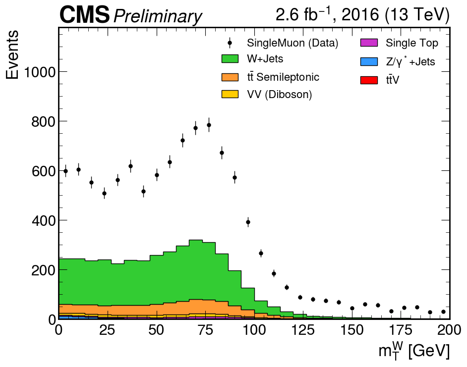
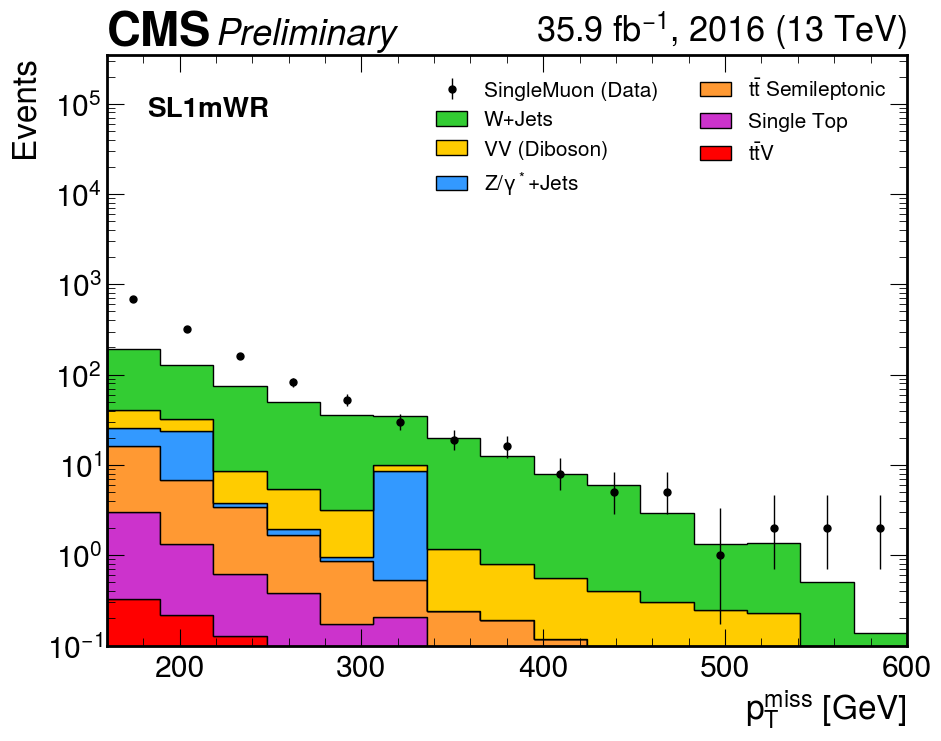

# Advances of the Project

## Title / Objective:
Reproducible Analysis of CMS Open Data: Search for Dark Matter in Association with Top Quarks
(Based on the CMS publication: “Search for dark matter produced in association with a single top quark or a top quark pair in proton–proton collisions at ($\sqrt s = 13 \TeV$”).

# Physics Motivation and Channel Strategy

The Large Hadron Collider (LHC) collides protons at center-of-mass energies high enough to probe physics beyond the Standard Model. Although the protons are composite objects, the relevant hard scatterings occur between their constituents — quarks and gluons. In the context of simplified dark matter models, these partonic interactions can produce **top quarks** together with a new mediator particle (commonly denoted φ for scalar or a for pseudoscalar). The mediator then decays invisibly into a pair of dark matter candidates ($\chi \bar{\chi}$). At the detector level, this results in events with multiple top quarks plus significant **missing transverse momentum** ($p_T^{\text{miss}}$), the latter coming from both neutrinos and the invisible χ particles.

The production mechanisms of interest include:  

- **Gluon fusion**:  
  $$ gg \to t \bar{t}\,\phi \to t \bar{t} + \chi \bar{\chi} $$  

- **Single top associated production**:  
  $$ gb \to t \phi \to t + \chi \bar{\chi} $$  

- **t–channel production**:  
  $$ qq' \to tb \phi \to tb + \chi \bar{\chi} $$  

In all cases, the top quarks decay via $t \to W b$. Each W boson subsequently decays either leptonically ($W \to \ell \nu$) or hadronically ($W \to q \bar{q}'$). Thus, the final states contain a mixture of b-tagged jets, light-flavor jets, charged leptons (electrons or muons), and genuine $p_T^{\text{miss}}$. The specific experimental signature depends strongly on the decay mode of the W bosons.

Because of this, analyses are divided into **channels**, each defined by the number of isolated charged leptons:

- **Single-lepton (SL):** one isolated electron or muon, several jets (including ≥1 b-tag), and nonzero $p_T^{\text{miss}}$. This channel is statistically powerful and relatively clean, striking a balance between signal sensitivity and manageable backgrounds.  
- **All-hadronic (AH):** no isolated leptons, many jets including b-tagged jets, and $p_T^{\text{miss}}$. While it has the largest raw yield, it suffers from overwhelming QCD multijet background, which can fake $p_T^{\text{miss}}$.  
- **Dilepton:** two isolated leptons, large $p_T^{\text{miss}}$, and multiple jets. It provides a very clean signal region but is limited by low branching fraction, hence low statistics.

In this notebook, we concentrate on the **single-lepton channel with exactly one muon**. There are both theoretical and practical reasons for this choice. From the physics side, the SL channel has the right compromise: it suppresses pure QCD while retaining enough events to make meaningful comparisons. From the experimental side, single-muon triggers are robust, well understood in CMS, and ensure efficient data collection. This focus allows us to demonstrate the full workflow — from event selection to histograms — in a setting where the interplay between **signal characteristics** and **background processes** can be clearly explained. Splitting into channels is therefore not a stylistic decision but a physics necessity: each final state probes the same underlying processes under different background conditions and detector signatures.

---


After defining the objective of the project (Reproducible Analysis of CMS Open Data), we discussed in which data format to work — NanoAOD or MiniAOD. We decided to use NanoAOD, because it is lighter and optimized for analysis tasks.

In the most precise version, we work within cernbox/swan, but it can work in any Jupyter environment; the important packages are: uproot and awkward

## Single Lepton

We import all the libraries that we are going to use.


```python
%load_ext autoreload
%autoreload 2

import numpy as np
import pandas as pd
import matplotlib.pyplot as plt
import hist


import requests
import os
import time
import json


import awkward as ak
import uproot
import vector
vector.register_awkward()


```

    Matplotlib is building the font cache; this may take a moment.


We will use the **dpoa_workshop_utilities** module to help you access the datasets. The functions it contains are:


The `nanoaod_filenames` is a dictionary with the urls to the file indexes of the root files for every dataset that we will use in the analysis.

The `pretty_print(fields, fmt='40s', require=None, ignore=None)` function allows you to print subsets of keys based on strings that you require or ignore. It will also format that output based on how many characters you want in a column (you are limited to 80 characters per line).

The `build_lumi_mask(lumifile, tree, verbose=False)` function helps you mask (select) the data that's collected from collisions.


```python
#-------------------------------

import dpoa_workshop
from dpoa_workshop import (
    nanoaod_filenames,
    get_files_for_dataset,
    pretty_print,
    build_lumi_mask
)
#-------------------------------------------
```


In the drafts related to the papers, the datasets used from 2016 are listed along with their run periods and corresponding luminosities. However, one must be careful with these values, because not all periods are available and the data format differs from the one originally used, as previously noted.”


```python
from IPython.display import Image, display

display(Image(filename="dataset_2016.png"))

```


    

    


```python

display(Image(filename="MC_data.png"))

```


    

    


# Building the Ntuple File Index

CMS Open Data provides **file index text files** (`file_index.txt`) for each dataset.  
These contain the actual XRootD paths to the NanoAOD `.root` files, along with metadata such as the number of events per file. Example line:

root://eospublic.cern.ch//eos/opendata/cms/mc/.../nano_1.root nevts=58293


The objective is to collect file paths from multiple URLs, organize them by dataset, and store them in a JSON file, while handling possible download errors so the program keeps running.


### To streamline the workflow:
- We define a function `download_files(url)` that fetches each `file_index.txt` via HTTP and extracts only the ROOT file paths.  
- We loop over all entries in `nanoaod_filenames` (the dictionary we built earlier) and collect the full list of ROOT files per dataset.  
- The result is stored in a new dictionary `ntuples`, which maps *dataset -- list of ROOT file paths*.  
- Finally, we save this as a JSON file (`ntuples.json`) for later reuse


```python
def download_files(url):
    r = requests.get(url)
    lines = [ln.strip() for ln in r.text.splitlines() if ln.strip()]

    paths = [ln.split()[0] for ln in lines]
    return paths

ntuples = {}

for dataset, urls in nanoaod_filenames.items():
    all_paths = []
    for url in urls:
        try:
            all_paths.extend(download_files(url))
        except Exception as e:
            print(f"[warn] {dataset} {url}--{e}")
    ntuples[dataset] = all_paths

with open("ntuples.json", "w") as f:
    json.dump(ntuples, f, indent=2)

print("ntuples.json :", list(ntuples.keys()))

```

    ntuples.json : ['met', 'SingleMuon', 'SingleElectron', 'ttbar-semileptonic', 'ttbar-hadronic', 't-channel-top', 'ttW', 'WJets-HT400to600', 'DYJets-Zpt200', 'WW', 'ZZ', 'Zvv']


And we will download important files like the luminosity file.


```python
!wget https://opendata.cern.ch/record/14220/files/Cert_271036-284044_13TeV_Legacy2016_Collisions16_JSON.txt

```

    --2025-11-05 20:43:37--  https://opendata.cern.ch/record/14220/files/Cert_271036-284044_13TeV_Legacy2016_Collisions16_JSON.txt
    Resolving opendata.cern.ch (opendata.cern.ch)... 137.138.6.31, 2001:1458:201:8b::100:1c8
    Connecting to opendata.cern.ch (opendata.cern.ch)|137.138.6.31|:443... connected.
    HTTP request sent, awaiting response... 200 OK
    Length: 11686 (11K) [text/plain]
    Saving to: ‘Cert_271036-284044_13TeV_Legacy2016_Collisions16_JSON.txt’
    
    Cert_271036-284044_ 100%[===================>]  11.41K  --.-KB/s    in 0.001s  
    
    2025-11-05 20:43:38 (10.2 MB/s) - ‘Cert_271036-284044_13TeV_Legacy2016_Collisions16_JSON.txt’ saved [11686/11686]
    


Complete dictionary, in case it's possible to add all the events but it hasn't been found or verified yet...


```python
    # --- Cross sections in pb de todo los dataset del paper ---

XSEC2_PB = {
    # --- TOP QUARK ---
    "ttbar-semileptonic": 364.35,  
    "t-channel-top": 136.02,       # ST t-channel top
    "t-channel-antitop": 80.95,    # ST t-channel antitop
    "tW-top": 35.85,               # ST tW top 
    
    # --- Rare Top ---
    "ttW": 0.2043,  #  to TTWJetsToLNu
    "ttZ": 0.2529,  # to TTZToLLNuNu
    
    # --- WJETS (HT Binned) ---
    
    "WJets-HT70to100":    1372.0,
    "WJets-HT100to200":   1345.0, # (Revisa este valor, parece alto para ser binned, quizás es LO)
    "WJets-HT200to400":   359.7,  
    "WJets-HT400to600":   48.91,  
    "WJets-HT600to800":   12.05,
    "WJets-HT800to1200":  5.501,  
    "WJets-HT1200to2500": 1.329,  
    "WJets-HT2500toInf":  0.0322,

    # --- DRELL-YAN (DY) ---
    "DYJets-HT100to200": 147.40,
    "DYJets-HT200to400": 40.99,
    "DYJets-HT400to600": 5.678,
    
    # --- DIBOSON ---
    "WW": 118.7, #   sumados dan aprox esto
    "ZZ": 16.6,  # 
    "WZ": 47.13  
}
```

until while these datasets are being used


```python
    XSEC_PB = {
    # --- Top Quark ---
    "ttbar-semileptonic": 364.35,   
    "ttbar-hadronic":     377.96,  
    "t-channel-top":      136.02,   
    "ttW":                0.2043,   

    # --- WJets ---
    "WJets-HT400to600":   48.91, 

    # --- Electroweak / Bosons ---
    "DYJets-Zpt200":      1.27,     
    "WW":                 118.7,    
    "ZZ":                 16.6,     
    "Zvv":                77.3,     
}

```


---

This function builds the fileset used by the analysis. It reads the JSON inventory of ntuples, identifies which samples are data or MC, applies an optional file limit for fast debugging, and attaches minimal metadata such as the cross section and number of files. The output is a clean, ready-to-use dictionary that tells the processor exactly which datasets to run over and how they should be treated.


```python
def construct_fileset(ntuples_json="ntuples.json", limit=None, verbose=True):
    """
    Parses the input JSON inventory and assigns metadata (xsec, is_data).
    
    Args:
        ntuples_json (str): Path to the JSON file containing the file lists.
        limit (int or None): Max number of files to load per process. 
                             Useful for quick debugging (e.g., limit=1).
                             If None, loads all files (production mode).
        verbose (bool): If True, prints a summary table of loaded samples.
    
    Returns:
        dict: A dictionary structured for the processor (Coffea/UpRoot).
    """
    
    # Load the file manifest
    with open(ntuples_json) as f:
        info = json.load(f)

    fileset = {}
    
    if verbose:
        print(f"\n{'Process Name':30} {'Type':>6} {'N Files':>10} {'XSEC [pb]':>12}")
        print("-" * 65)

    # Iterate over each process found in the JSON
    for process_name, file_list in info.items():
        
        # --- A. APPLY LIMIT (DEBUG MODE) ---
        # Slicing handles None gracefully, but explicit check is clearer for readers
        if limit is not None:
            files_to_use = file_list[:limit]
        else:
            files_to_use = file_list

        # --- B. IDENTIFY TYPE (DATA vs MC) ---
        # Logic: If process exists in the Cross-Section table, treat as Simulation (MC).
        # Otherwise, treat as Real Data.
        if process_name in XSEC_PB:
            is_data = False
            xsec_value = XSEC_PB[process_name]
            proc_type = "MC"
        else:
            is_data = True
            xsec_value = None  # Real data has no theoretical xsec here
            proc_type = "DATA"

        # --- C. BUILD DICTIONARY ---
        # Minimal metadata structure to keep it lightweight
        fileset[process_name] = {
            "files": files_to_use,
            "metadata": {
                "is_data": is_data,
                "xsec": xsec_value,
                "n_files_loaded": len(files_to_use)
            }
        }

        # --- D. LOGGING ---
        if verbose:
            xsec_str = f"{xsec_value:.2f}" if xsec_value else "-"
            print(f"{process_name:30} {proc_type:>6} {len(files_to_use):>10} {xsec_str:>12}")

    if verbose: 
        print("-" * 65)
        print(f" Fileset construction complete. Loaded {len(fileset)} processes.")
    
    return fileset
```

This line initializes the full list of datasets for the analysis. It loads all ntuples defined in *ntuples.json* (since `limit=None`) and prints a summary of the samples. The resulting `fileset` becomes the central input that tells the processor which data and MC files to process.


```python
fileset = construct_fileset(
    ntuples_json="ntuples.json",
    limit=None,      
    verbose=True
)
```

    
    Process Name                     Type    N Files    XSEC [pb]
    -----------------------------------------------------------------
    met                              DATA         32            -
    SingleMuon                       DATA         82            -
    SingleElectron                   DATA         80            -
    ttbar-semileptonic                 MC        138       364.35
    ttbar-hadronic                     MC        146       377.96
    t-channel-top                      MC         25       136.02
    ttW                                MC         12         0.20
    WJets-HT400to600                   MC         11        48.91
    DYJets-Zpt200                      MC         10         1.27
    WW                                 MC         41       118.70
    ZZ                                 MC         17        16.60
    Zvv                                MC         14        77.30
    -----------------------------------------------------------------
     Fileset construction complete. Loaded 12 processes.


Before running a massive analysis loop (which might take hours), a physicist always opens one single file first. We call this Exploratory Data Analysis (EDA). You need to verify:

1.Are the files actually there?

2.What are the variable names? (Is it Muon_pt or Muon_pT? Case matters!)

3.What Triggers (HLT) are available?

Here is the code organized as a clear "Exploratory Phase" for students.


Why do we do this? We are about to treat the data as a "black box" in the processing loop. But we need to verify the inputs first. We use uproot, which is a Python library that allows us to read CERN ROOT files directly, without needing C++.


```python
dataset = "SingleMuon"

for i, fpath in enumerate(fileset[dataset]["files"][:10]):
    print(f"{i+1:2d}. {fpath}")

```

     1. root://eospublic.cern.ch//eos/opendata/cms/Run2016H/SingleMuon/NANOAOD/UL2016_MiniAODv2_NanoAODv9-v1/120000/61FC1E38-F75C-6B44-AD19-A9894155874E.root
     2. root://eospublic.cern.ch//eos/opendata/cms/Run2016H/SingleMuon/NANOAOD/UL2016_MiniAODv2_NanoAODv9-v1/1210000/576759DA-4A35-534B-B926-2A9E4A5A7268.root
     3. root://eospublic.cern.ch//eos/opendata/cms/Run2016H/SingleMuon/NANOAOD/UL2016_MiniAODv2_NanoAODv9-v1/130000/0107961B-4308-F845-8F96-E14622BBA484.root
     4. root://eospublic.cern.ch//eos/opendata/cms/Run2016H/SingleMuon/NANOAOD/UL2016_MiniAODv2_NanoAODv9-v1/130000/0DEE1709-0416-F24B-ACB2-C68997CB6465.root
     5. root://eospublic.cern.ch//eos/opendata/cms/Run2016H/SingleMuon/NANOAOD/UL2016_MiniAODv2_NanoAODv9-v1/130000/1C08614E-0C0E-6044-966A-CAF630CAEF8F.root
     6. root://eospublic.cern.ch//eos/opendata/cms/Run2016H/SingleMuon/NANOAOD/UL2016_MiniAODv2_NanoAODv9-v1/130000/1D87B4FB-E31C-9F43-AC21-C32469DE9FC6.root
     7. root://eospublic.cern.ch//eos/opendata/cms/Run2016H/SingleMuon/NANOAOD/UL2016_MiniAODv2_NanoAODv9-v1/130000/1EB443F2-1230-8042-B8AE-FD50329CA59B.root
     8. root://eospublic.cern.ch//eos/opendata/cms/Run2016H/SingleMuon/NANOAOD/UL2016_MiniAODv2_NanoAODv9-v1/130000/2045F967-9F0A-7C46-9946-787B27D56E88.root
     9. root://eospublic.cern.ch//eos/opendata/cms/Run2016H/SingleMuon/NANOAOD/UL2016_MiniAODv2_NanoAODv9-v1/130000/236A04EE-C105-D947-8A2E-F8CC6731644F.root
    10. root://eospublic.cern.ch//eos/opendata/cms/Run2016H/SingleMuon/NANOAOD/UL2016_MiniAODv2_NanoAODv9-v1/130000/370BE877-DA24-DB41-A875-07A86EAB6852.root


```python
#import uproot

f = uproot.open(fileset["SingleMuon"]["files"][0])
events = f["Events"]
for name in events.keys():
    if "Muon" in name or "Electron" in name or "Jet" in name or "MET" in name:
        print(name)

```

    CaloMET_phi
    CaloMET_pt
    CaloMET_sumEt
    ChsMET_phi
    ChsMET_pt
    ChsMET_sumEt
    nCorrT1METJet
    CorrT1METJet_area
    CorrT1METJet_eta
    CorrT1METJet_muonSubtrFactor
    CorrT1METJet_phi
    CorrT1METJet_rawPt
    DeepMETResolutionTune_phi
    DeepMETResolutionTune_pt
    DeepMETResponseTune_phi
    DeepMETResponseTune_pt
    nElectron
    Electron_dEscaleDown
    Electron_dEscaleUp
    Electron_dEsigmaDown
    Electron_dEsigmaUp
    Electron_deltaEtaSC
    Electron_dr03EcalRecHitSumEt
    Electron_dr03HcalDepth1TowerSumEt
    Electron_dr03TkSumPt
    Electron_dr03TkSumPtHEEP
    Electron_dxy
    Electron_dxyErr
    Electron_dz
    Electron_dzErr
    Electron_eCorr
    Electron_eInvMinusPInv
    Electron_energyErr
    Electron_eta
    Electron_hoe
    Electron_ip3d
    Electron_jetPtRelv2
    Electron_jetRelIso
    Electron_mass
    Electron_miniPFRelIso_all
    Electron_miniPFRelIso_chg
    Electron_mvaFall17V2Iso
    Electron_mvaFall17V2noIso
    Electron_pfRelIso03_all
    Electron_pfRelIso03_chg
    Electron_phi
    Electron_pt
    Electron_r9
    Electron_scEtOverPt
    Electron_sieie
    Electron_sip3d
    Electron_mvaTTH
    Electron_charge
    Electron_cutBased
    Electron_jetIdx
    Electron_pdgId
    Electron_photonIdx
    Electron_tightCharge
    Electron_vidNestedWPBitmap
    Electron_vidNestedWPBitmapHEEP
    Electron_convVeto
    Electron_cutBased_HEEP
    Electron_isPFcand
    Electron_jetNDauCharged
    Electron_lostHits
    Electron_mvaFall17V2Iso_WP80
    Electron_mvaFall17V2Iso_WP90
    Electron_mvaFall17V2Iso_WPL
    Electron_mvaFall17V2noIso_WP80
    Electron_mvaFall17V2noIso_WP90
    Electron_mvaFall17V2noIso_WPL
    Electron_seedGain
    nFatJet
    FatJet_area
    FatJet_btagCSVV2
    FatJet_btagDDBvLV2
    FatJet_btagDDCvBV2
    FatJet_btagDDCvLV2
    FatJet_btagDeepB
    FatJet_btagHbb
    FatJet_deepTagMD_H4qvsQCD
    FatJet_deepTagMD_HbbvsQCD
    FatJet_deepTagMD_TvsQCD
    FatJet_deepTagMD_WvsQCD
    FatJet_deepTagMD_ZHbbvsQCD
    FatJet_deepTagMD_ZHccvsQCD
    FatJet_deepTagMD_ZbbvsQCD
    FatJet_deepTagMD_ZvsQCD
    FatJet_deepTagMD_bbvsLight
    FatJet_deepTagMD_ccvsLight
    FatJet_deepTag_H
    FatJet_deepTag_QCD
    FatJet_deepTag_QCDothers
    FatJet_deepTag_TvsQCD
    FatJet_deepTag_WvsQCD
    FatJet_deepTag_ZvsQCD
    FatJet_eta
    FatJet_mass
    FatJet_msoftdrop
    FatJet_n2b1
    FatJet_n3b1
    FatJet_particleNetMD_QCD
    FatJet_particleNetMD_Xbb
    FatJet_particleNetMD_Xcc
    FatJet_particleNetMD_Xqq
    FatJet_particleNet_H4qvsQCD
    FatJet_particleNet_HbbvsQCD
    FatJet_particleNet_HccvsQCD
    FatJet_particleNet_QCD
    FatJet_particleNet_TvsQCD
    FatJet_particleNet_WvsQCD
    FatJet_particleNet_ZvsQCD
    FatJet_particleNet_mass
    FatJet_phi
    FatJet_pt
    FatJet_rawFactor
    FatJet_tau1
    FatJet_tau2
    FatJet_tau3
    FatJet_tau4
    FatJet_lsf3
    FatJet_jetId
    FatJet_subJetIdx1
    FatJet_subJetIdx2
    FatJet_electronIdx3SJ
    FatJet_muonIdx3SJ
    FatJet_nConstituents
    nJet
    Jet_area
    Jet_btagCSVV2
    Jet_btagDeepB
    Jet_btagDeepCvB
    Jet_btagDeepCvL
    Jet_btagDeepFlavB
    Jet_btagDeepFlavCvB
    Jet_btagDeepFlavCvL
    Jet_btagDeepFlavQG
    Jet_chEmEF
    Jet_chFPV0EF
    Jet_chHEF
    Jet_eta
    Jet_hfsigmaEtaEta
    Jet_hfsigmaPhiPhi
    Jet_mass
    Jet_muEF
    Jet_muonSubtrFactor
    Jet_neEmEF
    Jet_neHEF
    Jet_phi
    Jet_pt
    Jet_puIdDisc
    Jet_qgl
    Jet_rawFactor
    Jet_bRegCorr
    Jet_bRegRes
    Jet_cRegCorr
    Jet_cRegRes
    Jet_electronIdx1
    Jet_electronIdx2
    Jet_hfadjacentEtaStripsSize
    Jet_hfcentralEtaStripSize
    Jet_jetId
    Jet_muonIdx1
    Jet_muonIdx2
    Jet_nElectrons
    Jet_nMuons
    Jet_puId
    Jet_nConstituents
    L1PreFiringWeight_Muon_Nom
    L1PreFiringWeight_Muon_StatDn
    L1PreFiringWeight_Muon_StatUp
    L1PreFiringWeight_Muon_SystDn
    L1PreFiringWeight_Muon_SystUp
    nLowPtElectron
    LowPtElectron_ID
    LowPtElectron_convVtxRadius
    LowPtElectron_deltaEtaSC
    LowPtElectron_dxy
    LowPtElectron_dxyErr
    LowPtElectron_dz
    LowPtElectron_dzErr
    LowPtElectron_eInvMinusPInv
    LowPtElectron_embeddedID
    LowPtElectron_energyErr
    LowPtElectron_eta
    LowPtElectron_hoe
    LowPtElectron_mass
    LowPtElectron_miniPFRelIso_all
    LowPtElectron_miniPFRelIso_chg
    LowPtElectron_phi
    LowPtElectron_pt
    LowPtElectron_ptbiased
    LowPtElectron_r9
    LowPtElectron_scEtOverPt
    LowPtElectron_sieie
    LowPtElectron_unbiased
    LowPtElectron_charge
    LowPtElectron_convWP
    LowPtElectron_pdgId
    LowPtElectron_convVeto
    LowPtElectron_lostHits
    MET_MetUnclustEnUpDeltaX
    MET_MetUnclustEnUpDeltaY
    MET_covXX
    MET_covXY
    MET_covYY
    MET_phi
    MET_pt
    MET_significance
    MET_sumEt
    MET_sumPtUnclustered
    nMuon
    Muon_dxy
    Muon_dxyErr
    Muon_dxybs
    Muon_dz
    Muon_dzErr
    Muon_eta
    Muon_ip3d
    Muon_jetPtRelv2
    Muon_jetRelIso
    Muon_mass
    Muon_miniPFRelIso_all
    Muon_miniPFRelIso_chg
    Muon_pfRelIso03_all
    Muon_pfRelIso03_chg
    Muon_pfRelIso04_all
    Muon_phi
    Muon_pt
    Muon_ptErr
    Muon_segmentComp
    Muon_sip3d
    Muon_softMva
    Muon_tkRelIso
    Muon_tunepRelPt
    Muon_mvaLowPt
    Muon_mvaTTH
    Muon_charge
    Muon_jetIdx
    Muon_nStations
    Muon_nTrackerLayers
    Muon_pdgId
    Muon_tightCharge
    Muon_fsrPhotonIdx
    Muon_highPtId
    Muon_highPurity
    Muon_inTimeMuon
    Muon_isGlobal
    Muon_isPFcand
    Muon_isStandalone
    Muon_isTracker
    Muon_jetNDauCharged
    Muon_looseId
    Muon_mediumId
    Muon_mediumPromptId
    Muon_miniIsoId
    Muon_multiIsoId
    Muon_mvaId
    Muon_mvaLowPtId
    Muon_pfIsoId
    Muon_puppiIsoId
    Muon_softId
    Muon_softMvaId
    Muon_tightId
    Muon_tkIsoId
    Muon_triggerIdLoose
    PuppiMET_phi
    PuppiMET_phiJERDown
    PuppiMET_phiJERUp
    PuppiMET_phiJESDown
    PuppiMET_phiJESUp
    PuppiMET_phiUnclusteredDown
    PuppiMET_phiUnclusteredUp
    PuppiMET_pt
    PuppiMET_ptJERDown
    PuppiMET_ptJERUp
    PuppiMET_ptJESDown
    PuppiMET_ptJESUp
    PuppiMET_ptUnclusteredDown
    PuppiMET_ptUnclusteredUp
    PuppiMET_sumEt
    RawMET_phi
    RawMET_pt
    RawMET_sumEt
    RawPuppiMET_phi
    RawPuppiMET_pt
    RawPuppiMET_sumEt
    nSoftActivityJet
    SoftActivityJet_eta
    SoftActivityJet_phi
    SoftActivityJet_pt
    SoftActivityJetHT
    SoftActivityJetHT10
    SoftActivityJetHT2
    SoftActivityJetHT5
    SoftActivityJetNjets10
    SoftActivityJetNjets2
    SoftActivityJetNjets5
    nSubJet
    SubJet_btagCSVV2
    SubJet_btagDeepB
    SubJet_eta
    SubJet_mass
    SubJet_n2b1
    SubJet_n3b1
    SubJet_phi
    SubJet_pt
    SubJet_rawFactor
    SubJet_tau1
    SubJet_tau2
    SubJet_tau3
    SubJet_tau4
    TkMET_phi
    TkMET_pt
    TkMET_sumEt
    Electron_cleanmask
    Jet_cleanmask
    Muon_cleanmask
    L1_CastorHaloMuon
    L1_CastorHaloMuon_BptxAND
    L1_CastorHighJet_BptxAND
    L1_CastorMediumJet_BptxAND
    L1_DoubleJet12_ForwardBackward
    L1_DoubleJet16_ForwardBackward
    L1_DoubleJet30_Mj30j30_400_Mu10
    L1_DoubleJet30_Mj30j30_400_Mu6
    L1_DoubleJet8_ForwardBackward
    L1_DoubleJetC100
    L1_DoubleJetC112
    L1_DoubleJetC120
    L1_DoubleJetC40
    L1_DoubleJetC50
    L1_DoubleJetC60
    L1_DoubleJetC60_ETM60
    L1_DoubleJetC80
    L1_DoubleJet_100_30_Mj30j30_620
    L1_DoubleJet_90_30_Mj30j30_620
    L1_ETM75_Jet60_dPhi_Min0p4
    L1_Jet32_DoubleMu_10_0_dPhi_Jet_Mu0_Max0p4_dPhi_Mu_Mu_Min1p0
    L1_Jet32_Mu0_EG10_dPhi_Jet_Mu_Max0p4_dPhi_Mu_EG_Min1p0
    L1_Mu3_JetC120
    L1_Mu3_JetC120_dEta_Max0p4_dPhi_Max0p4
    L1_Mu3_JetC16
    L1_Mu3_JetC16_dEta_Max0p4_dPhi_Max0p4
    L1_Mu3_JetC60
    L1_Mu3_JetC60_dEta_Max0p4_dPhi_Max0p4
    L1_QuadJetC36_Tau52
    L1_QuadJetC40
    L1_QuadJetC50
    L1_QuadJetC60
    L1_SingleJet12
    L1_SingleJet120
    L1_SingleJet12_BptxAND
    L1_SingleJet140
    L1_SingleJet150
    L1_SingleJet16
    L1_SingleJet160
    L1_SingleJet170
    L1_SingleJet180
    L1_SingleJet20
    L1_SingleJet200
    L1_SingleJet35
    L1_SingleJet4
    L1_SingleJet60
    L1_SingleJet8
    L1_SingleJet8_BptxAND
    L1_SingleJet90
    L1_SingleJetC20_NotBptxOR
    L1_SingleJetC20_NotBptxOR_3BX
    L1_SingleJetC40_NotBptxOR_3BX
    L1_SingleJetC40_NotBptxOR_5BX
    L1_TripleJet_84_68_48_VBF
    L1_TripleJet_88_72_56_VBF
    L1_TripleJet_92_76_64_VBF
    Flag_BadPFMuonFilter
    Flag_BadPFMuonDzFilter
    Flag_BadPFMuonSummer16Filter
    Flag_METFilters
    Flag_BadPFMuonFilter_pRECO
    Flag_BadPFMuonSummer16Filter_pRECO
    Flag_METFilters_pRECO
    HLT_AK8PFJet360_TrimMass30
    HLT_AK8PFJet400_TrimMass30
    HLT_AK8DiPFJet300_200_TrimMass30_BTagCSV_p20
    HLT_AK8DiPFJet280_200_TrimMass30_BTagCSV_p087
    HLT_AK8DiPFJet300_200_TrimMass30_BTagCSV_p087
    HLT_AK8DiPFJet300_200_TrimMass30
    HLT_AK8DiPFJet280_200_TrimMass30
    HLT_AK8DiPFJet250_200_TrimMass30
    HLT_AK8DiPFJet280_200_TrimMass30_BTagCSV_p20
    HLT_AK8DiPFJet250_200_TrimMass30_BTagCSV_p20
    HLT_CaloJet500_NoJetID
    HLT_Ele27_WPTight_Gsf_L1JetTauSeeded
    HLT_Ele45_CaloIdVT_GsfTrkIdT_PFJet200_PFJet50
    HLT_IsoMu16_eta2p1_MET30
    HLT_IsoMu16_eta2p1_MET30_LooseIsoPFTau50_Trk30_eta2p1
    HLT_JetE30_NoBPTX3BX
    HLT_JetE30_NoBPTX
    HLT_JetE50_NoBPTX3BX
    HLT_JetE70_NoBPTX3BX
    HLT_LooseIsoPFTau50_Trk30_eta2p1_MET90
    HLT_LooseIsoPFTau50_Trk30_eta2p1_MET110
    HLT_LooseIsoPFTau50_Trk30_eta2p1_MET120
    HLT_Mu30_eta2p1_PFJet150_PFJet50
    HLT_Mu40_eta2p1_PFJet200_PFJet50
    HLT_Mu28NoFiltersNoVtx_DisplacedJet40_Loose
    HLT_Mu38NoFiltersNoVtxDisplaced_DisplacedJet60_Tight
    HLT_Mu38NoFiltersNoVtxDisplaced_DisplacedJet60_Loose
    HLT_Mu38NoFiltersNoVtx_DisplacedJet60_Loose
    HLT_Mu28NoFiltersNoVtx_CentralCaloJet40
    HLT_PFHT300_PFMET110
    HLT_PFHT550_4JetPt50
    HLT_PFHT650_4JetPt50
    HLT_PFHT750_4JetPt70
    HLT_PFHT750_4JetPt80
    HLT_PFHT800_4JetPt50
    HLT_PFHT850_4JetPt50
    HLT_PFJet15_NoCaloMatched
    HLT_PFJet25_NoCaloMatched
    HLT_DiPFJet15_NoCaloMatched
    HLT_DiPFJet25_NoCaloMatched
    HLT_DiPFJet15_FBEta3_NoCaloMatched
    HLT_DiPFJet25_FBEta3_NoCaloMatched
    HLT_DiPFJetAve15_HFJEC
    HLT_DiPFJetAve25_HFJEC
    HLT_DiPFJetAve35_HFJEC
    HLT_AK8PFJet40
    HLT_AK8PFJet60
    HLT_AK8PFJet80
    HLT_AK8PFJet140
    HLT_AK8PFJet200
    HLT_AK8PFJet260
    HLT_AK8PFJet320
    HLT_AK8PFJet400
    HLT_AK8PFJet450
    HLT_AK8PFJet500
    HLT_PFJet40
    HLT_PFJet60
    HLT_PFJet80
    HLT_PFJet140
    HLT_PFJet200
    HLT_PFJet260
    HLT_PFJet320
    HLT_PFJet400
    HLT_PFJet450
    HLT_PFJet500
    HLT_DiPFJetAve40
    HLT_DiPFJetAve60
    HLT_DiPFJetAve80
    HLT_DiPFJetAve140
    HLT_DiPFJetAve200
    HLT_DiPFJetAve260
    HLT_DiPFJetAve320
    HLT_DiPFJetAve400
    HLT_DiPFJetAve500
    HLT_DiPFJetAve60_HFJEC
    HLT_DiPFJetAve80_HFJEC
    HLT_DiPFJetAve100_HFJEC
    HLT_DiPFJetAve160_HFJEC
    HLT_DiPFJetAve220_HFJEC
    HLT_DiPFJetAve300_HFJEC
    HLT_DiPFJet40_DEta3p5_MJJ600_PFMETNoMu140
    HLT_DiPFJet40_DEta3p5_MJJ600_PFMETNoMu80
    HLT_DiCentralPFJet170
    HLT_SingleCentralPFJet170_CFMax0p1
    HLT_DiCentralPFJet170_CFMax0p1
    HLT_DiCentralPFJet330_CFMax0p5
    HLT_DiCentralPFJet430
    HLT_DiJetVBF_PassThrough
    HLT_DiJetVBFMu_PassThrough
    HLT_PFHT200_DiPFJetAve90_PFAlphaT0p63
    HLT_PFHT250_DiPFJetAve90_PFAlphaT0p58
    HLT_PFHT300_DiPFJetAve90_PFAlphaT0p54
    HLT_PFHT350_DiPFJetAve90_PFAlphaT0p53
    HLT_PFHT400_DiPFJetAve90_PFAlphaT0p52
    HLT_MET60_IsoTrk35_Loose
    HLT_MET75_IsoTrk50
    HLT_MET90_IsoTrk50
    HLT_PFMET170_NotCleaned
    HLT_PFMET170_HBHECleaned
    HLT_PFMET170_BeamHaloCleaned
    HLT_PFMET170_HBHE_BeamHaloCleaned
    HLT_PFMETTypeOne190_HBHE_BeamHaloCleaned
    HLT_PFMET110_PFMHT110_IDTight
    HLT_PFMET120_PFMHT120_IDTight
    HLT_CaloMHTNoPU90_PFMET90_PFMHT90_IDTight_BTagCSV_p067
    HLT_CaloMHTNoPU90_PFMET90_PFMHT90_IDTight
    HLT_QuadPFJet_BTagCSV_p016_p11_VBF_Mqq200
    HLT_QuadPFJet_BTagCSV_p016_VBF_Mqq460
    HLT_QuadPFJet_BTagCSV_p016_p11_VBF_Mqq240
    HLT_QuadPFJet_BTagCSV_p016_VBF_Mqq500
    HLT_QuadPFJet_VBF
    HLT_L1_TripleJet_VBF
    HLT_QuadJet45_TripleBTagCSV_p087
    HLT_QuadJet45_DoubleBTagCSV_p087
    HLT_DoubleJet90_Double30_TripleBTagCSV_p087
    HLT_DoubleJet90_Double30_DoubleBTagCSV_p087
    HLT_DoubleJetsC100_DoubleBTagCSV_p026_DoublePFJetsC160
    HLT_DoubleJetsC100_DoubleBTagCSV_p014_DoublePFJetsC100MaxDeta1p6
    HLT_DoubleJetsC112_DoubleBTagCSV_p026_DoublePFJetsC172
    HLT_DoubleJetsC112_DoubleBTagCSV_p014_DoublePFJetsC112MaxDeta1p6
    HLT_DoubleJetsC100_SingleBTagCSV_p026
    HLT_DoubleJetsC100_SingleBTagCSV_p014
    HLT_DoubleJetsC100_SingleBTagCSV_p026_SinglePFJetC350
    HLT_DoubleJetsC100_SingleBTagCSV_p014_SinglePFJetC350
    HLT_Photon135_PFMET100
    HLT_Photon22_R9Id90_HE10_Iso40_EBOnly_PFMET40
    HLT_Photon36_R9Id90_HE10_Iso40_EBOnly_PFMET40
    HLT_Photon50_R9Id90_HE10_Iso40_EBOnly_PFMET40
    HLT_Photon75_R9Id90_HE10_Iso40_EBOnly_PFMET40
    HLT_Photon90_R9Id90_HE10_Iso40_EBOnly_PFMET40
    HLT_Photon120_R9Id90_HE10_Iso40_EBOnly_PFMET40
    HLT_Ele8_CaloIdL_TrackIdL_IsoVL_PFJet30
    HLT_Ele12_CaloIdL_TrackIdL_IsoVL_PFJet30
    HLT_Ele17_CaloIdL_TrackIdL_IsoVL_PFJet30
    HLT_Ele23_CaloIdL_TrackIdL_IsoVL_PFJet30
    HLT_BTagMu_DiJet20_Mu5
    HLT_BTagMu_DiJet40_Mu5
    HLT_BTagMu_DiJet70_Mu5
    HLT_BTagMu_DiJet110_Mu5
    HLT_BTagMu_DiJet170_Mu5
    HLT_BTagMu_Jet300_Mu5
    HLT_BTagMu_AK8Jet300_Mu5
    HLT_Ele23_Ele12_CaloIdL_TrackIdL_IsoVL_DZ_L1JetTauSeeded
    HLT_Mu6_PFHT200_PFMET100
    HLT_PFHT650_WideJetMJJ900DEtaJJ1p5
    HLT_PFHT650_WideJetMJJ950DEtaJJ1p5
    HLT_Dimuon0_Jpsi_Muon
    HLT_Dimuon0_Upsilon_Muon
    HLT_QuadMuon0_Dimuon0_Jpsi
    HLT_QuadMuon0_Dimuon0_Upsilon
    HLT_Rsq0p02_MR400_TriPFJet80_60_40_DoubleBTagCSV_p063_Mbb60_200
    HLT_Rsq0p02_MR450_TriPFJet80_60_40_DoubleBTagCSV_p063_Mbb60_200
    HLT_Rsq0p02_MR500_TriPFJet80_60_40_DoubleBTagCSV_p063_Mbb60_200
    HLT_Rsq0p02_MR550_TriPFJet80_60_40_DoubleBTagCSV_p063_Mbb60_200
    HLT_VBF_DisplacedJet40_DisplacedTrack
    HLT_VBF_DisplacedJet40_DisplacedTrack_2TrackIP2DSig5
    HLT_VBF_DisplacedJet40_TightID_DisplacedTrack
    HLT_VBF_DisplacedJet40_TightID_Hadronic
    HLT_VBF_DisplacedJet40_VTightID_Hadronic
    HLT_VBF_DisplacedJet40_VVTightID_Hadronic
    HLT_VBF_DisplacedJet40_VTightID_DisplacedTrack
    HLT_VBF_DisplacedJet40_VVTightID_DisplacedTrack
    HLT_PFMETNoMu110_PFMHTNoMu110_IDTight
    HLT_PFMETNoMu120_PFMHTNoMu120_IDTight
    HLT_MonoCentralPFJet80_PFMETNoMu110_PFMHTNoMu110_IDTight
    HLT_MonoCentralPFJet80_PFMETNoMu120_PFMHTNoMu120_IDTight
    HLT_Mu10_CentralPFJet30_BTagCSV_p13
    HLT_DoubleMu3_PFMET50
    HLT_Ele10_CaloIdM_TrackIdM_CentralPFJet30_BTagCSV_p13
    HLT_Ele15_IsoVVVL_PFHT400_PFMET50
    HLT_Mu8_TrkIsoVVL_DiPFJet40_DEta3p5_MJJ750_HTT300_PFMETNoMu60
    HLT_Mu10_TrkIsoVVL_DiPFJet40_DEta3p5_MJJ750_HTT350_PFMETNoMu60
    HLT_Mu15_IsoVVVL_PFHT400_PFMET50
    HLT_Mu3_PFJet40
    HLT_Ele8_CaloIdM_TrackIdM_PFJet30
    HLT_Ele12_CaloIdM_TrackIdM_PFJet30
    HLT_Ele17_CaloIdM_TrackIdM_PFJet30
    HLT_Ele23_CaloIdM_TrackIdM_PFJet30
    HLT_Ele50_CaloIdVT_GsfTrkIdT_PFJet165
    HLT_PFHT400_SixJet30_DoubleBTagCSV_p056
    HLT_PFHT450_SixJet40_BTagCSV_p056
    HLT_PFHT400_SixJet30
    HLT_PFHT450_SixJet40
    HLT_MET200
    HLT_AK4CaloJet30
    HLT_AK4CaloJet40
    HLT_AK4CaloJet50
    HLT_AK4CaloJet80
    HLT_AK4CaloJet100
    HLT_AK4PFJet30
    HLT_AK4PFJet50
    HLT_AK4PFJet80
    HLT_AK4PFJet100
    HLT_MET250
    HLT_MET300
    HLT_MET600
    HLT_MET700
    HLT_PFMET300
    HLT_PFMET400
    HLT_PFMET500
    HLT_PFMET600


```python
for b in events.keys():
    if b.startswith("HLT_"):
        print(b)

```

    HLT_AK8PFJet360_TrimMass30
    HLT_AK8PFJet400_TrimMass30
    HLT_AK8PFHT750_TrimMass50
    HLT_AK8PFHT800_TrimMass50
    HLT_AK8DiPFJet300_200_TrimMass30_BTagCSV_p20
    HLT_AK8DiPFJet280_200_TrimMass30_BTagCSV_p087
    HLT_AK8DiPFJet300_200_TrimMass30_BTagCSV_p087
    HLT_AK8DiPFJet300_200_TrimMass30
    HLT_AK8PFHT700_TrimR0p1PT0p03Mass50
    HLT_AK8PFHT650_TrimR0p1PT0p03Mass50
    HLT_AK8PFHT600_TrimR0p1PT0p03Mass50_BTagCSV_p20
    HLT_AK8DiPFJet280_200_TrimMass30
    HLT_AK8DiPFJet250_200_TrimMass30
    HLT_AK8DiPFJet280_200_TrimMass30_BTagCSV_p20
    HLT_AK8DiPFJet250_200_TrimMass30_BTagCSV_p20
    HLT_CaloJet500_NoJetID
    HLT_Dimuon13_PsiPrime
    HLT_Dimuon13_Upsilon
    HLT_Dimuon20_Jpsi
    HLT_DoubleEle24_22_eta2p1_WPLoose_Gsf
    HLT_DoubleEle33_CaloIdL
    HLT_DoubleEle33_CaloIdL_MW
    HLT_DoubleEle33_CaloIdL_GsfTrkIdVL_MW
    HLT_DoubleMediumCombinedIsoPFTau35_Trk1_eta2p1_Reg
    HLT_DoubleTightCombinedIsoPFTau35_Trk1_eta2p1_Reg
    HLT_DoubleMediumCombinedIsoPFTau40_Trk1_eta2p1_Reg
    HLT_DoubleTightCombinedIsoPFTau40_Trk1_eta2p1_Reg
    HLT_DoubleMediumCombinedIsoPFTau40_Trk1_eta2p1
    HLT_DoubleTightCombinedIsoPFTau40_Trk1_eta2p1
    HLT_DoubleEle37_Ele27_CaloIdL_GsfTrkIdVL
    HLT_DoubleMu33NoFiltersNoVtx
    HLT_DoubleMu38NoFiltersNoVtx
    HLT_DoubleMu23NoFiltersNoVtxDisplaced
    HLT_DoubleMu28NoFiltersNoVtxDisplaced
    HLT_DoubleMu0
    HLT_DoubleMu4_3_Bs
    HLT_DoubleMu4_3_Jpsi_Displaced
    HLT_DoubleMu4_JpsiTrk_Displaced
    HLT_DoubleMu4_LowMassNonResonantTrk_Displaced
    HLT_DoubleMu3_Trk_Tau3mu
    HLT_DoubleMu4_PsiPrimeTrk_Displaced
    HLT_Mu7p5_L2Mu2_Jpsi
    HLT_Mu7p5_L2Mu2_Upsilon
    HLT_Mu7p5_Track2_Jpsi
    HLT_Mu7p5_Track3p5_Jpsi
    HLT_Mu7p5_Track7_Jpsi
    HLT_Mu7p5_Track2_Upsilon
    HLT_Mu7p5_Track3p5_Upsilon
    HLT_Mu7p5_Track7_Upsilon
    HLT_Dimuon0er16_Jpsi_NoOS_NoVertexing
    HLT_Dimuon6_Jpsi_NoVertexing
    HLT_DoublePhoton60
    HLT_DoublePhoton85
    HLT_Ele20_eta2p1_WPLoose_Gsf_LooseIsoPFTau28
    HLT_Ele22_eta2p1_WPLoose_Gsf_LooseIsoPFTau29
    HLT_Ele22_eta2p1_WPLoose_Gsf
    HLT_Ele24_eta2p1_WPLoose_Gsf_LooseIsoPFTau30
    HLT_Ele25_WPTight_Gsf
    HLT_Ele25_eta2p1_WPTight_Gsf
    HLT_Ele27_WPLoose_Gsf_WHbbBoost
    HLT_Ele27_WPTight_Gsf
    HLT_Ele27_WPTight_Gsf_L1JetTauSeeded
    HLT_Ele27_eta2p1_WPLoose_Gsf
    HLT_Ele27_eta2p1_WPTight_Gsf
    HLT_Ele30_WPTight_Gsf
    HLT_Ele30_eta2p1_WPTight_Gsf
    HLT_Ele32_WPTight_Gsf
    HLT_Ele32_eta2p1_WPTight_Gsf
    HLT_Ele36_eta2p1_WPLoose_Gsf_LooseIsoPFTau20_SingleL1
    HLT_Ele45_CaloIdVT_GsfTrkIdT_PFJet200_PFJet50
    HLT_Ele105_CaloIdVT_GsfTrkIdT
    HLT_HT200
    HLT_HT275
    HLT_HT325
    HLT_HT425
    HLT_HT575
    HLT_HT430to450
    HLT_HT450to470
    HLT_HT470to500
    HLT_HT500to550
    HLT_HT550to650
    HLT_HT650
    HLT_IsoMu16_eta2p1_MET30
    HLT_IsoMu16_eta2p1_MET30_LooseIsoPFTau50_Trk30_eta2p1
    HLT_DoubleIsoMu17_eta2p1_noDzCut
    HLT_IsoMu19_eta2p1_LooseIsoPFTau20
    HLT_IsoMu19_eta2p1_LooseIsoPFTau20_SingleL1
    HLT_IsoMu19_eta2p1_MediumIsoPFTau32_Trk1_eta2p1_Reg
    HLT_IsoMu19_eta2p1_LooseCombinedIsoPFTau20
    HLT_IsoMu19_eta2p1_MediumCombinedIsoPFTau32_Trk1_eta2p1_Reg
    HLT_IsoMu19_eta2p1_TightCombinedIsoPFTau32_Trk1_eta2p1_Reg
    HLT_IsoMu21_eta2p1_MediumCombinedIsoPFTau32_Trk1_eta2p1_Reg
    HLT_IsoMu21_eta2p1_TightCombinedIsoPFTau32_Trk1_eta2p1_Reg
    HLT_IsoMu20
    HLT_IsoMu21_eta2p1_LooseIsoPFTau20_SingleL1
    HLT_IsoMu21_eta2p1_LooseIsoPFTau50_Trk30_eta2p1_SingleL1
    HLT_IsoMu21_eta2p1_MediumIsoPFTau32_Trk1_eta2p1_Reg
    HLT_IsoMu22
    HLT_IsoMu22_eta2p1
    HLT_IsoMu24
    HLT_IsoMu24_eta2p1
    HLT_IsoMu27
    HLT_IsoTkMu20
    HLT_IsoTkMu22
    HLT_IsoTkMu22_eta2p1
    HLT_IsoTkMu24
    HLT_IsoTkMu24_eta2p1
    HLT_IsoTkMu27
    HLT_JetE30_NoBPTX3BX
    HLT_JetE30_NoBPTX
    HLT_JetE50_NoBPTX3BX
    HLT_JetE70_NoBPTX3BX
    HLT_L1SingleMu18
    HLT_L2Mu10
    HLT_L2DoubleMu23_NoVertex
    HLT_L2DoubleMu28_NoVertex_2Cha_Angle2p5_Mass10
    HLT_L2DoubleMu38_NoVertex_2Cha_Angle2p5_Mass10
    HLT_L2Mu10_NoVertex_NoBPTX3BX
    HLT_L2Mu10_NoVertex_NoBPTX
    HLT_L2Mu45_NoVertex_3Sta_NoBPTX3BX
    HLT_L2Mu40_NoVertex_3Sta_NoBPTX3BX
    HLT_LooseIsoPFTau50_Trk30_eta2p1
    HLT_LooseIsoPFTau50_Trk30_eta2p1_MET90
    HLT_LooseIsoPFTau50_Trk30_eta2p1_MET110
    HLT_LooseIsoPFTau50_Trk30_eta2p1_MET120
    HLT_PFTau120_eta2p1
    HLT_PFTau140_eta2p1
    HLT_VLooseIsoPFTau120_Trk50_eta2p1
    HLT_VLooseIsoPFTau140_Trk50_eta2p1
    HLT_Mu17_Mu8
    HLT_Mu17_Mu8_DZ
    HLT_Mu17_Mu8_SameSign
    HLT_Mu17_Mu8_SameSign_DZ
    HLT_Mu20_Mu10
    HLT_Mu20_Mu10_DZ
    HLT_Mu20_Mu10_SameSign
    HLT_Mu20_Mu10_SameSign_DZ
    HLT_Mu17_TkMu8_DZ
    HLT_Mu17_TrkIsoVVL_Mu8_TrkIsoVVL
    HLT_Mu17_TrkIsoVVL_Mu8_TrkIsoVVL_DZ
    HLT_Mu17_TrkIsoVVL_TkMu8_TrkIsoVVL
    HLT_Mu17_TrkIsoVVL_TkMu8_TrkIsoVVL_DZ
    HLT_Mu25_TkMu0_dEta18_Onia
    HLT_Mu27_TkMu8
    HLT_Mu30_TkMu11
    HLT_Mu30_eta2p1_PFJet150_PFJet50
    HLT_Mu40_TkMu11
    HLT_Mu40_eta2p1_PFJet200_PFJet50
    HLT_Mu20
    HLT_TkMu17
    HLT_TkMu17_TrkIsoVVL_TkMu8_TrkIsoVVL
    HLT_TkMu17_TrkIsoVVL_TkMu8_TrkIsoVVL_DZ
    HLT_TkMu20
    HLT_Mu24_eta2p1
    HLT_TkMu24_eta2p1
    HLT_Mu27
    HLT_TkMu27
    HLT_Mu45_eta2p1
    HLT_Mu50
    HLT_TkMu50
    HLT_Mu38NoFiltersNoVtx_Photon38_CaloIdL
    HLT_Mu42NoFiltersNoVtx_Photon42_CaloIdL
    HLT_Mu28NoFiltersNoVtxDisplaced_Photon28_CaloIdL
    HLT_Mu33NoFiltersNoVtxDisplaced_Photon33_CaloIdL
    HLT_Mu23NoFiltersNoVtx_Photon23_CaloIdL
    HLT_DoubleMu18NoFiltersNoVtx
    HLT_Mu28NoFiltersNoVtx_DisplacedJet40_Loose
    HLT_Mu38NoFiltersNoVtxDisplaced_DisplacedJet60_Tight
    HLT_Mu38NoFiltersNoVtxDisplaced_DisplacedJet60_Loose
    HLT_Mu38NoFiltersNoVtx_DisplacedJet60_Loose
    HLT_Mu28NoFiltersNoVtx_CentralCaloJet40
    HLT_PFHT300_PFMET110
    HLT_PFHT550_4JetPt50
    HLT_PFHT650_4JetPt50
    HLT_PFHT750_4JetPt70
    HLT_PFHT750_4JetPt80
    HLT_PFHT800_4JetPt50
    HLT_PFHT850_4JetPt50
    HLT_PFJet15_NoCaloMatched
    HLT_PFJet25_NoCaloMatched
    HLT_DiPFJet15_NoCaloMatched
    HLT_DiPFJet25_NoCaloMatched
    HLT_DiPFJet15_FBEta3_NoCaloMatched
    HLT_DiPFJet25_FBEta3_NoCaloMatched
    HLT_DiPFJetAve15_HFJEC
    HLT_DiPFJetAve25_HFJEC
    HLT_DiPFJetAve35_HFJEC
    HLT_AK8PFJet40
    HLT_AK8PFJet60
    HLT_AK8PFJet80
    HLT_AK8PFJet140
    HLT_AK8PFJet200
    HLT_AK8PFJet260
    HLT_AK8PFJet320
    HLT_AK8PFJet400
    HLT_AK8PFJet450
    HLT_AK8PFJet500
    HLT_PFJet40
    HLT_PFJet60
    HLT_PFJet80
    HLT_PFJet140
    HLT_PFJet200
    HLT_PFJet260
    HLT_PFJet320
    HLT_PFJet400
    HLT_PFJet450
    HLT_PFJet500
    HLT_DiPFJetAve40
    HLT_DiPFJetAve60
    HLT_DiPFJetAve80
    HLT_DiPFJetAve140
    HLT_DiPFJetAve200
    HLT_DiPFJetAve260
    HLT_DiPFJetAve320
    HLT_DiPFJetAve400
    HLT_DiPFJetAve500
    HLT_DiPFJetAve60_HFJEC
    HLT_DiPFJetAve80_HFJEC
    HLT_DiPFJetAve100_HFJEC
    HLT_DiPFJetAve160_HFJEC
    HLT_DiPFJetAve220_HFJEC
    HLT_DiPFJetAve300_HFJEC
    HLT_DiPFJet40_DEta3p5_MJJ600_PFMETNoMu140
    HLT_DiPFJet40_DEta3p5_MJJ600_PFMETNoMu80
    HLT_DiCentralPFJet170
    HLT_SingleCentralPFJet170_CFMax0p1
    HLT_DiCentralPFJet170_CFMax0p1
    HLT_DiCentralPFJet330_CFMax0p5
    HLT_DiCentralPFJet430
    HLT_DiJetVBF_PassThrough
    HLT_DiJetVBFMu_PassThrough
    HLT_PFHT125
    HLT_PFHT200
    HLT_PFHT250
    HLT_PFHT300
    HLT_PFHT350
    HLT_PFHT400
    HLT_PFHT475
    HLT_PFHT600
    HLT_PFHT650
    HLT_PFHT900
    HLT_PFHT200_PFAlphaT0p51
    HLT_PFHT200_DiPFJetAve90_PFAlphaT0p63
    HLT_PFHT250_DiPFJetAve90_PFAlphaT0p58
    HLT_PFHT300_DiPFJetAve90_PFAlphaT0p54
    HLT_PFHT350_DiPFJetAve90_PFAlphaT0p53
    HLT_PFHT400_DiPFJetAve90_PFAlphaT0p52
    HLT_MET60_IsoTrk35_Loose
    HLT_MET75_IsoTrk50
    HLT_MET90_IsoTrk50
    HLT_PFMET170_NotCleaned
    HLT_PFMET170_HBHECleaned
    HLT_PFMET170_BeamHaloCleaned
    HLT_PFMET170_HBHE_BeamHaloCleaned
    HLT_PFMETTypeOne190_HBHE_BeamHaloCleaned
    HLT_PFMET110_PFMHT110_IDTight
    HLT_PFMET120_PFMHT120_IDTight
    HLT_CaloMHTNoPU90_PFMET90_PFMHT90_IDTight_BTagCSV_p067
    HLT_CaloMHTNoPU90_PFMET90_PFMHT90_IDTight
    HLT_QuadPFJet_BTagCSV_p016_p11_VBF_Mqq200
    HLT_QuadPFJet_BTagCSV_p016_VBF_Mqq460
    HLT_QuadPFJet_BTagCSV_p016_p11_VBF_Mqq240
    HLT_QuadPFJet_BTagCSV_p016_VBF_Mqq500
    HLT_QuadPFJet_VBF
    HLT_L1_TripleJet_VBF
    HLT_QuadJet45_TripleBTagCSV_p087
    HLT_QuadJet45_DoubleBTagCSV_p087
    HLT_DoubleJet90_Double30_TripleBTagCSV_p087
    HLT_DoubleJet90_Double30_DoubleBTagCSV_p087
    HLT_DoubleJetsC100_DoubleBTagCSV_p026_DoublePFJetsC160
    HLT_DoubleJetsC100_DoubleBTagCSV_p014_DoublePFJetsC100MaxDeta1p6
    HLT_DoubleJetsC112_DoubleBTagCSV_p026_DoublePFJetsC172
    HLT_DoubleJetsC112_DoubleBTagCSV_p014_DoublePFJetsC112MaxDeta1p6
    HLT_DoubleJetsC100_SingleBTagCSV_p026
    HLT_DoubleJetsC100_SingleBTagCSV_p014
    HLT_DoubleJetsC100_SingleBTagCSV_p026_SinglePFJetC350
    HLT_DoubleJetsC100_SingleBTagCSV_p014_SinglePFJetC350
    HLT_Photon135_PFMET100
    HLT_Photon22_R9Id90_HE10_Iso40_EBOnly_PFMET40
    HLT_Photon22_R9Id90_HE10_Iso40_EBOnly_VBF
    HLT_Photon250_NoHE
    HLT_Photon300_NoHE
    HLT_Photon26_R9Id85_OR_CaloId24b40e_Iso50T80L_Photon16_AND_HE10_R9Id65_Eta2_Mass60
    HLT_Photon36_R9Id85_OR_CaloId24b40e_Iso50T80L_Photon22_AND_HE10_R9Id65_Eta2_Mass15
    HLT_Photon36_R9Id90_HE10_Iso40_EBOnly_PFMET40
    HLT_Photon36_R9Id90_HE10_Iso40_EBOnly_VBF
    HLT_Photon50_R9Id90_HE10_Iso40_EBOnly_PFMET40
    HLT_Photon50_R9Id90_HE10_Iso40_EBOnly_VBF
    HLT_Photon75_R9Id90_HE10_Iso40_EBOnly_PFMET40
    HLT_Photon75_R9Id90_HE10_Iso40_EBOnly_VBF
    HLT_Photon90_R9Id90_HE10_Iso40_EBOnly_PFMET40
    HLT_Photon90_R9Id90_HE10_Iso40_EBOnly_VBF
    HLT_Photon120_R9Id90_HE10_Iso40_EBOnly_PFMET40
    HLT_Photon120_R9Id90_HE10_Iso40_EBOnly_VBF
    HLT_Mu8_TrkIsoVVL
    HLT_Mu17_TrkIsoVVL
    HLT_Ele8_CaloIdL_TrackIdL_IsoVL_PFJet30
    HLT_Ele12_CaloIdL_TrackIdL_IsoVL_PFJet30
    HLT_Ele17_CaloIdL_TrackIdL_IsoVL_PFJet30
    HLT_Ele23_CaloIdL_TrackIdL_IsoVL_PFJet30
    HLT_BTagMu_DiJet20_Mu5
    HLT_BTagMu_DiJet40_Mu5
    HLT_BTagMu_DiJet70_Mu5
    HLT_BTagMu_DiJet110_Mu5
    HLT_BTagMu_DiJet170_Mu5
    HLT_BTagMu_Jet300_Mu5
    HLT_BTagMu_AK8Jet300_Mu5
    HLT_Ele23_Ele12_CaloIdL_TrackIdL_IsoVL_DZ
    HLT_Ele23_Ele12_CaloIdL_TrackIdL_IsoVL_DZ_L1JetTauSeeded
    HLT_Ele17_Ele12_CaloIdL_TrackIdL_IsoVL_DZ
    HLT_Ele16_Ele12_Ele8_CaloIdL_TrackIdL
    HLT_Mu8_TrkIsoVVL_Ele17_CaloIdL_TrackIdL_IsoVL
    HLT_Mu8_TrkIsoVVL_Ele23_CaloIdL_TrackIdL_IsoVL_DZ
    HLT_Mu12_TrkIsoVVL_Ele23_CaloIdL_TrackIdL_IsoVL
    HLT_Mu12_TrkIsoVVL_Ele23_CaloIdL_TrackIdL_IsoVL_DZ
    HLT_Mu17_TrkIsoVVL_Ele12_CaloIdL_TrackIdL_IsoVL
    HLT_Mu23_TrkIsoVVL_Ele8_CaloIdL_TrackIdL_IsoVL_DZ
    HLT_Mu23_TrkIsoVVL_Ele12_CaloIdL_TrackIdL_IsoVL
    HLT_Mu23_TrkIsoVVL_Ele12_CaloIdL_TrackIdL_IsoVL_DZ
    HLT_Mu33_Ele33_CaloIdL_GsfTrkIdVL
    HLT_Mu37_Ele27_CaloIdL_GsfTrkIdVL
    HLT_Mu27_Ele37_CaloIdL_GsfTrkIdVL
    HLT_Mu8_DiEle12_CaloIdL_TrackIdL
    HLT_Mu12_Photon25_CaloIdL
    HLT_Mu12_Photon25_CaloIdL_L1ISO
    HLT_Mu12_Photon25_CaloIdL_L1OR
    HLT_Mu17_Photon30_CaloIdL_L1ISO
    HLT_Mu17_Photon35_CaloIdL_L1ISO
    HLT_DiMu9_Ele9_CaloIdL_TrackIdL
    HLT_TripleMu_5_3_3_DZ_Mass3p8
    HLT_TripleMu_12_10_5
    HLT_Mu6_PFHT200_PFMET100
    HLT_Ele17_Ele12_CaloIdL_TrackIdL_IsoVL
    HLT_Ele23_Ele12_CaloIdL_TrackIdL_IsoVL
    HLT_Ele12_CaloIdL_TrackIdL_IsoVL
    HLT_Ele17_CaloIdL_GsfTrkIdVL
    HLT_Ele17_CaloIdL_TrackIdL_IsoVL
    HLT_Ele23_CaloIdL_TrackIdL_IsoVL
    HLT_PFHT650_WideJetMJJ900DEtaJJ1p5
    HLT_PFHT650_WideJetMJJ950DEtaJJ1p5
    HLT_Photon22
    HLT_Photon30
    HLT_Photon36
    HLT_Photon50
    HLT_Photon75
    HLT_Photon90
    HLT_Photon120
    HLT_Photon175
    HLT_Photon165_HE10
    HLT_Photon22_R9Id90_HE10_IsoM
    HLT_Photon30_R9Id90_HE10_IsoM
    HLT_Photon36_R9Id90_HE10_IsoM
    HLT_Photon50_R9Id90_HE10_IsoM
    HLT_Photon75_R9Id90_HE10_IsoM
    HLT_Photon90_R9Id90_HE10_IsoM
    HLT_Photon120_R9Id90_HE10_IsoM
    HLT_Photon165_R9Id90_HE10_IsoM
    HLT_Diphoton30_18_R9Id_OR_IsoCaloId_AND_HE_R9Id_Mass90
    HLT_Diphoton30_18_R9Id_OR_IsoCaloId_AND_HE_R9Id_DoublePixelSeedMatch_Mass70
    HLT_Diphoton30PV_18PV_R9Id_AND_IsoCaloId_AND_HE_R9Id_DoublePixelVeto_Mass55
    HLT_Diphoton30_18_Solid_R9Id_AND_IsoCaloId_AND_HE_R9Id_Mass55
    HLT_Diphoton30EB_18EB_R9Id_OR_IsoCaloId_AND_HE_R9Id_DoublePixelVeto_Mass55
    HLT_Dimuon0_Jpsi_Muon
    HLT_Dimuon0_Upsilon_Muon
    HLT_QuadMuon0_Dimuon0_Jpsi
    HLT_QuadMuon0_Dimuon0_Upsilon
    HLT_Rsq0p25
    HLT_Rsq0p30
    HLT_RsqMR270_Rsq0p09_MR200
    HLT_RsqMR270_Rsq0p09_MR200_4jet
    HLT_Rsq0p02_MR400_TriPFJet80_60_40_DoubleBTagCSV_p063_Mbb60_200
    HLT_Rsq0p02_MR450_TriPFJet80_60_40_DoubleBTagCSV_p063_Mbb60_200
    HLT_Rsq0p02_MR500_TriPFJet80_60_40_DoubleBTagCSV_p063_Mbb60_200
    HLT_Rsq0p02_MR550_TriPFJet80_60_40_DoubleBTagCSV_p063_Mbb60_200
    HLT_HT250_DisplacedDijet40_DisplacedTrack
    HLT_HT350_DisplacedDijet40_DisplacedTrack
    HLT_HT350_DisplacedDijet80_DisplacedTrack
    HLT_HT350_DisplacedDijet80_Tight_DisplacedTrack
    HLT_HT350_DisplacedDijet40_Inclusive
    HLT_HT550_DisplacedDijet80_Inclusive
    HLT_HT650_DisplacedDijet80_Inclusive
    HLT_HT750_DisplacedDijet80_Inclusive
    HLT_VBF_DisplacedJet40_DisplacedTrack
    HLT_VBF_DisplacedJet40_DisplacedTrack_2TrackIP2DSig5
    HLT_VBF_DisplacedJet40_TightID_DisplacedTrack
    HLT_VBF_DisplacedJet40_TightID_Hadronic
    HLT_VBF_DisplacedJet40_VTightID_Hadronic
    HLT_VBF_DisplacedJet40_VVTightID_Hadronic
    HLT_VBF_DisplacedJet40_VTightID_DisplacedTrack
    HLT_VBF_DisplacedJet40_VVTightID_DisplacedTrack
    HLT_PFMETNoMu110_PFMHTNoMu110_IDTight
    HLT_PFMETNoMu120_PFMHTNoMu120_IDTight
    HLT_MonoCentralPFJet80_PFMETNoMu110_PFMHTNoMu110_IDTight
    HLT_MonoCentralPFJet80_PFMETNoMu120_PFMHTNoMu120_IDTight
    HLT_Ele27_eta2p1_WPLoose_Gsf_HT200
    HLT_DoubleMu8_Mass8_PFHT300
    HLT_Mu8_Ele8_CaloIdM_TrackIdM_Mass8_PFHT300
    HLT_DoubleEle8_CaloIdM_TrackIdM_Mass8_PFHT300
    HLT_Mu10_CentralPFJet30_BTagCSV_p13
    HLT_DoubleMu3_PFMET50
    HLT_Ele10_CaloIdM_TrackIdM_CentralPFJet30_BTagCSV_p13
    HLT_Ele15_IsoVVVL_BTagCSV_p067_PFHT400
    HLT_Ele15_IsoVVVL_PFHT600
    HLT_Ele15_IsoVVVL_PFHT400_PFMET50
    HLT_Ele15_IsoVVVL_PFHT400
    HLT_Ele50_IsoVVVL_PFHT400
    HLT_Mu8_TrkIsoVVL_DiPFJet40_DEta3p5_MJJ750_HTT300_PFMETNoMu60
    HLT_Mu10_TrkIsoVVL_DiPFJet40_DEta3p5_MJJ750_HTT350_PFMETNoMu60
    HLT_Mu15_IsoVVVL_BTagCSV_p067_PFHT400
    HLT_Mu15_IsoVVVL_PFHT600
    HLT_Mu15_IsoVVVL_PFHT400_PFMET50
    HLT_Mu15_IsoVVVL_PFHT400
    HLT_Mu50_IsoVVVL_PFHT400
    HLT_Dimuon16_Jpsi
    HLT_Dimuon8_PsiPrime_Barrel
    HLT_Dimuon8_Upsilon_Barrel
    HLT_Dimuon0_Phi_Barrel
    HLT_TrkMu15_DoubleTrkMu5NoFiltersNoVtx
    HLT_TrkMu17_DoubleTrkMu8NoFiltersNoVtx
    HLT_Mu8
    HLT_Mu17
    HLT_Mu3_PFJet40
    HLT_Ele8_CaloIdM_TrackIdM_PFJet30
    HLT_Ele12_CaloIdM_TrackIdM_PFJet30
    HLT_Ele17_CaloIdM_TrackIdM_PFJet30
    HLT_Ele23_CaloIdM_TrackIdM_PFJet30
    HLT_Ele50_CaloIdVT_GsfTrkIdT_PFJet165
    HLT_PFHT400_SixJet30_DoubleBTagCSV_p056
    HLT_PFHT450_SixJet40_BTagCSV_p056
    HLT_PFHT400_SixJet30
    HLT_PFHT450_SixJet40
    HLT_Ele115_CaloIdVT_GsfTrkIdT
    HLT_Ele145_CaloIdVT_GsfTrkIdT
    HLT_Ele200_CaloIdVT_GsfTrkIdT
    HLT_Mu55
    HLT_Photon42_R9Id85_OR_CaloId24b40e_Iso50T80L_Photon25_AND_HE10_R9Id65_Eta2_Mass15
    HLT_Photon90_CaloIdL_PFHT600
    HLT_FullTracks_Multiplicity80
    HLT_FullTracks_Multiplicity100
    HLT_FullTracks_Multiplicity130
    HLT_FullTracks_Multiplicity150
    HLT_ECALHT800
    HLT_DiSC30_18_EIso_AND_HE_Mass70
    HLT_MET200
    HLT_Ele27_HighEta_Ele20_Mass55
    HLT_L1FatEvents
    HLT_Physics
    HLT_L1FatEvents_part0
    HLT_L1FatEvents_part1
    HLT_L1FatEvents_part2
    HLT_L1FatEvents_part3
    HLT_Random
    HLT_ZeroBias
    HLT_ZeroBias_part0
    HLT_ZeroBias_part1
    HLT_ZeroBias_part2
    HLT_ZeroBias_part3
    HLT_ZeroBias_part4
    HLT_ZeroBias_part5
    HLT_ZeroBias_part6
    HLT_ZeroBias_part7
    HLT_AK4CaloJet30
    HLT_AK4CaloJet40
    HLT_AK4CaloJet50
    HLT_AK4CaloJet80
    HLT_AK4CaloJet100
    HLT_AK4PFJet30
    HLT_AK4PFJet50
    HLT_AK4PFJet80
    HLT_AK4PFJet100
    HLT_HISinglePhoton10
    HLT_HISinglePhoton15
    HLT_HISinglePhoton20
    HLT_HISinglePhoton40
    HLT_HISinglePhoton60
    HLT_EcalCalibration
    HLT_HcalCalibration
    HLT_GlobalRunHPDNoise
    HLT_L1BptxMinus
    HLT_L1BptxPlus
    HLT_L1NotBptxOR
    HLT_L1MinimumBiasHF_OR_part0
    HLT_L1MinimumBiasHF_OR_part1
    HLT_L1MinimumBiasHF_OR_part2
    HLT_L1MinimumBiasHF_OR_part3
    HLT_L1MinimumBiasHF_OR_part4
    HLT_L1MinimumBiasHF_OR_part5
    HLT_L1MinimumBiasHF_OR_part6
    HLT_L1MinimumBiasHF_OR_part7
    HLT_L1MinimumBiasHF_OR_part8
    HLT_L1MinimumBiasHF_OR_part9
    HLT_L1MinimumBiasHF_AND
    HLT_HcalNZS
    HLT_HcalPhiSym
    HLT_HcalIsolatedbunch
    HLT_ZeroBias_FirstCollisionAfterAbortGap
    HLT_ZeroBias_FirstCollisionAfterAbortGap_copy
    HLT_ZeroBias_IsolatedBunches
    HLT_ZeroBias_FirstCollisionInTrain
    HLT_ZeroBias_FirstBXAfterTrain
    HLT_Photon500
    HLT_Photon600
    HLT_Mu300
    HLT_Mu350
    HLT_MET250
    HLT_MET300
    HLT_MET600
    HLT_MET700
    HLT_PFMET300
    HLT_PFMET400
    HLT_PFMET500
    HLT_PFMET600
    HLT_Ele250_CaloIdVT_GsfTrkIdT
    HLT_Ele300_CaloIdVT_GsfTrkIdT
    HLT_HT2000
    HLT_HT2500
    HLT_IsoTrackHE
    HLT_IsoTrackHB


```python
#import uproot

sample = "ttbar-semileptonic"

root_path = fileset[sample]["files"][0]
print("Open:", root_path)

f = uproot.open(root_path)
events = f["Events"]

print("# events:", events.num_entries)

all_keys = events.keys()
print(f"Total braches : {len(all_keys)}")

```

    Open: root://eospublic.cern.ch//eos/opendata/cms/mc/RunIISummer20UL16NanoAODv9/TTToSemiLeptonic_TuneCP5_13TeV-powheg-pythia8/NANOAODSIM/106X_mcRun2_asymptotic_v17-v1/120000/08FCB2ED-176B-064B-85AB-37B898773B98.root
    # events: 1233000
    Total braches : 1504


```python
#from dpoa_workshop import pretty_print

pretty_print(all_keys, fmt='35s', require='Muon')
pretty_print(all_keys, fmt='35s', require='Electron')
pretty_print(all_keys, fmt='35s', require='Jet')
pretty_print(all_keys, fmt='35s', require='MET')

```

    Jet_nMuons                          L1PreFiringWeight_Muon_Nom          
    L1PreFiringWeight_Muon_StatDn       L1PreFiringWeight_Muon_StatUp       
    L1PreFiringWeight_Muon_SystDn       L1PreFiringWeight_Muon_SystUp       nMuon                               
    Muon_dxy                            Muon_dxyErr                         
    Muon_dxybs                          Muon_dz                             
    Muon_dzErr                          Muon_eta                            
    Muon_ip3d                           Muon_jetPtRelv2                     
    Muon_jetRelIso                      Muon_mass                           
    Muon_miniPFRelIso_all               Muon_miniPFRelIso_chg               
    Muon_pfRelIso03_all                 Muon_pfRelIso03_chg                 
    Muon_pfRelIso04_all                 Muon_phi                            Muon_pt                             
    Muon_ptErr                          Muon_segmentComp                    
    Muon_sip3d                          Muon_softMva                        
    Muon_tkRelIso                       Muon_tunepRelPt                     
    Muon_mvaLowPt                       Muon_mvaTTH                         
    Muon_charge                         Muon_jetIdx                         
    Muon_nStations                      Muon_nTrackerLayers                 
    Muon_pdgId                          Muon_tightCharge                    
    Muon_fsrPhotonIdx                   Muon_highPtId                       
    Muon_highPurity                     Muon_inTimeMuon                     
    Muon_isGlobal                       Muon_isPFcand                       
    Muon_isStandalone                   Muon_isTracker                      
    Muon_jetNDauCharged                 Muon_looseId                        
    Muon_mediumId                       Muon_mediumPromptId                 
    Muon_miniIsoId                      Muon_multiIsoId                     
    Muon_mvaId                          Muon_mvaLowPtId                     
    Muon_pfIsoId                        Muon_puppiIsoId                     
    Muon_softId                         Muon_softMvaId                      
    Muon_tightId                        Muon_tkIsoId                        
    Muon_triggerIdLoose                 Muon_genPartIdx                     
    Muon_genPartFlav                    Muon_cleanmask                      
    Flag_BadPFMuonFilter                Flag_BadPFMuonDzFilter              
    Flag_BadPFMuonSummer16Filter        HLT_Dimuon0_Jpsi_Muon               
    HLT_Dimuon0_Upsilon_Muon            HLT_QuadMuon0_Dimuon0_Jpsi          
    HLT_QuadMuon0_Dimuon0_Upsilon       
    nElectron                           Electron_dEscaleDown                
    Electron_dEscaleUp                  Electron_dEsigmaDown                
    Electron_dEsigmaUp                  Electron_deltaEtaSC                 
    Electron_dr03EcalRecHitSumEt        Electron_dr03HcalDepth1TowerSumEt   
    Electron_dr03TkSumPt                Electron_dr03TkSumPtHEEP            
    Electron_dxy                        Electron_dxyErr                     
    Electron_dz                         Electron_dzErr                      
    Electron_eCorr                      Electron_eInvMinusPInv              
    Electron_energyErr                  Electron_eta                        
    Electron_hoe                        Electron_ip3d                       
    Electron_jetPtRelv2                 Electron_jetRelIso                  
    Electron_mass                       Electron_miniPFRelIso_all           
    Electron_miniPFRelIso_chg           Electron_mvaFall17V2Iso             
    Electron_mvaFall17V2noIso           Electron_pfRelIso03_all             
    Electron_pfRelIso03_chg             Electron_phi                        
    Electron_pt                         Electron_r9                         
    Electron_scEtOverPt                 Electron_sieie                      
    Electron_sip3d                      Electron_mvaTTH                     
    Electron_charge                     Electron_cutBased                   
    Electron_jetIdx                     Electron_pdgId                      
    Electron_photonIdx                  Electron_tightCharge                
    Electron_vidNestedWPBitmap          Electron_vidNestedWPBitmapHEEP      
    Electron_convVeto                   Electron_cutBased_HEEP              
    Electron_isPFcand                   Electron_jetNDauCharged             
    Electron_lostHits                   Electron_mvaFall17V2Iso_WP80        
    Electron_mvaFall17V2Iso_WP90        Electron_mvaFall17V2Iso_WPL         
    Electron_mvaFall17V2noIso_WP80      Electron_mvaFall17V2noIso_WP90      
    Electron_mvaFall17V2noIso_WPL       Electron_seedGain                   
    Jet_nElectrons                      nLowPtElectron                      
    LowPtElectron_ID                    LowPtElectron_convVtxRadius         
    LowPtElectron_deltaEtaSC            LowPtElectron_dxy                   
    LowPtElectron_dxyErr                LowPtElectron_dz                    
    LowPtElectron_dzErr                 LowPtElectron_eInvMinusPInv         
    LowPtElectron_embeddedID            LowPtElectron_energyErr             
    LowPtElectron_eta                   LowPtElectron_hoe                   
    LowPtElectron_mass                  LowPtElectron_miniPFRelIso_all      
    LowPtElectron_miniPFRelIso_chg      LowPtElectron_phi                   
    LowPtElectron_pt                    LowPtElectron_ptbiased              
    LowPtElectron_r9                    LowPtElectron_scEtOverPt            
    LowPtElectron_sieie                 LowPtElectron_unbiased              
    LowPtElectron_charge                LowPtElectron_convWP                
    LowPtElectron_pdgId                 LowPtElectron_convVeto              
    LowPtElectron_lostHits              Electron_genPartIdx                 
    Electron_genPartFlav                LowPtElectron_genPartIdx            
    LowPtElectron_genPartFlav           Electron_cleanmask                  
    nCorrT1METJet                       CorrT1METJet_area                   
    CorrT1METJet_eta                    CorrT1METJet_muonSubtrFactor        
    CorrT1METJet_phi                    CorrT1METJet_rawPt                  nFatJet                             
    FatJet_area                         FatJet_btagCSVV2                    
    FatJet_btagDDBvLV2                  FatJet_btagDDCvBV2                  
    FatJet_btagDDCvLV2                  FatJet_btagDeepB                    
    FatJet_btagHbb                      FatJet_deepTagMD_H4qvsQCD           
    FatJet_deepTagMD_HbbvsQCD           FatJet_deepTagMD_TvsQCD             
    FatJet_deepTagMD_WvsQCD             FatJet_deepTagMD_ZHbbvsQCD          
    FatJet_deepTagMD_ZHccvsQCD          FatJet_deepTagMD_ZbbvsQCD           
    FatJet_deepTagMD_ZvsQCD             FatJet_deepTagMD_bbvsLight          
    FatJet_deepTagMD_ccvsLight          FatJet_deepTag_H                    
    FatJet_deepTag_QCD                  FatJet_deepTag_QCDothers            
    FatJet_deepTag_TvsQCD               FatJet_deepTag_WvsQCD               
    FatJet_deepTag_ZvsQCD               FatJet_eta                          
    FatJet_mass                         FatJet_msoftdrop                    
    FatJet_n2b1                         FatJet_n3b1                         
    FatJet_particleNetMD_QCD            FatJet_particleNetMD_Xbb            
    FatJet_particleNetMD_Xcc            FatJet_particleNetMD_Xqq            
    FatJet_particleNet_H4qvsQCD         FatJet_particleNet_HbbvsQCD         
    FatJet_particleNet_HccvsQCD         FatJet_particleNet_QCD              
    FatJet_particleNet_TvsQCD           FatJet_particleNet_WvsQCD           
    FatJet_particleNet_ZvsQCD           FatJet_particleNet_mass             
    FatJet_phi                          FatJet_pt                           
    FatJet_rawFactor                    FatJet_tau1                         
    FatJet_tau2                         FatJet_tau3                         
    FatJet_tau4                         FatJet_lsf3                         
    FatJet_jetId                        FatJet_subJetIdx1                   
    FatJet_subJetIdx2                   FatJet_electronIdx3SJ               
    FatJet_muonIdx3SJ                   FatJet_nConstituents                
    nGenJetAK8                          GenJetAK8_eta                       
    GenJetAK8_mass                      GenJetAK8_phi                       
    GenJetAK8_pt                        nGenJet                             
    GenJet_eta                          GenJet_mass                         
    GenJet_phi                          GenJet_pt                           
    nSubGenJetAK8                       SubGenJetAK8_eta                    
    SubGenJetAK8_mass                   SubGenJetAK8_phi                    
    SubGenJetAK8_pt                     nJet                                Jet_area                            
    Jet_btagCSVV2                       Jet_btagDeepB                       
    Jet_btagDeepCvB                     Jet_btagDeepCvL                     
    Jet_btagDeepFlavB                   Jet_btagDeepFlavCvB                 
    Jet_btagDeepFlavCvL                 Jet_btagDeepFlavQG                  
    Jet_chEmEF                          Jet_chFPV0EF                        
    Jet_chHEF                           Jet_eta                             
    Jet_hfsigmaEtaEta                   Jet_hfsigmaPhiPhi                   Jet_mass                            
    Jet_muEF                            Jet_muonSubtrFactor                 
    Jet_neEmEF                          Jet_neHEF                           Jet_phi                             
    Jet_pt                              Jet_puIdDisc                        Jet_qgl                             
    Jet_rawFactor                       Jet_bRegCorr                        
    Jet_bRegRes                         Jet_cRegCorr                        
    Jet_cRegRes                         Jet_electronIdx1                    
    Jet_electronIdx2                    Jet_hfadjacentEtaStripsSize         
    Jet_hfcentralEtaStripSize           Jet_jetId                           
    Jet_muonIdx1                        Jet_muonIdx2                        
    Jet_nElectrons                      Jet_nMuons                          Jet_puId                            
    Jet_nConstituents                   nSoftActivityJet                    
    SoftActivityJet_eta                 SoftActivityJet_phi                 
    SoftActivityJet_pt                  SoftActivityJetHT                   
    SoftActivityJetHT10                 SoftActivityJetHT2                  
    SoftActivityJetHT5                  SoftActivityJetNjets10              
    SoftActivityJetNjets2               SoftActivityJetNjets5               nSubJet                             
    SubJet_btagCSVV2                    SubJet_btagDeepB                    
    SubJet_eta                          SubJet_mass                         
    SubJet_n2b1                         SubJet_n3b1                         
    SubJet_phi                          SubJet_pt                           
    SubJet_rawFactor                    SubJet_tau1                         
    SubJet_tau2                         SubJet_tau3                         
    SubJet_tau4                         FatJet_genJetAK8Idx                 
    FatJet_hadronFlavour                FatJet_nBHadrons                    
    FatJet_nCHadrons                    GenJetAK8_partonFlavour             
    GenJetAK8_hadronFlavour             GenJet_partonFlavour                
    GenJet_hadronFlavour                Jet_genJetIdx                       
    Jet_hadronFlavour                   Jet_partonFlavour                   
    Jet_cleanmask                       SubJet_hadronFlavour                
    SubJet_nBHadrons                    SubJet_nCHadrons                    
    L1_DoubleJet12_ForwardBackward      L1_DoubleJet16_ForwardBackward      
    L1_DoubleJet8_ForwardBackward       L1_DoubleJetC100                    
    L1_DoubleJetC112                    L1_DoubleJetC120                    
    L1_DoubleJetC40                     L1_DoubleJetC50                     
    L1_DoubleJetC60                     L1_DoubleJetC60_ETM60               
    L1_DoubleJetC80                     L1_ETM75_Jet60_dPhi_Min0p4          
    L1_Jet32_DoubleMu_10_0_dPhi_Jet_Mu0_Max0p4_dPhi_Mu_Mu_Min1p0 
    L1_Jet32_Mu0_EG10_dPhi_Jet_Mu_Max0p4_dPhi_Mu_EG_Min1p0 L1_Mu3_JetC120                      
    L1_Mu3_JetC120_dEta_Max0p4_dPhi_Max0p4 L1_Mu3_JetC16                       
    L1_Mu3_JetC16_dEta_Max0p4_dPhi_Max0p4 L1_Mu3_JetC60                       
    L1_Mu3_JetC60_dEta_Max0p4_dPhi_Max0p4 L1_QuadJetC36_Tau52                 
    L1_QuadJetC40                       L1_QuadJetC50                       
    L1_QuadJetC60                       L1_SingleJet120                     
    L1_SingleJet12_BptxAND              L1_SingleJet140                     
    L1_SingleJet150                     L1_SingleJet16                      
    L1_SingleJet160                     L1_SingleJet170                     
    L1_SingleJet180                     L1_SingleJet20                      
    L1_SingleJet200                     L1_SingleJet35                      
    L1_SingleJet60                      L1_SingleJet8_BptxAND               
    L1_SingleJet90                      L1_SingleJetC20_NotBptxOR           
    L1_SingleJetC20_NotBptxOR_3BX       L1_SingleJetC32_NotBptxOR           
    L1_SingleJetC32_NotBptxOR_3BX       L1_SingleJetC36_NotBptxOR_3BX       
    L1_TripleJet_84_68_48_VBF           L1_TripleJet_88_72_56_VBF           
    L1_TripleJet_92_76_64_VBF           HLT_AK8PFJet360_TrimMass30          
    HLT_AK8PFJet400_TrimMass30          HLT_AK8DiPFJet300_200_TrimMass30_BTagCSV_p20 
    HLT_AK8DiPFJet280_200_TrimMass30_BTagCSV_p087 
    HLT_AK8DiPFJet300_200_TrimMass30_BTagCSV_p087 HLT_AK8DiPFJet300_200_TrimMass30    
    HLT_AK8DiPFJet280_200_TrimMass30    HLT_AK8DiPFJet250_200_TrimMass30    
    HLT_AK8DiPFJet280_200_TrimMass30_BTagCSV_p20 
    HLT_AK8DiPFJet250_200_TrimMass30_BTagCSV_p20 HLT_CaloJet260                      
    HLT_CaloJet500_NoJetID              HLT_Ele27_WPTight_Gsf_L1JetTauSeeded 
    HLT_Ele35_CaloIdVT_GsfTrkIdT_PFJet150_PFJet50 
    HLT_Ele45_WPLoose_Gsf_L1JetTauSeeded 
    HLT_Ele45_CaloIdVT_GsfTrkIdT_PFJet200_PFJet50 HLT_JetE30_NoBPTX3BX                
    HLT_JetE30_NoBPTX                   HLT_JetE50_NoBPTX3BX                
    HLT_JetE70_NoBPTX3BX                HLT_Mu30_eta2p1_PFJet150_PFJet50    
    HLT_Mu40_eta2p1_PFJet200_PFJet50    
    HLT_Mu33NoFiltersNoVtxDisplaced_DisplacedJet50_Tight 
    HLT_Mu33NoFiltersNoVtxDisplaced_DisplacedJet50_Loose 
    HLT_Mu28NoFiltersNoVtx_DisplacedJet40_Loose 
    HLT_Mu38NoFiltersNoVtxDisplaced_DisplacedJet60_Tight 
    HLT_Mu38NoFiltersNoVtxDisplaced_DisplacedJet60_Loose 
    HLT_Mu38NoFiltersNoVtx_DisplacedJet60_Loose 
    HLT_Mu28NoFiltersNoVtx_CentralCaloJet40 HLT_PFHT550_4JetPt50                
    HLT_PFHT650_4JetPt50                HLT_PFHT750_4JetPt50                
    HLT_PFHT750_4JetPt70                HLT_PFHT750_4JetPt80                
    HLT_PFHT800_4JetPt50                HLT_PFHT850_4JetPt50                
    HLT_PFJet15_NoCaloMatched           HLT_PFJet25_NoCaloMatched           
    HLT_DiPFJet15_NoCaloMatched         HLT_DiPFJet25_NoCaloMatched         
    HLT_DiPFJet15_FBEta3_NoCaloMatched  HLT_DiPFJet25_FBEta3_NoCaloMatched  
    HLT_DiPFJetAve15_HFJEC              HLT_DiPFJetAve25_HFJEC              
    HLT_DiPFJetAve35_HFJEC              HLT_AK8PFJet40                      
    HLT_AK8PFJet60                      HLT_AK8PFJet80                      
    HLT_AK8PFJet140                     HLT_AK8PFJet200                     
    HLT_AK8PFJet260                     HLT_AK8PFJet320                     
    HLT_AK8PFJet400                     HLT_AK8PFJet450                     
    HLT_AK8PFJet500                     HLT_PFJet40                         
    HLT_PFJet60                         HLT_PFJet80                         
    HLT_PFJet140                        HLT_PFJet200                        
    HLT_PFJet260                        HLT_PFJet320                        
    HLT_PFJet400                        HLT_PFJet450                        
    HLT_PFJet500                        HLT_DiPFJetAve40                    
    HLT_DiPFJetAve60                    HLT_DiPFJetAve80                    
    HLT_DiPFJetAve140                   HLT_DiPFJetAve200                   
    HLT_DiPFJetAve260                   HLT_DiPFJetAve320                   
    HLT_DiPFJetAve400                   HLT_DiPFJetAve500                   
    HLT_DiPFJetAve60_HFJEC              HLT_DiPFJetAve80_HFJEC              
    HLT_DiPFJetAve100_HFJEC             HLT_DiPFJetAve160_HFJEC             
    HLT_DiPFJetAve220_HFJEC             HLT_DiPFJetAve300_HFJEC             
    HLT_DiPFJet40_DEta3p5_MJJ600_PFMETNoMu140 
    HLT_DiPFJet40_DEta3p5_MJJ600_PFMETNoMu80 HLT_DiCentralPFJet170               
    HLT_SingleCentralPFJet170_CFMax0p1  HLT_DiCentralPFJet170_CFMax0p1      
    HLT_DiCentralPFJet220_CFMax0p3      HLT_DiCentralPFJet330_CFMax0p5      
    HLT_DiCentralPFJet430               HLT_PFHT200_DiPFJetAve90_PFAlphaT0p57 
    HLT_PFHT200_DiPFJetAve90_PFAlphaT0p63 HLT_PFHT250_DiPFJetAve90_PFAlphaT0p55 
    HLT_PFHT250_DiPFJetAve90_PFAlphaT0p58 HLT_PFHT300_DiPFJetAve90_PFAlphaT0p53 
    HLT_PFHT300_DiPFJetAve90_PFAlphaT0p54 HLT_PFHT350_DiPFJetAve90_PFAlphaT0p52 
    HLT_PFHT350_DiPFJetAve90_PFAlphaT0p53 HLT_PFHT400_DiPFJetAve90_PFAlphaT0p51 
    HLT_PFHT400_DiPFJetAve90_PFAlphaT0p52 HLT_PFMET170_JetIdCleaned           
    HLT_QuadPFJet_BTagCSV_p016_p11_VBF_Mqq200 HLT_QuadPFJet_BTagCSV_p016_VBF_Mqq460 
    HLT_QuadPFJet_BTagCSV_p016_p11_VBF_Mqq240 HLT_QuadPFJet_BTagCSV_p016_VBF_Mqq500 
    HLT_QuadPFJet_VBF                   HLT_L1_TripleJet_VBF                
    HLT_QuadJet45_TripleBTagCSV_p087    HLT_QuadJet45_DoubleBTagCSV_p087    
    HLT_DoubleJet90_Double30_TripleBTagCSV_p087 
    HLT_DoubleJet90_Double30_DoubleBTagCSV_p087 
    HLT_DoubleJetsC100_DoubleBTagCSV_p026_DoublePFJetsC160 
    HLT_DoubleJetsC100_DoubleBTagCSV_p014_DoublePFJetsC100MaxDeta1p6 
    HLT_DoubleJetsC112_DoubleBTagCSV_p026_DoublePFJetsC172 
    HLT_DoubleJetsC112_DoubleBTagCSV_p014_DoublePFJetsC112MaxDeta1p6 
    HLT_DoubleJetsC100_SingleBTagCSV_p026 HLT_DoubleJetsC100_SingleBTagCSV_p014 
    HLT_DoubleJetsC100_SingleBTagCSV_p026_SinglePFJetC350 
    HLT_DoubleJetsC100_SingleBTagCSV_p014_SinglePFJetC350 
    HLT_Ele8_CaloIdL_TrackIdL_IsoVL_PFJet30 HLT_Ele12_CaloIdL_TrackIdL_IsoVL_PFJet30 
    HLT_Ele17_CaloIdL_TrackIdL_IsoVL_PFJet30 
    HLT_Ele23_CaloIdL_TrackIdL_IsoVL_PFJet30 HLT_BTagMu_DiJet20_Mu5              
    HLT_BTagMu_DiJet40_Mu5              HLT_BTagMu_DiJet70_Mu5              
    HLT_BTagMu_DiJet110_Mu5             HLT_BTagMu_DiJet170_Mu5             
    HLT_BTagMu_Jet300_Mu5               HLT_BTagMu_AK8Jet300_Mu5            
    HLT_Ele23_Ele12_CaloIdL_TrackIdL_IsoVL_DZ_L1JetTauSeeded 
    HLT_PFHT650_WideJetMJJ900DEtaJJ1p5  HLT_PFHT650_WideJetMJJ950DEtaJJ1p5  
    HLT_Rsq0p02_MR300_TriPFJet80_60_40_BTagCSV_p063_p20_Mbb60_200 
    HLT_Rsq0p02_MR400_TriPFJet80_60_40_DoubleBTagCSV_p063_Mbb60_200 
    HLT_Rsq0p02_MR450_TriPFJet80_60_40_DoubleBTagCSV_p063_Mbb60_200 
    HLT_Rsq0p02_MR500_TriPFJet80_60_40_DoubleBTagCSV_p063_Mbb60_200 
    HLT_Rsq0p02_MR550_TriPFJet80_60_40_DoubleBTagCSV_p063_Mbb60_200 
    HLT_VBF_DisplacedJet40_DisplacedTrack 
    HLT_VBF_DisplacedJet40_DisplacedTrack_2TrackIP2DSig5 
    HLT_VBF_DisplacedJet40_TightID_DisplacedTrack HLT_VBF_DisplacedJet40_Hadronic     
    HLT_VBF_DisplacedJet40_Hadronic_2PromptTrack 
    HLT_VBF_DisplacedJet40_TightID_Hadronic HLT_VBF_DisplacedJet40_VTightID_Hadronic 
    HLT_VBF_DisplacedJet40_VVTightID_Hadronic 
    HLT_VBF_DisplacedJet40_VTightID_DisplacedTrack 
    HLT_VBF_DisplacedJet40_VVTightID_DisplacedTrack 
    HLT_MonoCentralPFJet80_PFMETNoMu90_PFMHTNoMu90_IDTight 
    HLT_MonoCentralPFJet80_PFMETNoMu100_PFMHTNoMu100_IDTight 
    HLT_MonoCentralPFJet80_PFMETNoMu110_PFMHTNoMu110_IDTight 
    HLT_MonoCentralPFJet80_PFMETNoMu120_PFMHTNoMu120_IDTight 
    HLT_Mu10_CentralPFJet30_BTagCSV_p13 
    HLT_Ele10_CaloIdM_TrackIdM_CentralPFJet30_BTagCSV_p13 
    HLT_Mu8_TrkIsoVVL_DiPFJet40_DEta3p5_MJJ750_HTT300_PFMETNoMu60 
    HLT_Mu10_TrkIsoVVL_DiPFJet40_DEta3p5_MJJ750_HTT350_PFMETNoMu60 HLT_Mu3_PFJet40                     
    HLT_Ele8_CaloIdM_TrackIdM_PFJet30   HLT_Ele12_CaloIdM_TrackIdM_PFJet30  
    HLT_Ele17_CaloIdM_TrackIdM_PFJet30  HLT_Ele23_CaloIdM_TrackIdM_PFJet30  
    HLT_Ele50_CaloIdVT_GsfTrkIdT_PFJet140 HLT_Ele50_CaloIdVT_GsfTrkIdT_PFJet165 
    HLT_PFHT400_SixJet30_DoubleBTagCSV_p056 HLT_PFHT450_SixJet40_BTagCSV_p056   
    HLT_PFHT400_SixJet30                HLT_PFHT450_SixJet40                
    HLT_AK4CaloJet30                    HLT_AK4CaloJet40                    
    HLT_AK4CaloJet50                    HLT_AK4CaloJet80                    
    HLT_AK4CaloJet100                   HLT_AK4PFJet30                      
    HLT_AK4PFJet50                      HLT_AK4PFJet80                      
    HLT_AK4PFJet100                     
    CaloMET_phi                         CaloMET_pt                          
    CaloMET_sumEt                       ChsMET_phi                          
    ChsMET_pt                           ChsMET_sumEt                        
    nCorrT1METJet                       CorrT1METJet_area                   
    CorrT1METJet_eta                    CorrT1METJet_muonSubtrFactor        
    CorrT1METJet_phi                    CorrT1METJet_rawPt                  
    DeepMETResolutionTune_phi           DeepMETResolutionTune_pt            
    DeepMETResponseTune_phi             DeepMETResponseTune_pt              
    GenMET_phi                          GenMET_pt                           
    MET_MetUnclustEnUpDeltaX            MET_MetUnclustEnUpDeltaY            
    MET_covXX                           MET_covXY                           
    MET_covYY                           MET_phi                             MET_pt                              
    MET_significance                    MET_sumEt                           
    MET_sumPtUnclustered                PuppiMET_phi                        
    PuppiMET_phiJERDown                 PuppiMET_phiJERUp                   
    PuppiMET_phiJESDown                 PuppiMET_phiJESUp                   
    PuppiMET_phiUnclusteredDown         PuppiMET_phiUnclusteredUp           
    PuppiMET_pt                         PuppiMET_ptJERDown                  
    PuppiMET_ptJERUp                    PuppiMET_ptJESDown                  
    PuppiMET_ptJESUp                    PuppiMET_ptUnclusteredDown          
    PuppiMET_ptUnclusteredUp            PuppiMET_sumEt                      
    RawMET_phi                          RawMET_pt                           
    RawMET_sumEt                        RawPuppiMET_phi                     
    RawPuppiMET_pt                      RawPuppiMET_sumEt                   
    TkMET_phi                           TkMET_pt                            
    TkMET_sumEt                         MET_fiducialGenPhi                  
    MET_fiducialGenPt                   Flag_METFilters                     
    HLT_HT250_CaloMET70                 HLT_Mu16_eta2p1_MET30               
    HLT_IsoMu16_eta2p1_MET30            
    HLT_IsoMu16_eta2p1_MET30_LooseIsoPFTau50_Trk30_eta2p1 
    HLT_LooseIsoPFTau50_Trk30_eta2p1_MET80 HLT_LooseIsoPFTau50_Trk30_eta2p1_MET90 
    HLT_LooseIsoPFTau50_Trk30_eta2p1_MET110 HLT_LooseIsoPFTau50_Trk30_eta2p1_MET120 
    HLT_PFHT300_PFMET100                HLT_PFHT300_PFMET110                
    HLT_DiPFJet40_DEta3p5_MJJ600_PFMETNoMu140 
    HLT_DiPFJet40_DEta3p5_MJJ600_PFMETNoMu80 HLT_MET60_IsoTrk35_Loose            
    HLT_MET75_IsoTrk50                  HLT_MET90_IsoTrk50                  
    HLT_PFMET120_BTagCSV_p067           HLT_PFMET120_Mu5                    
    HLT_PFMET170_NotCleaned             HLT_PFMET170_NoiseCleaned           
    HLT_PFMET170_HBHECleaned            HLT_PFMET170_JetIdCleaned           
    HLT_PFMET170_BeamHaloCleaned        HLT_PFMET170_HBHE_BeamHaloCleaned   
    HLT_PFMETTypeOne190_HBHE_BeamHaloCleaned HLT_PFMET90_PFMHT90_IDTight         
    HLT_PFMET100_PFMHT100_IDTight       
    HLT_PFMET100_PFMHT100_IDTight_BeamHaloCleaned HLT_PFMET110_PFMHT110_IDTight       
    HLT_PFMET120_PFMHT120_IDTight       
    HLT_CaloMHTNoPU90_PFMET90_PFMHT90_IDTight_BTagCSV_p067 
    HLT_CaloMHTNoPU90_PFMET90_PFMHT90_IDTight HLT_Photon135_PFMET100              
    HLT_Photon22_R9Id90_HE10_Iso40_EBOnly_PFMET40 
    HLT_Photon36_R9Id90_HE10_Iso40_EBOnly_PFMET40 
    HLT_Photon50_R9Id90_HE10_Iso40_EBOnly_PFMET40 
    HLT_Photon75_R9Id90_HE10_Iso40_EBOnly_PFMET40 
    HLT_Photon90_R9Id90_HE10_Iso40_EBOnly_PFMET40 
    HLT_Photon120_R9Id90_HE10_Iso40_EBOnly_PFMET40 HLT_Mu3er_PFHT140_PFMET125          
    HLT_Mu6_PFHT200_PFMET80_BTagCSV_p067 HLT_Mu6_PFHT200_PFMET100            
    HLT_Mu14er_PFMET100                 HLT_PFMETNoMu90_PFMHTNoMu90_IDTight 
    HLT_PFMETNoMu100_PFMHTNoMu100_IDTight HLT_PFMETNoMu110_PFMHTNoMu110_IDTight 
    HLT_PFMETNoMu120_PFMHTNoMu120_IDTight 
    HLT_MonoCentralPFJet80_PFMETNoMu90_PFMHTNoMu90_IDTight 
    HLT_MonoCentralPFJet80_PFMETNoMu100_PFMHTNoMu100_IDTight 
    HLT_MonoCentralPFJet80_PFMETNoMu110_PFMHTNoMu110_IDTight 
    HLT_MonoCentralPFJet80_PFMETNoMu120_PFMHTNoMu120_IDTight HLT_DoubleMu3_PFMET50               
    HLT_Ele15_IsoVVVL_PFHT350_PFMET50   HLT_Ele15_IsoVVVL_PFHT400_PFMET50   
    HLT_Mu8_TrkIsoVVL_DiPFJet40_DEta3p5_MJJ750_HTT300_PFMETNoMu60 
    HLT_Mu10_TrkIsoVVL_DiPFJet40_DEta3p5_MJJ750_HTT350_PFMETNoMu60 
    HLT_Mu15_IsoVVVL_PFHT350_PFMET50    HLT_Mu15_IsoVVVL_PFHT400_PFMET50    
    HLT_MET100                          HLT_MET150                          
    HLT_MET200                          HLT_MET250                          
    HLT_MET300                          HLT_MET600                          
    HLT_MET700                          HLT_PFMET300                        
    HLT_PFMET400                        HLT_PFMET500                        
    HLT_PFMET600                        


```python
if "genWeight" in events.keys():
    gw = events["genWeight"].array(entry_stop=100_000, library="np")
    print(f"genWeight: mean={gw.mean():.3f}, std={gw.std():.3f}, negativos={(gw<0).mean():.2%}")
else:
    print("There is no genWeight")

```

    genWeight: mean=300.828, std=39.097, negativos=0.42%


Because std > 0 and negativos > 0, you have learned a golden rule for this dataset:

NEVER count events.

Wrong: N = len(events)

Right: N = sum(events.genWeight)

If you just count them (len), you will be wrong by 0.84% (counting the negatives as positives instead of subtracting them).


**“Now the goal is to explore the characteristic variables of these events and visualize them. We are not applying any cuts yet; this step is simply to inspect the raw distributions. For this, we will use the following:”**


**Note:**

Notice that we could reuse the dictionary built earlier (`fileset`) to automatically loop over all available datasets. However, for debugging and flexibility, a manual list of datasets was defined. At the beginning, only a few datasets were used for quick tests, and later this list was expanded to match the same datasets contained in the `fileset`. This approach allows easier control during development while keeping compatibility with the full processing workflow.


```python
#import uproot
#import awkward as ak
#import numpy as np
#import matplotlib.pyplot as plt


selected_datasets = [
    'SingleMuon', 'SingleElectron', 
    'ttbar-semileptonic', 't-channel-top', 'ttW', 
    'WJets-HT400to600', 'DYJets-Zpt200', 
    'WW', 'ZZ', 'Zvv'
]

variables = [
    "Muon_pt", "Muon_eta",
    "Jet_pt", "Jet_btagDeepFlavB", 
    "MET_pt",
    "nJet", "nMuon", "nElectron"
]


max_files = 1


data = {} 


for ds_name in selected_datasets:

    #################################3
    
    if ds_name not in fileset:
        print(f"Skipping {ds_name}: Not found in fileset")
        continue
     ####################################   

    
    file_list = fileset[ds_name]["files"][:max_files]
    
    print(f"Reading {ds_name}: {len(file_list)} files...")

    # We need a temporary place to hold data chunks from multiple files
    # Structure: temp_storage["Muon_pt"] = [ [array_file1], [array_file2] ]
    temp_storage = {var: [] for var in variables}

    # Loop over the selected files
    for file_path in file_list:
        try:
            with uproot.open(f"{file_path}:Events") as f:
                
                # Read raw data
                raw_data = f.arrays(variables, library="ak")
                
                for var in variables:
                    # Flatten the data for this specific file
                    flat_array = ak.to_numpy(ak.flatten(raw_data[var], axis=None))
                    
                    # Add to our temporary list
                    temp_storage[var].append(flat_array)

        except Exception as e:
            print(f"  Error reading file in {ds_name}: {e}")

    
    data[ds_name] = {}
    
    for var in variables:
        if len(temp_storage[var]) > 0:
            # np.concatenate joins the list of arrays into one big array
            data[ds_name][var] = np.concatenate(temp_storage[var])
        else:
            data[ds_name][var] = np.array([]) # Empty if something went wrong


```

    Reading SingleMuon: 1 files...
    Reading SingleElectron: 1 files...
    Reading ttbar-semileptonic: 1 files...
    Reading t-channel-top: 1 files...
    Reading ttW: 1 files...
    Reading WJets-HT400to600: 1 files...
    Reading DYJets-Zpt200: 1 files...
    Reading WW: 1 files...
    Reading ZZ: 1 files...
    Reading Zvv: 1 files...


```python
plt.rcParams.update({'font.size': 12})

for var in variables:
    
    plt.figure(figsize=(8, 6))
    
    # Loop through the data we just loaded
    for ds_name in selected_datasets:
        
        # Check if we have data for this combination
        if ds_name in data and var in data[ds_name]:
            
            values = data[ds_name][var]
            
            # Check if empty
            if len(values) == 0: continue
            

            
       ########################################################     
            
            
            plt.hist(
                values, 
                bins=50, 
                # Automatic range: cut off the top 1% outliers so plot looks good
                range=(0, np.percentile(values, 99)), 
                histtype='bar',   
                linewidth=2,      
                label=ds_name      # Name in legend
            )
            
    plt.xlabel(var)
    plt.ylabel("Events")
    plt.legend()
    plt.tight_layout()
    plt.show()
```


    

    


    

    


    

    


    

    


    

    


    

    


    

    


    

    


**“Because data and MC have very different event counts, we cannot compare their raw histograms directly. For now, we normalize each distribution so that its integral equals 1. This lets us compare the *shape* of the variables without worrying about absolute yields:”**

```python
# --- NORMALIZATION ---
# We create weights so the sum of the histogram equals 1.
# This allows us to compare SHAPES, not counts.
weights = np.ones_like(vals) / len(vals)
```

Then copy the previous block and add this line, and in plt.his add weights


```python


plt.rcParams.update({'font.size': 12})

for var in variables:
    
    plt.figure(figsize=(8, 6))
    
    for ds_name in selected_datasets:
        
        # Check for data
        if ds_name in data and var in data[ds_name]:
            
            vals = data[ds_name][var]
            if len(vals) == 0: continue
            
            # --- NORMALIZATION STEP ---
            # Create an array of weights where every entry is (1 / total_events)
            # When summed up by the histogram, the total area will be 1.0
            weights = np.ones_like(vals) / len(vals)
            
            # --- PLOT ---
            plt.hist(
                vals, 
                bins=50, 
                range=(0, np.percentile(vals, 99)), 
                weights=weights,   # APPLY WEIGHTS HERE
                histtype='bar',   
                linewidth=2,       
                label=ds_name      
            )
            
    # Labels
    plt.xlabel(var)
    plt.ylabel("Fraction of Events (Normalized)") # Changed label
    plt.legend()
    plt.tight_layout()
    plt.show()
```


    

    


    

    


    

    


    

    


    

    


    

    


    

    


    

    


**The workflow proceeds in three main steps:**

1. **Apply the baseline selection**
   We first select events that match the single-lepton topology (electron or muon).
   This removes events that clearly do not belong to the channel and defines the core event structure we will work with.

2. **Filter the events**
   After the baseline, we keep only the events that satisfy these basic criteria.
   This produces a clean and well-defined sample for further analysis.

3. **Apply additional cuts to build CR and SR**
   With the filtered sample, we introduce extra requirements to define:

   * **Control Regions (CR):** used to study and validate the dominant backgrounds.
   * **Signal Region (SR):** where the dark-matter search is performed.

This step-by-step structure mirrors the logic used in the CMS paper and ensures a transparent and reproducible analysis flow.


**So all of this is reflected in the tables, which are directly the cuts we should use, 
and we don't have to explore it ourselves in this case for this guide.**

### Base line


If you read the drafts


#### **Table 10 — Baseline Selection (SL and AH)**

#### **What does it contain?**

The **minimum or baseline selection** that every event must satisfy **before being assigned to any region** (Signal or Control).

It includes:

* Lepton quality and type (muons, electrons)
* Minimum cuts on **pT** and **η**
* Requirements on **jets** and **b-jets**
* Event-cleaning criteria
* **Additional-lepton veto**

### **What is it for?**

It acts as the **universal first filter** of the analysis.
No event enters the SR or CR without passing this baseline.

---

#### **Tables 11 and 12 — Expected Events After Optimized Cuts (SL and AH)**

#### **What do they contain?**

Tables showing:

* Expected event yields for each **background**
* Predictions for different **signal models**
* Results after the baseline plus **optimized cuts**

#### **What is it for?**

These tables serve **only for internal validation** in the paper:

* Checking consistency between simulated backgrounds and signals
* Showing how many events remain under different signal hypotheses


```python
from IPython.display import Image, display

display(Image(filename="Table_10.png"))

```


    

    


### Single Muon

1.“Load all physics objects (muons, electrons, jets, MET) from the ROOT file and package them as 4-vectors. This prepares the event for the physics selections that follow.”

2.“Apply the baseline selection: require exactly one tight muon, veto additional leptons, and apply the minimal MET requirement. This defines the core single-lepton topology before any SR or CR classification.”

3.“Clean all jets (quality, pT, ΔR from the muon) and classify them as central or forward. Retain only events with at least two central jets, as required by the topology used in the analysis.”

4.Compute the physics variables used throughout the analysis: W transverse mass, jet multiplicities, b-tag multiplicity, minΔφ(jets,MET), forward-jet count, and mT(b). These variables are the basis for the SR/CR definitions and the later shape studies.

5.Package all selected events and computed variables into NumPy arrays. This standardized structure makes it easy to plot distributions, apply further event selection, or feed the results into statistical tools.


```python
#import awkward as ak
#import uproot
#import numpy as np
#colorsimport vector
vector.register_awkward()

#  1.  ###################################

def process_file_muon(filename, dataset="Unknown", IS_DATA=False):
        
    try:
        with uproot.open(f"{filename}:Events") as tree:
            muons = ak.zip({
                "pt": tree["Muon_pt"].array(),
                "eta": tree["Muon_eta"].array(),
                "phi": tree["Muon_phi"].array(),
                "mass": tree["Muon_mass"].array(),
                "iso": tree["Muon_pfRelIso04_all"].array(),
                "tightId": tree["Muon_tightId"].array(),
                "looseId": tree["Muon_looseId"].array(),
            }, with_name="Momentum4D")

            electrons = ak.zip({
                "pt": tree["Electron_pt"].array(),
                "eta": tree["Electron_eta"].array(),
                "phi": tree["Electron_phi"].array(),
                "mass": tree["Electron_mass"].array(),
                "cutBased": tree["Electron_cutBased"].array(), 
            }, with_name="Momentum4D")

            jets = ak.zip({
                "pt": tree["Jet_pt"].array(),
                "eta": tree["Jet_eta"].array(),
                "phi": tree["Jet_phi"].array(),
                "mass": tree["Jet_mass"].array(),
                "jetId": tree["Jet_jetId"].array(),
                "btag": tree["Jet_btagDeepFlavB"].array(),
            }, with_name="Momentum4D")

            met_pt = tree["MET_pt"].array()
            met_phi = tree["MET_phi"].array()

            if not IS_DATA:
                gen_weight = tree["genWeight"].array()
            else:
                gen_weight = ak.ones_like(met_pt)

##############################################################################
        
        # --- 2. SELECCIÓN BASELINE ---

        
        mu_tight_mask = (muons.pt > 30) & (abs(muons.eta) < 2.4) & (muons.tightId) & (muons.iso < 0.15)
        mu_loose_mask = (muons.pt > 10) & (abs(muons.eta) < 2.4) & (muons.looseId) & (muons.iso < 0.25)
        ele_veto_mask = (electrons.pt > 10) & (abs(electrons.eta) < 2.5) & (electrons.cutBased >= 1)

        good_muons = muons[mu_tight_mask]
        veto_muons = muons[mu_loose_mask]
        veto_electrons = electrons[ele_veto_mask]

        has_1_tight_mu = (ak.num(good_muons) == 1)
        veto_extra_lep = (ak.num(veto_muons) == 1) & (ak.num(veto_electrons) == 0)
        pass_met = met_pt > 150 

        event_mask = has_1_tight_mu & veto_extra_lep & pass_met
        
        # Filtrado inicial
        good_muons = good_muons[event_mask]
        jets = jets[event_mask]
        met_pt = met_pt[event_mask]
        met_phi = met_phi[event_mask]
        gen_weight = gen_weight[event_mask]

        leading_mu = good_muons[:, 0]
        
        
        # 3. ###########################################################3
        jet_clean_mask = (
            (jets.pt > 30) & 
            (jets.jetId >= 1) & 
            (jets.deltaR(leading_mu) > 0.4)
        )
        all_clean_jets = jets[jet_clean_mask]
        
        # B. Separar Central vs Forward (NUEVO)
        central_jets = all_clean_jets[abs(all_clean_jets.eta) < 2.4]
        forward_jets = all_clean_jets[(abs(all_clean_jets.eta) >= 2.4) & (abs(all_clean_jets.eta) < 5.0)]
        
        has_2_jets = ak.num(central_jets) >= 2

        .###################################33###############################3
        
        # --- 4. ################################################################3
        f_met = met_pt[has_2_jets]
        f_met_phi = met_phi[has_2_jets]
        f_mu = leading_mu[has_2_jets]
        f_central = central_jets[has_2_jets]
        f_forward = forward_jets[has_2_jets]
        f_gen_weight = gen_weight[has_2_jets]
        
        # mT_W
        dphi_lep = f_mu.phi - f_met_phi
        mt_w = np.sqrt(2 * f_mu.pt * f_met * (1 - np.cos(dphi_lep)))
        
        # min DeltaPhi
        jets_top2 = f_central[:, :2]
        dphi_jets = abs(jets_top2.phi - f_met_phi)
        dphi_jets = np.mod(dphi_jets + np.pi, 2*np.pi) - np.pi
        min_dphi = ak.min(abs(dphi_jets), axis=1)

        # B-tagging
        is_btag = f_central.btag > 0.2770
        n_btag = ak.sum(is_btag, axis=1)
        
        
        # 1. Conteo Forward Jets
        n_fwd = ak.num(f_forward)
        
        # 2. mT_b (Masa Transversa MET - Leading b-jet)
        b_jets = f_central[is_btag]
        has_b = ak.num(b_jets) > 0
        
        # Padding seguro
        b_jet_padded = ak.fill_none(ak.firsts(b_jets), {"pt": 0, "phi": 0}, axis=0)
        dphi_b = b_jet_padded.phi - f_met_phi
        calc_mt_b = np.sqrt(2 * b_jet_padded.pt * f_met * (1 - np.cos(dphi_b)))
        
        mt_b_np = ak.to_numpy(calc_mt_b)
        has_b_np = ak.to_numpy(has_b)
        mt_b_np[~has_b_np] = -1.0 # Valor dummy

        ###############################################################################

######## 5 . #############################################################################

        return {
            "dataset": dataset,
            "lep_pt": ak.to_numpy(f_mu.pt),
            "lep_eta": ak.to_numpy(f_mu.eta),
            "met": ak.to_numpy(f_met),
            "mT_W": ak.to_numpy(mt_w),
            "genWeight": ak.to_numpy(f_gen_weight),
            "nJet": ak.to_numpy(ak.num(f_central)),
            "nBTag": ak.to_numpy(n_btag),
            "min_dphi": ak.to_numpy(min_dphi),
            
            ## to use the processed datasets later 
            "nForwardJets": ak.to_numpy(n_fwd),
            "mT_b": mt_b_np
        }
        
    except Exception as e:
        print(f"Error procesando {filename}: {e}")
        return None
```

BLOCK 1 — Dataset list (Muon Channel only)

This block defines the list of datasets that will be processed with the muon selection logic.

SingleMuon is data.

Everything else is MC background.
This allows the orchestrator to automatically detect whether generator weights exist.

BLOCK 2 — Orchestrator function

This function:

Determines whether the dataset is Data or MC.

Checks that the dataset exists in the global fileset.

Loops over the first n_files files of the dataset.

For each file:

Calls process_file_muon() (the physics function you wrote earlier).

Converts the returned dict into a pandas.DataFrame.

Merges all partial DataFrames.

Saves the result to a Parquet file under output_raw/.

Returns the full DataFrame.

This function does not perform physics.
Its job is to:

--loop

--collect

--assemble

--save


It is the “manager” layer.

BLOCK 3 — Execution loop

This simply iterates over all muon-channel datasets and processes each one with a chosen number of input ROOT files per dataset.


```python
#import pandas as pd
#import os
#import awkward as ak
#import uproot
#import numpy as np
#import vector

vector.register_awkward()

# BLOCK 1 — DATASET LIST (Muon Channel Only)


datasets_muon_channel = [
    'SingleMuon',           # DATA
    'ttbar-semileptonic',   # Main background
    'ttW', 'WW', 'ZZ', 'Zvv',
    'DYJets-Zpt200',
    't-channel-top',
    'WJets-HT400to600'
]


# BLOCK 2 — ORCHESTRATOR FUNCTION (Muon Analysis Logic)

def process_dataset_muon_raw(dataset, n_files=5):
    """
    High-level orchestrator:
    - Determines if dataset is Data or MC
    - Retrieves ROOT files
    - Calls the muon-physics function (process_file_muon)
    - Converts results to DataFrames
    - Concatenates them and saves as a Parquet file
    """
    
    # Check if dataset is Data (only SingleMuon)
    is_data = "SingleMuon" in dataset

    print(f" Processing RAW {dataset} (Is Data: {is_data})...")

    # Verify that dataset exists in the global fileset
    if dataset not in fileset:
        print(f" {dataset} not found in fileset. Skipping.")
        return None

    # Select only the first n_files
    files = fileset[dataset]["files"][:n_files]
    dfs = []

    for f in files:
        try:
            # Call your physics selection function
            data_dict = process_file_muon(f, dataset=dataset, IS_DATA=is_data)

            # Turn dict into DataFrame
            df = pd.DataFrame(data_dict)
            dfs.append(df)

        except Exception as e:
            # A single bad file should not stop the batch
            print(f" Error in file {f}: {e}")

    # If no results were generated
    if len(dfs) == 0:
        print(f" No valid events produced for {dataset}")
        return None

    # Merge all dataframes
    full_df = pd.concat(dfs, ignore_index=True)

    # Save as parquet in output_raw/
    os.makedirs("output_raw", exist_ok=True)
    output_path = f"output_raw/{dataset}_raw.parquet"

    full_df.to_parquet(output_path, index=False)
    print(f" Saved: {output_path} with {len(full_df)} events.")

    return full_df


# BLOCK 3 — EXECUTION LOOP


N_FILES = 10  # Increase to 20+ for proper statistics

print(f"=== STARTING MUON PROCESSING ({N_FILES} files per dataset) ===")

for ds in datasets_muon_channel:
    process_dataset_muon_raw(ds, n_files=N_FILES)

```

    === STARTING MUON PROCESSING (10 files per dataset) ===
     Processing RAW SingleMuon (Is Data: True)...
     Saved: output_raw/SingleMuon_raw.parquet with 10832 events.
     Processing RAW ttbar-semileptonic (Is Data: False)...
     Saved: output_raw/ttbar-semileptonic_raw.parquet with 108389 events.
     Processing RAW ttW (Is Data: False)...
     Saved: output_raw/ttW_raw.parquet with 85898 events.
     Processing RAW WW (Is Data: False)...
     Saved: output_raw/WW_raw.parquet with 8476 events.
     Processing RAW ZZ (Is Data: False)...
     Saved: output_raw/ZZ_raw.parquet with 100 events.
     Processing RAW Zvv (Is Data: False)...
     Saved: output_raw/Zvv_raw.parquet with 4 events.
     Processing RAW DYJets-Zpt200 (Is Data: False)...
     Saved: output_raw/DYJets-Zpt200_raw.parquet with 2240 events.
     Processing RAW t-channel-top (Is Data: False)...
     Saved: output_raw/t-channel-top_raw.parquet with 6811 events.
     Processing RAW WJets-HT400to600 (Is Data: False)...
     Saved: output_raw/WJets-HT400to600_raw.parquet with 49574 events.


# — Why Normalization Is Needed


This section introduces the central problem:
data and MC cannot be compared directly because:

* Data reflects what the detector *actually recorded*.
* MC is generated with arbitrary numbers of events and must be rescaled.

Your introduction sets the conceptual foundation:
**MC must be weighted so that its event yields match the luminosity of the data sample**.

### **What this enables**

The next blocks will:

* Extract necessary metadata
* Compute normalization weights
* Apply them when building histograms

Without this conceptual block, the following code would feel unmotivated.

---


# Extracting Total Generated Weights (`sumGenWeights`)

### **Explanation**

To compute the MC weight

$$
w = \frac{\sigma \cdot L}{N_{\text{gen}}}
$$

we need the denominator:
**the number of generated events**, usually stored as **sum of generated event weights**:

```
Runs/genEventSumw
```

This block reads that information *efficiently* from the `Runs` tree in each file.

### **What this block does for normalization**

* Provides **N_gen ≡ sumGenWeights**
* Without it, normalization would be impossible
* For **data**, you correctly set the weight to **1** (data is never scaled)


```python
#import uproot
#import numpy as np


sum_weights_map = {}


print(f"{'Dataset':<30} | {'SumW (Runs)':<20}")
print("-" * 60)

for dataset_name, info in fileset.items():
    
    # Identify data (data has no generator weights)
    is_data = any(x in dataset_name for x in ["SingleMuon", "SingleElectron", "MET", "EGamma"])
    
    if is_data:
        sum_weights_map[dataset_name] = 1.0
        print(f"{dataset_name:<30} | {'1.0 (DATA)':<20}")
        continue
        
    total_sum_w = 0.0
    file_list = info["files"]
    
    for filename in file_list:
        try:
            with uproot.open(f"{filename}:Runs") as runs:
                if "genEventSumw" in runs:
                    w = runs["genEventSumw"].array(library="np")
                    total_sum_w += np.sum(w)
        except Exception as e:
            print(f" Error reading {filename}: {e}")

    sum_weights_map[dataset_name] = total_sum_w
    print(f"{dataset_name:<30} | {total_sum_w:.2e}")

print("\n Normalization metadata loaded.")

```

    Dataset                        | SumW (Runs)         
    ------------------------------------------------------------
    met                            | 0.00e+00
    SingleMuon                     | 1.0 (DATA)          
    SingleElectron                 | 1.0 (DATA)          
    ttbar-semileptonic             | 4.35e+10
    ttbar-hadronic                 | 3.36e+10
    t-channel-top                  | 2.30e+09
    ttW                            | 1.11e+06
    WJets-HT400to600               | 2.12e+06
    DYJets-Zpt200                  | 7.51e+03
    WW                             | 1.58e+07
    ZZ                             | 1.15e+06
    Zvv                            | 6.47e+04
    
     Normalization metadata loaded.


# Defining the Physics Metadata (Cross Sections + Classification)


### **Explanation**

This block assigns:

* **Cross sections (σ)**
* **Dataset category (ttbar, WJets, etc.)**
* **Plotting style (colors)**

This is where you get the numerator of the weight formula:

[
\sigma \cdot L
]

### **How it connects to normalization**

You now have:

* **σ** (from `fileset[ds]["metadata"]`)
* **L** (your chosen `LUM`)
* **N_gen** (from previous block)

→ Everything needed to compute **per-event scale factors**.


```python
import pandas as pd

LUM = 2590.0  # pb^-1

DATA_SL = {"SingleMuon", "SingleElectron"}

COLOR_MAP = {
    "ttbar":     "#FF9933", 
    "WJets":     "#33CC33", 
    "ZJets":     "#3399FF", 
    "SingleTop": "#CC33CC", 
    "Diboson":   "#FFCC00", 
    "Rare":      "#FF0000", 
    "Other":     "#999999"   
}

def get_group_info(name):

    #####################################################################################################
    if "ttW" in name or "ttZ" in name: return "Rare", r"$t\bar{t}V$", COLOR_MAP["Rare"]
    if "ttbar" in name: return "ttbar", r"$t\bar{t}$ Semileptonic", COLOR_MAP["ttbar"]
    if "channel" in name or "tW" in name: return "SingleTop", r"Single Top", COLOR_MAP["SingleTop"]
    if "WJets" in name: return "WJets", r"W+Jets", COLOR_MAP["WJets"]
    if "DY" in name or "Zvv" in name: return "ZJets", r"Z/$\gamma^*$+Jets", COLOR_MAP["ZJets"]
    if name in ["WW", "ZZ", "WZ"]: return "Diboson", r"VV (Diboson)", COLOR_MAP["Diboson"]
    return "Other", "Other", COLOR_MAP["Other"]
    ###############################################################################################
 

print(f"{'Dataset':<25} | {'Xsec [pb]':<10} "
      f"| {'SumGenWeights':<15} | {'Scale Factor':<12}")
print("-" * 70)

datasets_general_check = list(fileset.keys())

for ds in datasets_general_check:

    # DATA
    if ds in DATA_SL:
        print(f"{ds:<25} | {'-':<10} | {'-':<15} | {'1.00':<12}")
        continue

    if ds not in fileset:
        print(f"{ds:<25} | {'No fileset':<10} | -")
        continue

    xsec = fileset[ds]["metadata"]["xsec"]
    sum_w = sum_weights_map.get(ds, 0.0)

    if sum_w > 0 and xsec is not None:
        scale = (xsec * LUM) / sum_w
        scale_str = f"{scale:.2e}"
        if scale > 10.0:
            scale_str += " HIGH"
        print(f"{ds:<25} | {xsec:<10.2f} | {sum_w:<15.2e} | {scale_str:<12}")

    else:
        reason = "SumW=0" if sum_w == 0 else "Xsec=None"
        print(f"{ds:<25} | {str(xsec):<10} | {sum_w:<15.2e} | ERROR ({reason})")

```

    Dataset                   | Xsec [pb]  | SumGenWeights   | Scale Factor
    ----------------------------------------------------------------------
    met                       | None       | 0.00e+00        | ERROR (SumW=0)
    SingleMuon                | -          | -               | 1.00        
    SingleElectron            | -          | -               | 1.00        
    ttbar-semileptonic        | 364.35     | 4.35e+10        | 2.17e-05    
    ttbar-hadronic            | 377.96     | 3.36e+10        | 2.91e-05    
    t-channel-top             | 136.02     | 2.30e+09        | 1.53e-04    
    ttW                       | 0.20       | 1.11e+06        | 4.75e-04    
    WJets-HT400to600          | 48.91      | 2.12e+06        | 5.99e-02    
    DYJets-Zpt200             | 1.27       | 7.51e+03        | 4.38e-01    
    WW                        | 118.70     | 1.58e+07        | 1.94e-02    
    ZZ                        | 16.60      | 1.15e+06        | 3.74e-02    
    Zvv                       | 77.30      | 6.47e+04        | 3.09e+00    


Inventory: We define exactly which datasets we want to mix.

Loop & Load: We iterate through the list, read the processed Parquet files (which are much faster than ROOT files), and load them into RAM.

Normalization: We apply the physics weights immediately so every dataframe in all_dfs is ready to be plotted.

Visualization: We trigger the plots right at the end.


To produce publication-quality plots—like those found in CMS analyses—we need a function that:

1. **Builds histograms for each MC process**, applying the final per-event normalization weight.
2. **Groups MC samples by physics category** (tt̄, W+jets, Single Top, Diboson, etc.).
3. **Stacks the MC contributions** in the correct order (smallest on top) so that the final shape reflects the Standard Model expectation.
4. **Overlays the real DATA** histogram with error bars.
5. **Applies CMS styling**, including the “Preliminary” tag and integrated luminosity.
6. Ensures the plot is clean, readable, and suitable for analysis notes or a professional report.

This function does exactly that.
By defining it once, we ensure that **every observable (pT, eta, MET, jets, etc.)** is plotted consistently and in the same professional format used in CMS.

---


```python
import mplhep as hep
import matplotlib.pyplot as plt
plt.style.use(hep.style.CMS)


def plot_grouped_stack(var_name, x_label, x_range, channel_data="SingleMuon",
                       n_bins=30, log_scale=False):
    
    # 1. Bines
    bins = np.linspace(x_range[0], x_range[1], n_bins + 1)
    
    grouped_counts = {}
    grouped_info   = {}
    
    # 2. AGRUPAR MC
    for name, df in all_dfs.items():

        # Ignore DATA here
        if name in DATA_SL:
            continue
        
        group_key, label, color = get_group_info(name)
        
        counts, _ = np.histogram(df[var_name], bins=bins, weights=df["final_weight"])
        
        if group_key not in grouped_counts:
            grouped_counts[group_key] = counts
            grouped_info[group_key]   = {"label": label, "color": color, "yield": np.sum(counts)}
        else:
            grouped_counts[group_key] += counts
            grouped_info[group_key]["yield"] += np.sum(counts)

    # 3. ORDENAR GRUPOS (por yield)
    active_groups = list(grouped_info.keys())
    active_groups.sort(key=lambda g: grouped_info[g]["yield"])  # small → top in stack
    
    mc_counts = []
    mc_colors = []
    mc_labels = []
    total_mc = np.zeros(n_bins)

    for g in active_groups:
        mc_counts.append(grouped_counts[g])
        mc_colors.append(grouped_info[g]["color"])
        mc_labels.append(grouped_info[g]["label"])
        total_mc += grouped_counts[g]

    # 4. DATA
    df_data = all_dfs.get(channel_data)
    if df_data is None:
        print(f"ERROR: No DATA found for channel {channel_data}")
        return
    
    data_counts, _ = np.histogram(df_data[var_name], bins=bins)

    # 5. PLOT
    fig, ax = plt.subplots(figsize=(10, 8))
    
    # --- MC STACK -----
    if len(mc_counts) > 0:
        hep.histplot(
            mc_counts,
            bins=bins,
            stack=True,
            histtype="fill",
            color=mc_colors,
            label=mc_labels,
            edgecolor="black",
            linewidth=1,
            ax=ax
        )

    # --- DATA -----
    hep.histplot(
        data_counts,
        bins=bins,
        histtype="errorbar",
        color="black",
        label=f"{channel_data} (Data)",
        yerr=True,
        marker="o",
        markersize=5,
        ax=ax
    )

    # --- CMS Style -----
    hep.cms.label("Preliminary", data=True, lumi=2.6, year=2016, ax=ax)

    # Leyenda ordenada para que DATA quede arriba
    handles, labels = ax.get_legend_handles_labels()
    ax.legend(reversed(handles), reversed(labels), fontsize=16, ncol=2, loc="upper right")
    
    # Ejes
    ax.set_xlabel(x_label, fontsize=24)
    ax.set_ylabel("Events", fontsize=24)
    ax.set_xlim(x_range)
    
    if log_scale:
        ax.set_yscale("log")
        ax.set_ylim(0.1, max(np.max(data_counts), np.max(total_mc)) * 500)
    else:
        ax.set_ylim(0, max(np.max(data_counts), np.max(total_mc)) * 1.5)

    plt.tight_layout()
    plt.show()

```

This block loads every muon-channel dataset from the previously generated _raw.parquet files, applies the correct normalization (data vs. Monte Carlo), assigns a final per-event weight, and stores everything inside a unified dictionary (all_dfs).
Once all datasets are normalized, we can safely call plot_grouped_stack to generate stacked MC vs. Data plots that follow a professional CMS-style presentation.


```python
loaded_dfs = {}


# Full list of expected Muon datasets
datasets_muon_channel = [
    'SingleMuon',           # Data
    'ttbar-semileptonic',   # Top
    'ttW', 'WW', 'ZZ', 'Zvv', 'DYJets-Zpt200',
    't-channel-top',
    'WJets-HT400to600'      # WJets binned (GOOD)
]

for dataset in datasets_muon_channel:
    
    # Muon channel uses '_raw.parquet' (no electron prefix)
    path = f"output_raw/{dataset}_raw.parquet"
    
    try:
        df = pd.read_parquet(path)
        
        # Normalization
        if dataset in DATA_SL:
            df["final_weight"] = 1.0
        else:
            xsec = fileset[dataset]["metadata"]["xsec"]
            sum_w = sum_weights_map.get(dataset, 1.0)
            if sum_w == 0:
                sum_w = 1.0
            scale = (xsec * LUM) / sum_w
            
            # Use genWeight if available
            if "genWeight" in df.columns:
                df["final_weight"] = df["genWeight"] * scale
            else:
                df["final_weight"] = scale
        
        loaded_dfs[dataset] = df
        print(f" Loaded: {dataset}")
    
    except FileNotFoundError:
        # Skip missing datasets silently
        continue

# Final dictionary with loaded Muon datasets
muon_dfs_clean = loaded_dfs

# Update all_dfs globally
all_dfs = muon_dfs_clean


# -------------------------------------------
# ---          CLEAN PLOTS               ---
# -------------------------------------------

if len(muon_dfs_clean) > 0:
    mi_canal = "SingleMuon"
    
    plot_grouped_stack("mT_W", r"$m_T^W$ [GeV]", (0, 200), mi_canal, log_scale=False)
    plot_grouped_stack("met", r"$p_T^{miss}$ [GeV]", (150, 500), mi_canal, log_scale=True)
    plot_grouped_stack("nJet", r"$N_{jets}$", (2, 10), mi_canal, n_bins=8, log_scale=True)
    plot_grouped_stack("nBTag", r"$N_{b-tags}$", (0, 5), mi_canal, n_bins=5, log_scale=True)

else:
    print(" No data loaded. Check if the _raw.parquet files exist.")

```

     Loaded: SingleMuon
     Loaded: ttbar-semileptonic
     Loaded: ttW
     Loaded: WW
     Loaded: ZZ
     Loaded: Zvv
     Loaded: DYJets-Zpt200
     Loaded: t-channel-top
     Loaded: WJets-HT400to600


    

    


    

    


    

    


    

    


```python
muon_dfs_clean = loaded_dfs
all_dfs = muon_dfs_clean

# ----- remover WJets -----
if "WJets-HT400to600" in muon_dfs_clean:
    muon_dfs_clean.pop("WJets-HT400to600")

# ----- graficar -----
if len(muon_dfs_clean) > 0:
    mi_canal = "SingleMuon"
    
    plot_grouped_stack("mT_W", r"$m_T^W$ [GeV]", (0, 200), mi_canal, log_scale=False)
    plot_grouped_stack("met", r"$p_T^{miss}$ [GeV]", (150, 500), mi_canal, log_scale=True)
    plot_grouped_stack("nJet", r"$N_{jets}$", (2, 10), mi_canal, n_bins=8, log_scale=True)
    plot_grouped_stack("nBTag", r"$N_{b-tags}$", (0, 5), mi_canal, n_bins=5, log_scale=True)

```


    

    


    

    


    

    


    

    


## Electron

To adapt the muon channel for the electron channel, we switch the signal object from `Muon` to `Electron` and adjust the kinematic cuts: pseudorapidity is restricted to **$|\eta| < 2.1$** (instead of 2.4), and a **"Gap Veto"** is implemented to exclude electrons in the barrel-endcap transition region ($1.4442 < |\eta| < 1.566$). Furthermore, the identification criteria change from specific `tightId` and isolation cuts to the standard **`cutBased == 4`** (Tight ID), and **Jet Cleaning** is re-evaluated by requiring $\Delta R > 0.4$ with respect to the selected electron rather than the muon.


```python
#import awkward as ak
#import uproot
#import numpy as np
#import vector
#vector.register_awkward()


def process_electron(filename, dataset="Unknown", IS_DATA=False):
    
        with uproot.open(f"{filename}:Events") as tree:
            electrons = ak.zip({
                "pt": tree["Electron_pt"].array(),
                "eta": tree["Electron_eta"].array(),
                "phi": tree["Electron_phi"].array(),
                "mass": tree["Electron_mass"].array(),
                "cutBased": tree["Electron_cutBased"].array(),
            }, with_name="Momentum4D")
            
            muons = ak.zip({
                "pt": tree["Muon_pt"].array(),
                "eta": tree["Muon_eta"].array(),
                "phi": tree["Muon_phi"].array(),
                "mass": tree["Muon_mass"].array(),
                "looseId": tree["Muon_looseId"].array(),
                "iso": tree["Muon_pfRelIso04_all"].array(),
            }, with_name="Momentum4D")

            jets = ak.zip({
                "pt": tree["Jet_pt"].array(),
                "eta": tree["Jet_eta"].array(),
                "phi": tree["Jet_phi"].array(),
                "mass": tree["Jet_mass"].array(),
                "jetId": tree["Jet_jetId"].array(),
                "btag": tree["Jet_btagDeepFlavB"].array(),
            }, with_name="Momentum4D")

            met_pt = tree["MET_pt"].array()
            met_phi = tree["MET_phi"].array()

            if not IS_DATA: gen_weight = tree["genWeight"].array()
            else: gen_weight = ak.ones_like(met_pt)

        # --- 1. selection---
        in_gap = (abs(electrons.eta) > 1.4442) & (abs(electrons.eta) < 1.566)
        ele_tight_mask = (electrons.pt > 30) & (abs(electrons.eta) < 2.1) & (electrons.cutBased == 4) & (~in_gap)
        ele_veto_mask = (electrons.pt > 10) & (electrons.cutBased >= 1)
        mu_loose_mask = (muons.pt > 10) & (abs(muons.eta) < 2.4) & (muons.looseId) & (muons.iso < 0.25)

        good_ele = electrons[ele_tight_mask]
        veto_ele = electrons[ele_veto_mask]
        veto_mu = muons[mu_loose_mask]

        has_1_tight = (ak.num(good_ele) == 1)
        is_exclusive = (ak.num(veto_ele) == 1) & (ak.num(veto_mu) == 0)
        pass_met = met_pt > 150

        event_mask = has_1_tight & is_exclusive & pass_met
        
        good_ele = good_ele[event_mask]
        jets = jets[event_mask]
        met_pt = met_pt[event_mask]
        met_phi = met_phi[event_mask]
        gen_weight = gen_weight[event_mask]
        leading_ele = good_ele[:, 0]
        
        
        # A. Cleaning with ELECTRON
        jet_clean_mask = (
            (jets.pt > 30) & (jets.jetId >= 1) & 
            (jets.deltaR(leading_ele) > 0.4)
        )
        all_clean_jets = jets[jet_clean_mask]
        
        # B. Categories
        central_jets = all_clean_jets[abs(all_clean_jets.eta) < 2.4]
        forward_jets = all_clean_jets[(abs(all_clean_jets.eta) >= 2.4) & (abs(all_clean_jets.eta) < 5.0)]
        
        has_2_jets = ak.num(central_jets) >= 2
        
        f_met = met_pt[has_2_jets]
        f_met_phi = met_phi[has_2_jets]
        f_ele = leading_ele[has_2_jets]
        f_central = central_jets[has_2_jets]
        f_forward = forward_jets[has_2_jets]
        f_gen_weight = gen_weight[has_2_jets]
        
        # mT
        dphi = f_ele.phi - f_met_phi
        mt = np.sqrt(2 * f_ele.pt * f_met * (1 - np.cos(dphi)))
        
        # min DeltaPhi
        jets_top2 = f_central[:, :2]
        dphi_jets = abs(jets_top2.phi - f_met_phi)
        dphi_jets = np.mod(dphi_jets + np.pi, 2*np.pi) - np.pi
        min_dphi = ak.min(abs(dphi_jets), axis=1)

        # B-tagging
        is_btag = f_central.btag > 0.2770
        n_btag = ak.sum(is_btag, axis=1)
        
        # Extras
        n_fwd = ak.num(f_forward)
        
        b_jets = f_central[is_btag]
        has_b = ak.num(b_jets) > 0
        b_jet_padded = ak.fill_none(ak.firsts(b_jets), {"pt": 0, "phi": 0}, axis=0)
        dphi_b = b_jet_padded.phi - f_met_phi
        calc_mt_b = np.sqrt(2 * b_jet_padded.pt * f_met * (1 - np.cos(dphi_b)))
        
        mt_b_np = ak.to_numpy(calc_mt_b)
        has_b_np = ak.to_numpy(has_b)
        mt_b_np[~has_b_np] = -1.0

        return {
            "dataset": dataset,
            "lep_pt": ak.to_numpy(f_ele.pt),
            "lep_eta": ak.to_numpy(f_ele.eta),
            "met": ak.to_numpy(f_met),
            "mT_W": ak.to_numpy(mt),
            "genWeight": ak.to_numpy(f_gen_weight),
            "nJet": ak.to_numpy(ak.num(f_central)),
            "nBTag": ak.to_numpy(n_btag),
            "min_dphi": ak.to_numpy(min_dphi),
            "nForwardJets": ak.to_numpy(n_fwd),
            "mT_b": mt_b_np
        }

```

and with the same idea as the muon one


```python
#import pandas as pd
#import os


datasets_electron_channel = [
    'SingleElectron',        # DATA
    'ttbar-semileptonic',    # Main Background
    'ttW',
    'WW', 'ZZ', 'Zvv',
    'DYJets-Zpt200',         # Drell–Yan (important for Z→ee)
    't-channel-top',
    'WJets-HT400to600'       # W+Jets
]

def process_dataset_electron_raw(dataset, n_files=5):
    # Explicit detection for data
    is_data = "SingleElectron" in dataset
    
    print(f" Processing RAW Electron {dataset} (Is Data: {is_data})...")

    if dataset not in fileset:
        print(f"{dataset} not found in fileset. Skipping.")
        return None

    files = fileset[dataset]["files"][:n_files]
    dfs = []
    
    for f in files:
        try:
            # Call the electron-level physics processing function
            # (Make sure 'process_electron' is defined earlier)
            data_dict = process_electron(f, dataset=dataset, IS_DATA=is_data)
            
            df = pd.DataFrame(data_dict)
            dfs.append(df)
        
        except Exception as e:
            # Report individual file errors without stopping the loop
            print(f" Error in file {f}: {e}")

    if len(dfs) == 0:
        print(f"No valid events were produced for {dataset}")
        return None

    full_df = pd.concat(dfs, ignore_index=True)
    
    # Save output
    os.makedirs("output_raw", exist_ok=True)

    # NOTE: we use '_electron_raw' to avoid overlapping with muon outputs
    output_path = f"output_raw/{dataset}_electron_raw.parquet"
    
    full_df.to_parquet(output_path, index=False)
    print(f"Saved: {output_path} with {len(full_df)} events.")
    
    return full_df


# --- 3. MASS EXECUTION ---
# Use n_files=10 or more for reasonable statistics
N_FILES = 10

print(f"=== STARTING ELECTRON PROCESSING ({N_FILES} files per dataset) ===")

for ds in datasets_electron_channel:
    process_dataset_electron_raw(ds, n_files=N_FILES)

```

    === STARTING ELECTRON PROCESSING (10 files per dataset) ===
     Processing RAW Electron SingleElectron (Is Data: True)...
    Saved: output_raw/SingleElectron_electron_raw.parquet with 10757 events.
     Processing RAW Electron ttbar-semileptonic (Is Data: False)...
    Saved: output_raw/ttbar-semileptonic_electron_raw.parquet with 78228 events.
     Processing RAW Electron ttW (Is Data: False)...
    Saved: output_raw/ttW_electron_raw.parquet with 60974 events.
     Processing RAW Electron WW (Is Data: False)...
    Saved: output_raw/WW_electron_raw.parquet with 6141 events.
     Processing RAW Electron ZZ (Is Data: False)...
    Saved: output_raw/ZZ_electron_raw.parquet with 83 events.
     Processing RAW Electron Zvv (Is Data: False)...
    Saved: output_raw/Zvv_electron_raw.parquet with 24 events.
     Processing RAW Electron DYJets-Zpt200 (Is Data: False)...
    Saved: output_raw/DYJets-Zpt200_electron_raw.parquet with 1398 events.
     Processing RAW Electron t-channel-top (Is Data: False)...
    Saved: output_raw/t-channel-top_electron_raw.parquet with 4238 events.
     Processing RAW Electron WJets-HT400to600 (Is Data: False)...
    Saved: output_raw/WJets-HT400to600_electron_raw.parquet with 35219 events.


```python
def load_all_electrons_cleaned():
    loaded_dfs = {}
    
    datasets_electron_channel = [
        'SingleElectron', 'ttbar-semileptonic',
        'ttW', 'WW', 'ZZ', 'Zvv', 'DYJets-Zpt200',
        't-channel-top',
        'WJets-HT400to600',
    ]

    for dataset in datasets_electron_channel:
        path = f"output_raw/{dataset}_electron_raw.parquet"
        try:
            df = pd.read_parquet(path)

            if dataset in DATA_SL:
                df["final_weight"] = 1.0
            else:
                xsec = fileset[dataset]["metadata"]["xsec"]
                sum_w = sum_weights_map.get(dataset, 1.0)
                if sum_w == 0: sum_w = 1.0
                scale = (xsec * LUM) / sum_w

                if "genWeight" in df.columns:
                    df["final_weight"] = df["genWeight"] * scale
                else:
                    df["final_weight"] = scale

            loaded_dfs[dataset] = df
            print(f" Cargado: {dataset}")

        except FileNotFoundError:
            continue
    
    return loaded_dfs


ele_dfs_clean = load_all_electrons_cleaned()

if len(ele_dfs_clean) > 0:
    print("\n Generating CLEAN plots for SingleElectron...")

    all_dfs = ele_dfs_clean   # THIS CAUSES plot_grouped_stack TO USE ELECTRONS

    mi_canal = "SingleElectron"

    
    plot_grouped_stack("mT_W", r"$m_T^W$ [GeV]", (0, 200), mi_canal, log_scale=False)
    plot_grouped_stack("met",  r"$p_T^{miss}$ [GeV]", (150, 500), mi_canal, log_scale=True)
    plot_grouped_stack("nJet", r"$N_{jets}$", (2, 10), mi_canal, n_bins=8, log_scale=True)
    plot_grouped_stack("nBTag", r"$N_{b-tags}$", (0, 5), mi_canal, n_bins=5, log_scale=True)

else:
    print(" No electron data was uploaded.")


```

     Cargado: SingleElectron
     Cargado: ttbar-semileptonic
     Cargado: ttW
     Cargado: WW
     Cargado: ZZ
     Cargado: Zvv
     Cargado: DYJets-Zpt200
     Cargado: t-channel-top
     Cargado: WJets-HT400to600
    
     Generating CLEAN plots for SingleElectron...


    

    


    

    


    

    


    

    


# Signal Region

## **Table 13 — Final Event Selection (SL and AH)**

### **What does it contain?**

The **official final cuts** defining the analysis **Signal Regions (SR)**.
Each SR is classified according to:

* Channel (semi-leptonic or hadronic)
* Number of **b-jets**
* Presence of **forward jets**
* Values of **MET**, **MT**, **HT**, etc.

### **What is it for?**

It defines the regions where **dark matter signals** are searched for.
These regions are fed directly into the **final statistical fit**.


```python

display(Image(filename="Table_13.png"))

```


    

    


Now we move to the **signal region**. We use the events that were already filtered by the baseline selection and then apply the additional cuts described in **Table 13**. To do this, we first need to load the preprocessed datasets stored as **parquet** files, so the following function was created.

This function loads only the datasets needed for the analysis channel (muon or electron)


### Issues

The normalization is applied again at the loading stage because the stored **.parquet files do not consistently contain a final, analysis-ready weight**. In some cases, the `final_weight` column is not saved at all, and in others it may have been produced using a different luminosity, a different fileset configuration, or an earlier definition of the analysis.

To avoid mixing inconsistent normalizations and to guarantee that all samples are treated uniformly, the normalization is recomputed at runtime using the current cross sections and the total sum of generator weights. This ensures that the final event yields are coherent and directly comparable across datasets.


```python
def load_data(channel="muon"):
    loaded_dfs = {}
    
    datasets_to_load = [
        'SingleMuon' if channel == 'muon' else 'SingleElectron',
        'ttbar-semileptonic', 'ttW', 'WW', 'ZZ', 'Zvv', 
        'DYJets-Zpt200', 't-channel-top', 'WJets-HT400to600'
    ]
    
    suffix = "_raw.parquet" if channel == "muon" else "_electron_raw.parquet"

    for ds in datasets_to_load:
        path = f"output_raw/{ds}{suffix}"
        try:
            df = pd.read_parquet(path)
            
            # Normalización
            if ds in DATA_SL:
                df["final_weight"] = 1.0
            else:
                if ds not in fileset: continue
                xsec = fileset[ds]["metadata"]["xsec"]
                sum_w = sum_weights_map.get(ds, 1.0) 
                if sum_w == 0: sum_w = 1.0
                
                scale = (xsec * LUM) / sum_w
                
                if "genWeight" in df.columns:
                    df["final_weight"] = df["genWeight"] * scale
                else:
                    df["final_weight"] = scale
            
            loaded_dfs[ds] = df
            
        except FileNotFoundError:
            continue
            
    return loaded_dfs

```


```python
def signal_regions(df):

    
    if df is None or len(df) == 0: return {}
    
    # --- CORTES SUAVES ---
    pass_common = (
        (df["met"] > 160) &
        (df["min_dphi"] > 0.5) 
    )
    
    df_sr = df[pass_common]
    if len(df_sr) == 0: return {}

    # Definición de las 3 Regiones (Categorías)
    mask_1b_0f = (df_sr["nBTag"] == 1) & (df_sr["nForwardJets"] == 0)
    mask_1b_1f = (df_sr["nBTag"] == 1) & (df_sr["nForwardJets"] >= 1)
    mask_2b = (df_sr["nBTag"] >= 2) 
    
    return {
        "SR_1b_0f": df_sr[mask_1b_0f],
        "SR_1b_1f": df_sr[mask_1b_1f],
        "SR_2b":    df_sr[mask_2b]
    }

```


Once `plot_grouped_stack` was defined, the same base code was reused to create `plot_region_stack`. The logic of the stacked histogram is the same, but extra features were added to handle analysis regions. In particular, a region label is drawn on the plot and the display is adapted to show results specific to a selected region. This keeps the core behavior unchanged while adding more flexibility for regional visualization.


The main changes are:

* A region label parameter was added to the function signature.
* A text label was drawn on the plot using a line like:
  `ax.text(..., region_label, ...)`
* The plot title or decoration was adapted to reflect the selected region.
* Small adjustments were made to make the function work with region-specific dictionaries.

All other parts of the stacking logic (histogram creation, grouping, colors, and legends) remain unchanged.


```python
def plot_region_stack(dfs_dict, region_name, var_name, x_label, x_range, channel_label, n_bins=10):
    
    bins = np.linspace(x_range[0], x_range[1], n_bins + 1)
    
    # Preparar Datos para Stack
    grouped_counts = {}
    grouped_info = {}
    
    for name, df in dfs_dict.items():
        if name in DATA_SL: continue 
        
        counts, _ = np.histogram(df[var_name], bins=bins, weights=df["final_weight"])
        g_key, label, color = get_group_info(name)
        
        if g_key not in grouped_counts:
            grouped_counts[g_key] = counts
            grouped_info[g_key] = {"label": label, "color": color, "yield": np.sum(counts)}
        else:
            grouped_counts[g_key] += counts
            grouped_info[g_key]["yield"] += np.sum(counts)

    # Ordenar Stack
    active_groups = sorted(grouped_info.keys(), key=lambda k: grouped_info[k]["yield"])
    
    mc_counts = []
    mc_colors = []
    mc_labels = []
    total_mc = np.zeros(n_bins)
    
    for g in active_groups:
        mc_counts.append(grouped_counts[g])
        mc_colors.append(grouped_info[g]["color"])
        mc_labels.append(grouped_info[g]["label"])
        total_mc += grouped_counts[g]

    # Datos
    df_data = dfs_dict.get(channel_label)
    data_counts = np.zeros(n_bins)
    if df_data is not None:
        data_counts, _ = np.histogram(df_data[var_name], bins=bins)

    # Graficar
    fig, ax = plt.subplots(figsize=(10, 8))
    
    if len(mc_counts) > 0:
        hep.histplot(mc_counts, bins=bins, stack=True, histtype="fill",
                     color=mc_colors, label=mc_labels, edgecolor="black", linewidth=1, ax=ax)
    
    hep.histplot(data_counts, bins=bins, histtype="errorbar", color="black",
                 label=f"{channel_label} (Data)", yerr=True, marker='o', markersize=5, ax=ax)

    # Decoración
    hep.cms.label("Preliminary", data=True, lumi=35.9, year=2016, ax=ax)
    
    # Leyenda Limpia
    handles, labels = ax.get_legend_handles_labels()
    by_label = OrderedDict(zip(labels[::-1], handles[::-1]))
    ax.legend(by_label.values(), by_label.keys(), fontsize=15, ncol=2, loc='upper right')
    
    # Etiqueta Interna
    ax.text(0.05, 0.93, f"{region_name}", transform=ax.transAxes, 
            fontsize=20, fontweight='bold', va='top')
    
    ax.set_xlabel(x_label, fontsize=24)
    ax.set_ylabel("Events", fontsize=24)
    ax.set_xlim(x_range)
    ax.set_yscale("log") 
    
    max_y = max(np.max(data_counts), np.max(total_mc))
    ax.set_ylim(0.1, max_y * 500) 

    plt.tight_layout()
    plt.show()

```


```python
def run_analysis_for_channel(channel_mode):

    raw_dfs = load_data(channel_mode)
    if not raw_dfs: return
    
    regions_db = {"SR_1b_0f": {}, "SR_1b_1f": {}, "SR_2b": {}}
    for name, df in raw_dfs.items():
        sub_regions = signal_regions(df)
        for reg, df_reg in sub_regions.items():
            regions_db[reg][name] = df_reg
            
    d_label = "SingleMuon" if channel_mode == "muon" else "SingleElectron"
    
    plot_region_stack(regions_db["SR_2b"], "SR 2b", "met", r"$p_T^{miss}$ [GeV]", (160, 600), d_label)
    plot_region_stack(regions_db["SR_1b_1f"], r"SR 1b $\geq$1f", "met", r"$p_T^{miss}$ [GeV]", (160, 600), d_label)
    plot_region_stack(regions_db["SR_1b_0f"], "SR 1b 0f", "met", r"$p_T^{miss}$ [GeV]", (160, 600), d_label)

```


```python
from collections import OrderedDict


if 'sum_weights_map' in globals():
    run_analysis_for_channel("muon")
    run_analysis_for_channel("electron")
else:
    print(" Error.")

```


    

    


    

    


    

    


    

    


    

    


    

    


### Control Region


## **Table 14 — Control Region Definitions (SL and AH)**

### **What does it contain?**

This table defines the **Control Regions (CRs)** required to calibrate and validate the main background processes in the analysis:

* **Dileptonic tt̄**
* **W+jets**
* **Z→νν** (in the all-hadronic channel)
* **Semileptonic tt̄** (in the all-hadronic channel)

### **What is it used for?**

These regions serve to:

* **Constrain and normalize the simulated background yields**
* **Compare Monte Carlo predictions against real data**
* **Reduce systematic uncertainties**

They are essential for **controlling the dominant backgrounds** before extracting the signal in the Signal Regions (SRs).


```python

display(Image(filename="Table_14.png"))

```


    

    


```python
def filter_cr_wlnu(df):
    """
    Control Region: CR W(lν)
    Nombres oficiales Tabla 14:
        - SL1eWR  (electrón)
        - SL1mWR  (muón)
    """
    if df is None or len(df) == 0:
        return {}

    mask = (
        (df["met"] >= 160) &
        (df["mT_W"] >= 80) &
        (df["nBTag"] == 0) &
        (df["nJet"] >= 2)
    )

    df_cr = df[mask]
    if len(df_cr) == 0:
        return {}

    return {"CR_Wlnu": df_cr}

```


Once `plot_region_stack` was defined, the same base structure was reused to create `plot_cr_stack`. The core stacked histogram logic stays the same, but additional lines were added or modified to specialize the plot for Control Regions.

The main changes are:

* A **new function name** was created: `plot_cr_stack`.
* A new input parameter was added to handle the **control region label** (for example: `region_label`).
* The plot now includes a **region tag drawn on the figure**, added through a line like:
  `ax.text(..., region_label, ...)`
* The function was adapted to work with **Control Region–filtered datasets**, instead of general or signal regions.
* The default axis ranges and binning were tuned for control-region kinematics.

All histogram stacking, coloring, grouping, and legend logic remains the same as in the previous functions.


```python
def plot_cr_stack(dfs_dict, region_label, var_name, x_label, x_range, data_label, n_bins=15):

    bins = np.linspace(x_range[0], x_range[1], n_bins + 1)
    grouped_counts = {}
    grouped_info = {}

    # A) MC
    for name, df in dfs_dict.items():
        if name in DATA_SL:
            continue

        counts, _ = np.histogram(df[var_name], bins=bins, weights=df["final_weight"])
        g_key, label, color = get_group_info(name)

        if g_key not in grouped_counts:
            grouped_counts[g_key] = counts
            grouped_info[g_key] = {"label": label, "color": color, "yield": np.sum(counts)}
        else:
            grouped_counts[g_key] += counts
            grouped_info[g_key]["yield"] += np.sum(counts)

    active_groups = sorted(grouped_info.keys(), key=lambda k: grouped_info[k]["yield"])

    mc_counts = []
    mc_colors = []
    mc_labels = []
    total_mc = np.zeros(n_bins)

    for g in active_groups:
        mc_counts.append(grouped_counts[g])
        mc_colors.append(grouped_info[g]["color"])
        mc_labels.append(grouped_info[g]["label"])
        total_mc += grouped_counts[g]

    # B) DATA
    df_data = dfs_dict.get(data_label)
    if df_data is not None:
        data_counts, _ = np.histogram(df_data[var_name], bins=bins)
    else:
        data_counts = np.zeros(n_bins)

    # === Plot ===
    fig, ax = plt.subplots(figsize=(10, 8))

    hep.histplot(mc_counts, bins=bins, stack=True, histtype="fill",
                 color=mc_colors, label=mc_labels, edgecolor="black", linewidth=1, ax=ax)

    hep.histplot(data_counts, bins=bins, histtype="errorbar", color="black",
                 label=f"{data_label} (Data)", yerr=True, marker='o', markersize=5, ax=ax)

    hep.cms.label("Preliminary", data=True, lumi=35.9, year=2016, ax=ax)

    ax.text(0.05, 0.93, region_label, transform=ax.transAxes,
            fontsize=20, fontweight='bold', va='top', ha='left')

    handles, labels = ax.get_legend_handles_labels()
    by_label = OrderedDict(zip(labels[::-1], handles[::-1]))
    ax.legend(by_label.values(), by_label.keys(), fontsize=15, ncol=2, loc='upper right')

    ax.set_xlabel(x_label, fontsize=24)
    ax.set_ylabel("Events", fontsize=24)
    ax.set_xlim(x_range)
    ax.set_yscale("log")

    max_y = max(np.max(data_counts), np.max(total_mc))
    ax.set_ylim(0.1, max_y * 500)

    plt.tight_layout()
    plt.show()


```


```python

def run_SL(channel_mode):

    # 1. Load datasets
    raw_dfs = load_data(channel_mode)
    if not raw_dfs:
        return

    # 2. Filtrar región CR W(lν)
    cr_dict = {}
    for name, df in raw_dfs.items():
        reg = filter_cr_wlnu(df)
        if "CR_Wlnu" in reg:
            cr_dict[name] = reg["CR_Wlnu"]

    if len(cr_dict) == 0:
        print(" No events passed CR W(lν).")
        return

    # 3. Etiquetas correctas según Tabla 14
    if channel_mode == "muon":
        region_label = "SL1mWR"
        data_label = "SingleMuon"
    else:
        region_label = "SL1eWR"
        data_label = "SingleElectron"


    # plot MET
    plot_cr_stack(cr_dict, region_label, "met", r"$p_T^{miss}$ [GeV]", (160, 600), data_label, n_bins=15)

    # plot MT
    #plot_cr_stack(cr_dict, region_label, "mT_W", r"$m_T^W$ [GeV]", (160, 500), data_label, n_bins=15)


# --- RUN ---
run_SL("muon")
run_SL("electron")
```


    

    


    

    

