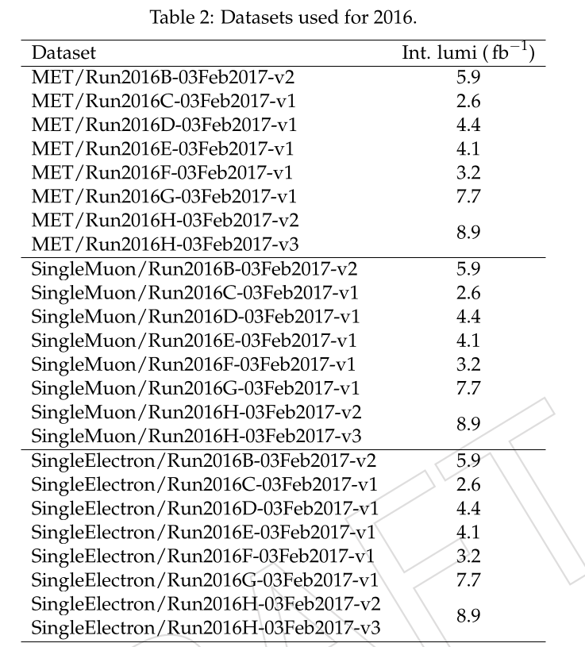
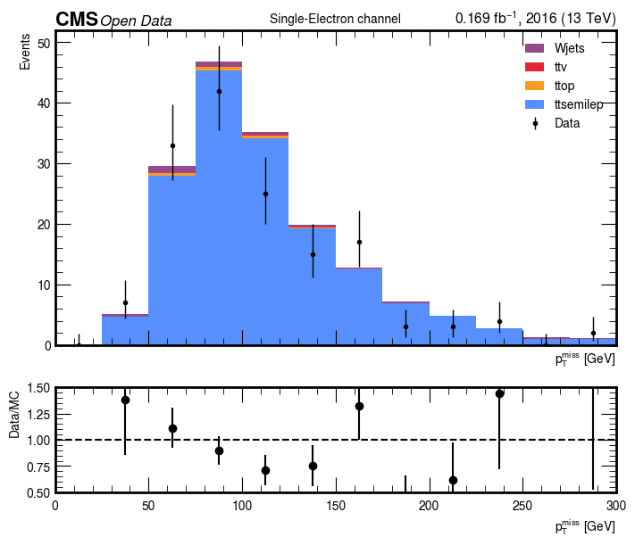

# Single Lepton

## Physics Motivation and Channel Strategy

The Large Hadron Collider (LHC) collides protons at center-of-mass energies high enough to probe physics beyond the Standard Model. Although the protons are composite objects, the relevant hard scatterings occur between their constituents — quarks and gluons. In the context of simplified dark matter models, these partonic interactions can produce **top quarks** together with a new mediator particle (commonly denoted φ for scalar or a for pseudoscalar). The mediator then decays invisibly into a pair of dark matter candidates ($\chi \bar{\chi}$). At the detector level, this results in events with multiple top quarks plus significant **missing transverse momentum** ($p_T^{\text{miss}}$), the latter coming from both neutrinos and the invisible χ particles.

The production mechanisms of interest include:  

- **Gluon fusion**:  
  $$ gg \to t \bar{t}\,\phi \to t \bar{t} + \chi \bar{\chi} $$  

- **Single top associated production**:  
  $$ gb \to t \phi \to t + \chi \bar{\chi} $$  

- **t–channel production**:  
  $$ qq' \to tb \phi \to tb + \chi \bar{\chi} $$  

In all cases, the top quarks decay via $t \to W b$. Each W boson subsequently decays either leptonically ($W \to \ell \nu$) or hadronically ($W \to q \bar{q}'$). Thus, the final states contain a mixture of b-tagged jets, light-flavor jets, charged leptons (electrons or muons), and genuine $p_T^{\text{miss}}$. The specific experimental signature depends strongly on the decay mode of the W bosons.

Because of this, analyses are divided into **channels**, each defined by the number of isolated charged leptons:

- **Single-lepton (SL):** one isolated electron or muon, several jets (including ≥1 b-tag), and nonzero $p_T^{\text{miss}}$. This channel is statistically powerful and relatively clean, striking a balance between signal sensitivity and manageable backgrounds.  
- **All-hadronic (AH):** no isolated leptons, many jets including b-tagged jets, and $p_T^{\text{miss}}$. While it has the largest raw yield, it suffers from overwhelming QCD multijet background, which can fake $p_T^{\text{miss}}$.  
- **Dilepton:** two isolated leptons, large $p_T^{\text{miss}}$, and multiple jets. It provides a very clean signal region but is limited by low branching fraction, hence low statistics.

In this notebook, we concentrate on the **single-lepton channel with exactly one muon**. There are both theoretical and practical reasons for this choice. From the physics side, the SL channel has the right compromise: it suppresses pure QCD while retaining enough events to make meaningful comparisons. From the experimental side, single-muon triggers are robust, well understood in CMS, and ensure efficient data collection. This focus allows us to demonstrate the full workflow — from event selection to histograms — in a setting where the interplay between **signal characteristics** and **background processes** can be clearly explained. Splitting into channels is therefore not a stylistic decision but a physics necessity: each final state probes the same underlying processes under different background conditions and detector signatures.

---


After defining the objective of the project (Reproducible Analysis of CMS Open Data: Search for Dark Matter in Association with Top Quarks), we discussed in which data format to work — NanoAOD or MiniAOD. We decided to use NanoAOD, because it is lighter and optimized for analysis tasks.

For this reason, the environment is built with Docker, using the image:

cmscloud/python-vnc

and all development is done inside JupyterLab.


# Single lepton channel


### Install and upgrade libraries

First we install and upgrade the libraries that would be used to analyze the data.


```python
!pip install --upgrade pip

!pip install --upgrade awkward
!pip install --upgrade uproot

!pip install fsspec-xrootd

!pip install vector

!pip install --upgrade pandas


!pip install --upgrade matplotlib

```

    Requirement already satisfied: pip in /usr/local/venv/lib/python3.10/site-packages (25.2)
    Requirement already satisfied: awkward in /usr/local/venv/lib/python3.10/site-packages (2.8.8)
    Collecting awkward
      Downloading awkward-2.8.9-py3-none-any.whl.metadata (7.5 kB)
    Collecting awkward-cpp==50 (from awkward)
      Downloading awkward_cpp-50-cp310-cp310-manylinux2014_x86_64.manylinux_2_17_x86_64.whl.metadata (2.2 kB)
    Requirement already satisfied: fsspec>=2022.11.0 in /usr/local/venv/lib/python3.10/site-packages (from awkward) (2025.2.0)
    Requirement already satisfied: importlib-metadata>=4.13.0 in /usr/local/venv/lib/python3.10/site-packages (from awkward) (8.6.1)
    Requirement already satisfied: numpy>=1.18.0 in /usr/local/venv/lib/python3.10/site-packages (from awkward) (2.2.3)
    Requirement already satisfied: packaging in /usr/local/venv/lib/python3.10/site-packages (from awkward) (24.2)
    Requirement already satisfied: typing-extensions>=4.1.0 in /usr/local/venv/lib/python3.10/site-packages (from awkward) (4.12.2)
    Requirement already satisfied: zipp>=3.20 in /usr/local/venv/lib/python3.10/site-packages (from importlib-metadata>=4.13.0->awkward) (3.21.0)
    Downloading awkward-2.8.9-py3-none-any.whl (903 kB)
       ━━━━━━━━━━━━━━━━━━━━━━━━━━━━━━━━━━━━━━━━ 903.5/903.5 kB 6.8 MB/s  0:00:00
    Downloading awkward_cpp-50-cp310-cp310-manylinux2014_x86_64.manylinux_2_17_x86_64.whl (653 kB)
       ━━━━━━━━━━━━━━━━━━━━━━━━━━━━━━━━━━━━━━━━ 653.7/653.7 kB 9.1 MB/s  0:00:00
    Installing collected packages: awkward-cpp, awkward
      Attempting uninstall: awkward-cpp
        Found existing installation: awkward_cpp 49
        Uninstalling awkward_cpp-49:
          Successfully uninstalled awkward_cpp-49
      Attempting uninstall: awkward
        Found existing installation: awkward 2.8.8
        Uninstalling awkward-2.8.8:
          Successfully uninstalled awkward-2.8.8
       ━━━━━━━━━━━━━━━━━━━━━━━━━━━━━━━━━━━━━━━━ 2/2 [awkward]m1/2 [awkward]
    Successfully installed awkward-2.8.9 awkward-cpp-50
    Requirement already satisfied: uproot in /usr/local/venv/lib/python3.10/site-packages (5.6.5)
    Collecting uproot
      Downloading uproot-5.6.6-py3-none-any.whl.metadata (34 kB)
    Requirement already satisfied: awkward>=2.4.6 in /usr/local/venv/lib/python3.10/site-packages (from uproot) (2.8.9)
    Requirement already satisfied: cramjam>=2.5.0 in /usr/local/venv/lib/python3.10/site-packages (from uproot) (2.9.1)
    Requirement already satisfied: fsspec!=2025.7.0 in /usr/local/venv/lib/python3.10/site-packages (from uproot) (2025.2.0)
    Requirement already satisfied: numpy in /usr/local/venv/lib/python3.10/site-packages (from uproot) (2.2.3)
    Requirement already satisfied: packaging in /usr/local/venv/lib/python3.10/site-packages (from uproot) (24.2)
    Requirement already satisfied: typing-extensions>=4.1.0 in /usr/local/venv/lib/python3.10/site-packages (from uproot) (4.12.2)
    Requirement already satisfied: xxhash in /usr/local/venv/lib/python3.10/site-packages (from uproot) (3.5.0)
    Requirement already satisfied: awkward-cpp==50 in /usr/local/venv/lib/python3.10/site-packages (from awkward>=2.4.6->uproot) (50)
    Requirement already satisfied: importlib-metadata>=4.13.0 in /usr/local/venv/lib/python3.10/site-packages (from awkward>=2.4.6->uproot) (8.6.1)
    Requirement already satisfied: zipp>=3.20 in /usr/local/venv/lib/python3.10/site-packages (from importlib-metadata>=4.13.0->awkward>=2.4.6->uproot) (3.21.0)
    Downloading uproot-5.6.6-py3-none-any.whl (385 kB)
    Installing collected packages: uproot
      Attempting uninstall: uproot
        Found existing installation: uproot 5.6.5
        Uninstalling uproot-5.6.5:
          Successfully uninstalled uproot-5.6.5
    Successfully installed uproot-5.6.6
    Requirement already satisfied: fsspec-xrootd in /usr/local/venv/lib/python3.10/site-packages (0.5.0)
    Requirement already satisfied: fsspec in /usr/local/venv/lib/python3.10/site-packages (from fsspec-xrootd) (2025.2.0)
    Requirement already satisfied: vector in /usr/local/venv/lib/python3.10/site-packages (1.6.3)
    Requirement already satisfied: numpy>=1.13.3 in /usr/local/venv/lib/python3.10/site-packages (from vector) (2.2.3)
    Requirement already satisfied: packaging>=19 in /usr/local/venv/lib/python3.10/site-packages (from vector) (24.2)
    Requirement already satisfied: pandas in /usr/local/venv/lib/python3.10/site-packages (2.3.2)
    Collecting pandas
      Downloading pandas-2.3.3-cp310-cp310-manylinux_2_24_x86_64.manylinux_2_28_x86_64.whl.metadata (91 kB)
    Requirement already satisfied: numpy>=1.22.4 in /usr/local/venv/lib/python3.10/site-packages (from pandas) (2.2.3)
    Requirement already satisfied: python-dateutil>=2.8.2 in /usr/local/venv/lib/python3.10/site-packages (from pandas) (2.9.0.post0)
    Requirement already satisfied: pytz>=2020.1 in /usr/local/venv/lib/python3.10/site-packages (from pandas) (2025.2)
    Requirement already satisfied: tzdata>=2022.7 in /usr/local/venv/lib/python3.10/site-packages (from pandas) (2025.2)
    Requirement already satisfied: six>=1.5 in /usr/local/venv/lib/python3.10/site-packages (from python-dateutil>=2.8.2->pandas) (1.17.0)
    Downloading pandas-2.3.3-cp310-cp310-manylinux_2_24_x86_64.manylinux_2_28_x86_64.whl (12.8 MB)
       ━━━━━━━━━━━━━━━━━━━━━━━━━━━━━━━━━━━━━━━━ 12.8/12.8 MB 8.5 MB/s  0:00:01m0:00:0100:01
    Installing collected packages: pandas
      Attempting uninstall: pandas
        Found existing installation: pandas 2.3.2
        Uninstalling pandas-2.3.2:
          Successfully uninstalled pandas-2.3.2
    Successfully installed pandas-2.3.3
    Requirement already satisfied: matplotlib in /usr/local/venv/lib/python3.10/site-packages (3.10.6)
    Requirement already satisfied: contourpy>=1.0.1 in /usr/local/venv/lib/python3.10/site-packages (from matplotlib) (1.3.1)
    Requirement already satisfied: cycler>=0.10 in /usr/local/venv/lib/python3.10/site-packages (from matplotlib) (0.12.1)
    Requirement already satisfied: fonttools>=4.22.0 in /usr/local/venv/lib/python3.10/site-packages (from matplotlib) (4.56.0)
    Requirement already satisfied: kiwisolver>=1.3.1 in /usr/local/venv/lib/python3.10/site-packages (from matplotlib) (1.4.8)
    Requirement already satisfied: numpy>=1.23 in /usr/local/venv/lib/python3.10/site-packages (from matplotlib) (2.2.3)
    Requirement already satisfied: packaging>=20.0 in /usr/local/venv/lib/python3.10/site-packages (from matplotlib) (24.2)
    Requirement already satisfied: pillow>=8 in /usr/local/venv/lib/python3.10/site-packages (from matplotlib) (11.1.0)
    Requirement already satisfied: pyparsing>=2.3.1 in /usr/local/venv/lib/python3.10/site-packages (from matplotlib) (3.2.1)
    Requirement already satisfied: python-dateutil>=2.7 in /usr/local/venv/lib/python3.10/site-packages (from matplotlib) (2.9.0.post0)
    Requirement already satisfied: six>=1.5 in /usr/local/venv/lib/python3.10/site-packages (from python-dateutil>=2.7->matplotlib) (1.17.0)


We import all the libraries that we are going to use.


```python
%load_ext autoreload
%autoreload 2

# The classics
import numpy as np
import matplotlib.pylab as plt
import matplotlib # To get the version

import pandas as pd

# The newcomers
import awkward as ak
import uproot

import vector
vector.register_awkward()

import requests
import os

import time

import json


%load_ext autoreload
%autoreload 2

# The classics
import numpy as np
import matplotlib.pylab as plt
import matplotlib # To get the version

import pandas as pd

import hist
from hist import Hist

# To read file names using the OS (operating system)
import glob
import os

import dpoa_workshop_utilities
from dpoa_workshop_utilities import nanoaod_filenames
from dpoa_workshop_utilities import get_files_for_dataset
from dpoa_workshop_utilities import pretty_print
from dpoa_workshop_utilities import build_lumi_mask
```

    The autoreload extension is already loaded. To reload it, use:
      %reload_ext autoreload


We are going to use the `dpoa_workshop_utilities` file to help you access the datasets.

The `nanoaod_filenames` is a dictionary with the urls to the file indexes of the root files for every dataset that we will use in the analysis.

The `get_files_for_dataset(dataset,radom,n)` is a function that returs the `n` root directions of the specified `dataset`, the `random` is set `False` by default and it allows you to select random urls.

The `pretty_print(fields, fmt='40s', require=None, ignore=None)` function allows you to print subsets of keys based on strings that you require or ignore. It will also format that output based on how many characters you want in a column (you are limited to 80 characters per line).

The `build_lumi_mask(lumifile, tree, verbose=False)` function helps you mask (select) the data that's collected from collisions.

In the next seccion will download important files like the luminosity file.


```python
from IPython.display import Image, display

display(Image(filename="dataset_2016.png"))

```


    

    


```python

display(Image(filename="MC_data.png"))

```


    

    


### Download the essential files


The following code uses these utilities to access the location of the ROOT files of every dataset used in the analysis.
We download and create a file with all the ROOT's urls for every dataset.

We assign a name similar to `FILE_LIST_ttsemilep.txt` to these files.


```python
# Descarga de las direcciones root para cada grupo de datos

for datasetname in nanoaod_filenames.keys():
    
    print(datasetname)

    outfilename = f'FILE_LIST_{datasetname}.txt'

    # Remove the file if it exists
    try:
        os.remove(outfilename)
    except OSError:
        pass

    for url in nanoaod_filenames[datasetname]:
        print(url)

        r = requests.get(url, allow_redirects=True)

        open(outfilename, 'a').write(r.text)

```

    ttsemilep
    https://opendata.cern.ch/record/67993/file_index/CMS_mc_RunIISummer20UL16NanoAODv9_TTToSemiLeptonic_TuneCP5_13TeV-powheg-pythia8_NANOAODSIM_106X_mcRun2_asymptotic_v17-v1_120000_file_index.txt
    https://opendata.cern.ch/record/67993/file_index/CMS_mc_RunIISummer20UL16NanoAODv9_TTToSemiLeptonic_TuneCP5_13TeV-powheg-pythia8_NANOAODSIM_106X_mcRun2_asymptotic_v17-v1_130000_file_index.txt
    https://opendata.cern.ch/record/67993/file_index/CMS_mc_RunIISummer20UL16NanoAODv9_TTToSemiLeptonic_TuneCP5_13TeV-powheg-pythia8_NANOAODSIM_106X_mcRun2_asymptotic_v17-v1_270000_file_index.txt
    https://opendata.cern.ch/record/67993/file_index/CMS_mc_RunIISummer20UL16NanoAODv9_TTToSemiLeptonic_TuneCP5_13TeV-powheg-pythia8_NANOAODSIM_106X_mcRun2_asymptotic_v17-v1_280000_file_index.txt
    https://opendata.cern.ch/record/67993/file_index/CMS_mc_RunIISummer20UL16NanoAODv9_TTToSemiLeptonic_TuneCP5_13TeV-powheg-pythia8_NANOAODSIM_106X_mcRun2_asymptotic_v17-v1_70000_file_index.txt
    ttop
    https://opendata.cern.ch/record/64763/file_index/CMS_mc_RunIISummer20UL16NanoAODv9_ST_t-channel_top_4f_InclusiveDecays_TuneCP5CR2_13TeV-powheg-madspin-pythia8_NANOAODSIM_106X_mcRun2_asymptotic_v17-v1_100000_file_index.txt
    https://opendata.cern.ch/record/64763/file_index/CMS_mc_RunIISummer20UL16NanoAODv9_ST_t-channel_top_4f_InclusiveDecays_TuneCP5CR2_13TeV-powheg-madspin-pythia8_NANOAODSIM_106X_mcRun2_asymptotic_v17-v1_230000_file_index.txt
    https://opendata.cern.ch/record/64763/file_index/CMS_mc_RunIISummer20UL16NanoAODv9_ST_t-channel_top_4f_InclusiveDecays_TuneCP5CR2_13TeV-powheg-madspin-pythia8_NANOAODSIM_106X_mcRun2_asymptotic_v17-v1_2430000_file_index.txt
    https://opendata.cern.ch/record/64763/file_index/CMS_mc_RunIISummer20UL16NanoAODv9_ST_t-channel_top_4f_InclusiveDecays_TuneCP5CR2_13TeV-powheg-madspin-pythia8_NANOAODSIM_106X_mcRun2_asymptotic_v17-v1_2500000_file_index.txt
    https://opendata.cern.ch/record/64763/file_index/CMS_mc_RunIISummer20UL16NanoAODv9_ST_t-channel_top_4f_InclusiveDecays_TuneCP5CR2_13TeV-powheg-madspin-pythia8_NANOAODSIM_106X_mcRun2_asymptotic_v17-v1_250000_file_index.txt
    Wjets
    https://opendata.cern.ch/record/69729/file_index/CMS_mc_RunIISummer20UL16NanoAODv9_WJetsToLNu_HT-400To600_TuneCP5_13TeV-madgraphMLM-pythia8_NANOAODSIM_106X_mcRun2_asymptotic_v17-v1_120000_file_index.txt
    https://opendata.cern.ch/record/69729/file_index/CMS_mc_RunIISummer20UL16NanoAODv9_WJetsToLNu_HT-400To600_TuneCP5_13TeV-madgraphMLM-pythia8_NANOAODSIM_106X_mcRun2_asymptotic_v17-v1_130000_file_index.txt
    https://opendata.cern.ch/record/69729/file_index/CMS_mc_RunIISummer20UL16NanoAODv9_WJetsToLNu_HT-400To600_TuneCP5_13TeV-madgraphMLM-pythia8_NANOAODSIM_106X_mcRun2_asymptotic_v17-v1_270000_file_index.txt
    https://opendata.cern.ch/record/69729/file_index/CMS_mc_RunIISummer20UL16NanoAODv9_WJetsToLNu_HT-400To600_TuneCP5_13TeV-madgraphMLM-pythia8_NANOAODSIM_106X_mcRun2_asymptotic_v17-v1_280000_file_index.txt
    https://opendata.cern.ch/record/69729/file_index/CMS_mc_RunIISummer20UL16NanoAODv9_WJetsToLNu_HT-400To600_TuneCP5_13TeV-madgraphMLM-pythia8_NANOAODSIM_106X_mcRun2_asymptotic_v17-v1_70000_file_index.txt
    ttv
    https://opendata.cern.ch/record/68073/file_index/CMS_mc_RunIISummer20UL16NanoAODv9_TTWJetsToLNu_TuneCP5_13TeV-amcatnloFXFX-madspin-pythia8_NANOAODSIM_106X_mcRun2_asymptotic_v17-v1_130000_file_index.txt
    https://opendata.cern.ch/record/68073/file_index/CMS_mc_RunIISummer20UL16NanoAODv9_TTWJetsToLNu_TuneCP5_13TeV-amcatnloFXFX-madspin-pythia8_NANOAODSIM_106X_mcRun2_asymptotic_v17-v1_270000_file_index.txt
    https://opendata.cern.ch/record/68073/file_index/CMS_mc_RunIISummer20UL16NanoAODv9_TTWJetsToLNu_TuneCP5_13TeV-amcatnloFXFX-madspin-pythia8_NANOAODSIM_106X_mcRun2_asymptotic_v17-v1_280000_file_index.txt
    https://opendata.cern.ch/record/68073/file_index/CMS_mc_RunIISummer20UL16NanoAODv9_TTWJetsToLNu_TuneCP5_13TeV-amcatnloFXFX-madspin-pythia8_NANOAODSIM_106X_mcRun2_asymptotic_v17-v1_70000_file_index.txt
    collmet
    https://opendata.cern.ch/record/30559/file_index/CMS_Run2016H_MET_NANOAOD_UL2016_MiniAODv2_NanoAODv9-v1_120000_file_index.txt
    https://opendata.cern.ch/record/30559/file_index/CMS_Run2016H_MET_NANOAOD_UL2016_MiniAODv2_NanoAODv9-v1_280000_file_index.txt
    https://opendata.cern.ch/record/30559/file_index/CMS_Run2016H_MET_NANOAOD_UL2016_MiniAODv2_NanoAODv9-v1_70000_file_index.txt
    collsm
    https://opendata.cern.ch/record/30563/file_index/CMS_Run2016H_SingleMuon_NANOAOD_UL2016_MiniAODv2_NanoAODv9-v1_120000_file_index.txt
    https://opendata.cern.ch/record/30563/file_index/CMS_Run2016H_SingleMuon_NANOAOD_UL2016_MiniAODv2_NanoAODv9-v1_1210000_file_index.txt
    https://opendata.cern.ch/record/30563/file_index/CMS_Run2016H_SingleMuon_NANOAOD_UL2016_MiniAODv2_NanoAODv9-v1_130000_file_index.txt
    https://opendata.cern.ch/record/30563/file_index/CMS_Run2016H_SingleMuon_NANOAOD_UL2016_MiniAODv2_NanoAODv9-v1_280000_file_index.txt
    https://opendata.cern.ch/record/30563/file_index/CMS_Run2016H_SingleMuon_NANOAOD_UL2016_MiniAODv2_NanoAODv9-v1_70000_file_index.txt
    collse
    https://opendata.cern.ch/record/30562/file_index/CMS_Run2016H_SingleElectron_NANOAOD_UL2016_MiniAODv2_NanoAODv9-v1_120000_file_index.txt
    https://opendata.cern.ch/record/30562/file_index/CMS_Run2016H_SingleElectron_NANOAOD_UL2016_MiniAODv2_NanoAODv9-v1_270000_file_index.txt
    https://opendata.cern.ch/record/30562/file_index/CMS_Run2016H_SingleElectron_NANOAOD_UL2016_MiniAODv2_NanoAODv9-v1_280000_file_index.txt
    https://opendata.cern.ch/record/30562/file_index/CMS_Run2016H_SingleElectron_NANOAOD_UL2016_MiniAODv2_NanoAODv9-v1_70000_file_index.txt


By running the next code we can count the number of ROOT files that are in every dataset.


```python
!wc -l FILE_LIST_*.txt

```

       11 FILE_LIST_Wjets.txt
       32 FILE_LIST_collmet.txt
       80 FILE_LIST_collse.txt
       82 FILE_LIST_collsm.txt
       25 FILE_LIST_ttop.txt
      138 FILE_LIST_ttsemilep.txt
       12 FILE_LIST_ttv.txt
      380 total


Using the `get_files_for_dataset` function we can get `n` number of ROOT files of a dataset, in this case the `ttsemilep` dataset.


```python
# Pick 2 tt̄ semileptonic files
filenames = get_files_for_dataset("ttsemilep",random=True, n=2)

for f in filenames:
    print(f)

```

    root://eospublic.cern.ch//eos/opendata/cms/mc/RunIISummer20UL16NanoAODv9/TTToSemiLeptonic_TuneCP5_13TeV-powheg-pythia8/NANOAODSIM/106X_mcRun2_asymptotic_v17-v1/270000/CBA39E34-6BAD-B740-AB89-ECD745490CE5.root
    
    root://eospublic.cern.ch//eos/opendata/cms/mc/RunIISummer20UL16NanoAODv9/TTToSemiLeptonic_TuneCP5_13TeV-powheg-pythia8/NANOAODSIM/106X_mcRun2_asymptotic_v17-v1/70000/7C94DA4D-C0B5-8747-B6F8-E4903C610777.root
    


In order to work with the collisions datasets it is necesary to apply a luminosity filter which you can download running the next cell.


```python
!wget https://opendata.cern.ch/record/14220/files/Cert_271036-284044_13TeV_Legacy2016_Collisions16_JSON.txt

```

    --2025-10-02 21:34:08--  https://opendata.cern.ch/record/14220/files/Cert_271036-284044_13TeV_Legacy2016_Collisions16_JSON.txt
    137.138.6.31, 2001:1458:201:8b::100:1c8rn.ch)... 
    connected. to opendata.cern.ch (opendata.cern.ch)|137.138.6.31|:443... 
    HTTP request sent, awaiting response... 200 OK
    Length: 11686 (11K) [text/plain]
    Saving to: ‘Cert_271036-284044_13TeV_Legacy2016_Collisions16_JSON.txt’
    
    Cert_271036-284044_ 100%[===================>]  11.41K  --.-KB/s    in 0s      
    
    2025-10-02 21:34:09 (91.7 MB/s) - ‘Cert_271036-284044_13TeV_Legacy2016_Collisions16_JSON.txt’ saved [11686/11686]
    


## Selecting the data

We will work with a random file from the `ttsemilp` dataset.


```python
filename = filenames[0]
print(f"Opening...{filename}")
f = uproot.open(filename)

events = f['Events']
nevents = events.num_entries

print(f"{nevents = }")
```

    Opening...root://eospublic.cern.ch//eos/opendata/cms/mc/RunIISummer20UL16NanoAODv9/TTToSemiLeptonic_TuneCP5_13TeV-powheg-pythia8/NANOAODSIM/106X_mcRun2_asymptotic_v17-v1/270000/CBA39E34-6BAD-B740-AB89-ECD745490CE5.root
    
    nevents = 810000


We can see the keys with


```python
print(events.keys())
```

    ['run', 'luminosityBlock', 'event', 'HTXS_Higgs_pt', 'HTXS_Higgs_y', 'HTXS_stage1_1_cat_pTjet25GeV', 'HTXS_stage1_1_cat_pTjet30GeV', 'HTXS_stage1_1_fine_cat_pTjet25GeV', 'HTXS_stage1_1_fine_cat_pTjet30GeV', 'HTXS_stage1_2_cat_pTjet25GeV', 'HTXS_stage1_2_cat_pTjet30GeV', 'HTXS_stage1_2_fine_cat_pTjet25GeV', 'HTXS_stage1_2_fine_cat_pTjet30GeV', 'HTXS_stage_0', 'HTXS_stage_1_pTjet25', 'HTXS_stage_1_pTjet30', 'HTXS_njets25', 'HTXS_njets30', 'nboostedTau', 'boostedTau_chargedIso', 'boostedTau_eta', 'boostedTau_leadTkDeltaEta', 'boostedTau_leadTkDeltaPhi', 'boostedTau_leadTkPtOverTauPt', 'boostedTau_mass', 'boostedTau_neutralIso', 'boostedTau_phi', 'boostedTau_photonsOutsideSignalCone', 'boostedTau_pt', 'boostedTau_puCorr', 'boostedTau_rawAntiEle2018', 'boostedTau_rawIso', 'boostedTau_rawIsodR03', 'boostedTau_rawMVAnewDM2017v2', 'boostedTau_rawMVAoldDM2017v2', 'boostedTau_rawMVAoldDMdR032017v2', 'boostedTau_charge', 'boostedTau_decayMode', 'boostedTau_jetIdx', 'boostedTau_rawAntiEleCat2018', 'boostedTau_idAntiEle2018', 'boostedTau_idAntiMu', 'boostedTau_idMVAnewDM2017v2', 'boostedTau_idMVAoldDM2017v2', 'boostedTau_idMVAoldDMdR032017v2', 'btagWeight_CSVV2', 'btagWeight_DeepCSVB', 'CaloMET_phi', 'CaloMET_pt', 'CaloMET_sumEt', 'ChsMET_phi', 'ChsMET_pt', 'ChsMET_sumEt', 'nCorrT1METJet', 'CorrT1METJet_area', 'CorrT1METJet_eta', 'CorrT1METJet_muonSubtrFactor', 'CorrT1METJet_phi', 'CorrT1METJet_rawPt', 'DeepMETResolutionTune_phi', 'DeepMETResolutionTune_pt', 'DeepMETResponseTune_phi', 'DeepMETResponseTune_pt', 'nElectron', 'Electron_dEscaleDown', 'Electron_dEscaleUp', 'Electron_dEsigmaDown', 'Electron_dEsigmaUp', 'Electron_deltaEtaSC', 'Electron_dr03EcalRecHitSumEt', 'Electron_dr03HcalDepth1TowerSumEt', 'Electron_dr03TkSumPt', 'Electron_dr03TkSumPtHEEP', 'Electron_dxy', 'Electron_dxyErr', 'Electron_dz', 'Electron_dzErr', 'Electron_eCorr', 'Electron_eInvMinusPInv', 'Electron_energyErr', 'Electron_eta', 'Electron_hoe', 'Electron_ip3d', 'Electron_jetPtRelv2', 'Electron_jetRelIso', 'Electron_mass', 'Electron_miniPFRelIso_all', 'Electron_miniPFRelIso_chg', 'Electron_mvaFall17V2Iso', 'Electron_mvaFall17V2noIso', 'Electron_pfRelIso03_all', 'Electron_pfRelIso03_chg', 'Electron_phi', 'Electron_pt', 'Electron_r9', 'Electron_scEtOverPt', 'Electron_sieie', 'Electron_sip3d', 'Electron_mvaTTH', 'Electron_charge', 'Electron_cutBased', 'Electron_jetIdx', 'Electron_pdgId', 'Electron_photonIdx', 'Electron_tightCharge', 'Electron_vidNestedWPBitmap', 'Electron_vidNestedWPBitmapHEEP', 'Electron_convVeto', 'Electron_cutBased_HEEP', 'Electron_isPFcand', 'Electron_jetNDauCharged', 'Electron_lostHits', 'Electron_mvaFall17V2Iso_WP80', 'Electron_mvaFall17V2Iso_WP90', 'Electron_mvaFall17V2Iso_WPL', 'Electron_mvaFall17V2noIso_WP80', 'Electron_mvaFall17V2noIso_WP90', 'Electron_mvaFall17V2noIso_WPL', 'Electron_seedGain', 'nFatJet', 'FatJet_area', 'FatJet_btagCSVV2', 'FatJet_btagDDBvLV2', 'FatJet_btagDDCvBV2', 'FatJet_btagDDCvLV2', 'FatJet_btagDeepB', 'FatJet_btagHbb', 'FatJet_deepTagMD_H4qvsQCD', 'FatJet_deepTagMD_HbbvsQCD', 'FatJet_deepTagMD_TvsQCD', 'FatJet_deepTagMD_WvsQCD', 'FatJet_deepTagMD_ZHbbvsQCD', 'FatJet_deepTagMD_ZHccvsQCD', 'FatJet_deepTagMD_ZbbvsQCD', 'FatJet_deepTagMD_ZvsQCD', 'FatJet_deepTagMD_bbvsLight', 'FatJet_deepTagMD_ccvsLight', 'FatJet_deepTag_H', 'FatJet_deepTag_QCD', 'FatJet_deepTag_QCDothers', 'FatJet_deepTag_TvsQCD', 'FatJet_deepTag_WvsQCD', 'FatJet_deepTag_ZvsQCD', 'FatJet_eta', 'FatJet_mass', 'FatJet_msoftdrop', 'FatJet_n2b1', 'FatJet_n3b1', 'FatJet_particleNetMD_QCD', 'FatJet_particleNetMD_Xbb', 'FatJet_particleNetMD_Xcc', 'FatJet_particleNetMD_Xqq', 'FatJet_particleNet_H4qvsQCD', 'FatJet_particleNet_HbbvsQCD', 'FatJet_particleNet_HccvsQCD', 'FatJet_particleNet_QCD', 'FatJet_particleNet_TvsQCD', 'FatJet_particleNet_WvsQCD', 'FatJet_particleNet_ZvsQCD', 'FatJet_particleNet_mass', 'FatJet_phi', 'FatJet_pt', 'FatJet_rawFactor', 'FatJet_tau1', 'FatJet_tau2', 'FatJet_tau3', 'FatJet_tau4', 'FatJet_lsf3', 'FatJet_jetId', 'FatJet_subJetIdx1', 'FatJet_subJetIdx2', 'FatJet_electronIdx3SJ', 'FatJet_muonIdx3SJ', 'FatJet_nConstituents', 'nFsrPhoton', 'FsrPhoton_dROverEt2', 'FsrPhoton_eta', 'FsrPhoton_phi', 'FsrPhoton_pt', 'FsrPhoton_relIso03', 'FsrPhoton_muonIdx', 'nGenJetAK8', 'GenJetAK8_eta', 'GenJetAK8_mass', 'GenJetAK8_phi', 'GenJetAK8_pt', 'nGenJet', 'GenJet_eta', 'GenJet_mass', 'GenJet_phi', 'GenJet_pt', 'nGenPart', 'GenPart_eta', 'GenPart_mass', 'GenPart_phi', 'GenPart_pt', 'GenPart_genPartIdxMother', 'GenPart_pdgId', 'GenPart_status', 'GenPart_statusFlags', 'nSubGenJetAK8', 'SubGenJetAK8_eta', 'SubGenJetAK8_mass', 'SubGenJetAK8_phi', 'SubGenJetAK8_pt', 'Generator_binvar', 'Generator_scalePDF', 'Generator_weight', 'Generator_x1', 'Generator_x2', 'Generator_xpdf1', 'Generator_xpdf2', 'Generator_id1', 'Generator_id2', 'GenVtx_x', 'GenVtx_y', 'GenVtx_z', 'nGenVisTau', 'GenVisTau_eta', 'GenVisTau_mass', 'GenVisTau_phi', 'GenVisTau_pt', 'GenVisTau_charge', 'GenVisTau_genPartIdxMother', 'GenVisTau_status', 'genWeight', 'LHEWeight_originalXWGTUP', 'nLHEPdfWeight', 'LHEPdfWeight', 'nLHEReweightingWeight', 'LHEReweightingWeight', 'nLHEScaleWeight', 'LHEScaleWeight', 'nPSWeight', 'PSWeight', 'nIsoTrack', 'IsoTrack_dxy', 'IsoTrack_dz', 'IsoTrack_eta', 'IsoTrack_pfRelIso03_all', 'IsoTrack_pfRelIso03_chg', 'IsoTrack_phi', 'IsoTrack_pt', 'IsoTrack_miniPFRelIso_all', 'IsoTrack_miniPFRelIso_chg', 'IsoTrack_charge', 'IsoTrack_fromPV', 'IsoTrack_pdgId', 'IsoTrack_isHighPurityTrack', 'IsoTrack_isPFcand', 'IsoTrack_isFromLostTrack', 'nJet', 'Jet_area', 'Jet_btagCSVV2', 'Jet_btagDeepB', 'Jet_btagDeepCvB', 'Jet_btagDeepCvL', 'Jet_btagDeepFlavB', 'Jet_btagDeepFlavCvB', 'Jet_btagDeepFlavCvL', 'Jet_btagDeepFlavQG', 'Jet_chEmEF', 'Jet_chFPV0EF', 'Jet_chHEF', 'Jet_eta', 'Jet_hfsigmaEtaEta', 'Jet_hfsigmaPhiPhi', 'Jet_mass', 'Jet_muEF', 'Jet_muonSubtrFactor', 'Jet_neEmEF', 'Jet_neHEF', 'Jet_phi', 'Jet_pt', 'Jet_puIdDisc', 'Jet_qgl', 'Jet_rawFactor', 'Jet_bRegCorr', 'Jet_bRegRes', 'Jet_cRegCorr', 'Jet_cRegRes', 'Jet_electronIdx1', 'Jet_electronIdx2', 'Jet_hfadjacentEtaStripsSize', 'Jet_hfcentralEtaStripSize', 'Jet_jetId', 'Jet_muonIdx1', 'Jet_muonIdx2', 'Jet_nElectrons', 'Jet_nMuons', 'Jet_puId', 'Jet_nConstituents', 'L1PreFiringWeight_Dn', 'L1PreFiringWeight_ECAL_Dn', 'L1PreFiringWeight_ECAL_Nom', 'L1PreFiringWeight_ECAL_Up', 'L1PreFiringWeight_Muon_Nom', 'L1PreFiringWeight_Muon_StatDn', 'L1PreFiringWeight_Muon_StatUp', 'L1PreFiringWeight_Muon_SystDn', 'L1PreFiringWeight_Muon_SystUp', 'L1PreFiringWeight_Nom', 'L1PreFiringWeight_Up', 'LHE_HT', 'LHE_HTIncoming', 'LHE_Vpt', 'LHE_AlphaS', 'LHE_Njets', 'LHE_Nb', 'LHE_Nc', 'LHE_Nuds', 'LHE_Nglu', 'LHE_NpNLO', 'LHE_NpLO', 'nLHEPart', 'LHEPart_pt', 'LHEPart_eta', 'LHEPart_phi', 'LHEPart_mass', 'LHEPart_incomingpz', 'LHEPart_pdgId', 'LHEPart_status', 'LHEPart_spin', 'nLowPtElectron', 'LowPtElectron_ID', 'LowPtElectron_convVtxRadius', 'LowPtElectron_deltaEtaSC', 'LowPtElectron_dxy', 'LowPtElectron_dxyErr', 'LowPtElectron_dz', 'LowPtElectron_dzErr', 'LowPtElectron_eInvMinusPInv', 'LowPtElectron_embeddedID', 'LowPtElectron_energyErr', 'LowPtElectron_eta', 'LowPtElectron_hoe', 'LowPtElectron_mass', 'LowPtElectron_miniPFRelIso_all', 'LowPtElectron_miniPFRelIso_chg', 'LowPtElectron_phi', 'LowPtElectron_pt', 'LowPtElectron_ptbiased', 'LowPtElectron_r9', 'LowPtElectron_scEtOverPt', 'LowPtElectron_sieie', 'LowPtElectron_unbiased', 'LowPtElectron_charge', 'LowPtElectron_convWP', 'LowPtElectron_pdgId', 'LowPtElectron_convVeto', 'LowPtElectron_lostHits', 'GenMET_phi', 'GenMET_pt', 'MET_MetUnclustEnUpDeltaX', 'MET_MetUnclustEnUpDeltaY', 'MET_covXX', 'MET_covXY', 'MET_covYY', 'MET_phi', 'MET_pt', 'MET_significance', 'MET_sumEt', 'MET_sumPtUnclustered', 'nMuon', 'Muon_dxy', 'Muon_dxyErr', 'Muon_dxybs', 'Muon_dz', 'Muon_dzErr', 'Muon_eta', 'Muon_ip3d', 'Muon_jetPtRelv2', 'Muon_jetRelIso', 'Muon_mass', 'Muon_miniPFRelIso_all', 'Muon_miniPFRelIso_chg', 'Muon_pfRelIso03_all', 'Muon_pfRelIso03_chg', 'Muon_pfRelIso04_all', 'Muon_phi', 'Muon_pt', 'Muon_ptErr', 'Muon_segmentComp', 'Muon_sip3d', 'Muon_softMva', 'Muon_tkRelIso', 'Muon_tunepRelPt', 'Muon_mvaLowPt', 'Muon_mvaTTH', 'Muon_charge', 'Muon_jetIdx', 'Muon_nStations', 'Muon_nTrackerLayers', 'Muon_pdgId', 'Muon_tightCharge', 'Muon_fsrPhotonIdx', 'Muon_highPtId', 'Muon_highPurity', 'Muon_inTimeMuon', 'Muon_isGlobal', 'Muon_isPFcand', 'Muon_isStandalone', 'Muon_isTracker', 'Muon_jetNDauCharged', 'Muon_looseId', 'Muon_mediumId', 'Muon_mediumPromptId', 'Muon_miniIsoId', 'Muon_multiIsoId', 'Muon_mvaId', 'Muon_mvaLowPtId', 'Muon_pfIsoId', 'Muon_puppiIsoId', 'Muon_softId', 'Muon_softMvaId', 'Muon_tightId', 'Muon_tkIsoId', 'Muon_triggerIdLoose', 'nPhoton', 'Photon_dEscaleDown', 'Photon_dEscaleUp', 'Photon_dEsigmaDown', 'Photon_dEsigmaUp', 'Photon_eCorr', 'Photon_energyErr', 'Photon_eta', 'Photon_hoe', 'Photon_mass', 'Photon_mvaID', 'Photon_mvaID_Fall17V1p1', 'Photon_pfRelIso03_all', 'Photon_pfRelIso03_chg', 'Photon_phi', 'Photon_pt', 'Photon_r9', 'Photon_sieie', 'Photon_charge', 'Photon_cutBased', 'Photon_cutBased_Fall17V1Bitmap', 'Photon_electronIdx', 'Photon_jetIdx', 'Photon_pdgId', 'Photon_vidNestedWPBitmap', 'Photon_electronVeto', 'Photon_isScEtaEB', 'Photon_isScEtaEE', 'Photon_mvaID_WP80', 'Photon_mvaID_WP90', 'Photon_pixelSeed', 'Photon_seedGain', 'Pileup_nTrueInt', 'Pileup_pudensity', 'Pileup_gpudensity', 'Pileup_nPU', 'Pileup_sumEOOT', 'Pileup_sumLOOT', 'PuppiMET_phi', 'PuppiMET_phiJERDown', 'PuppiMET_phiJERUp', 'PuppiMET_phiJESDown', 'PuppiMET_phiJESUp', 'PuppiMET_phiUnclusteredDown', 'PuppiMET_phiUnclusteredUp', 'PuppiMET_pt', 'PuppiMET_ptJERDown', 'PuppiMET_ptJERUp', 'PuppiMET_ptJESDown', 'PuppiMET_ptJESUp', 'PuppiMET_ptUnclusteredDown', 'PuppiMET_ptUnclusteredUp', 'PuppiMET_sumEt', 'RawMET_phi', 'RawMET_pt', 'RawMET_sumEt', 'RawPuppiMET_phi', 'RawPuppiMET_pt', 'RawPuppiMET_sumEt', 'fixedGridRhoFastjetAll', 'fixedGridRhoFastjetCentral', 'fixedGridRhoFastjetCentralCalo', 'fixedGridRhoFastjetCentralChargedPileUp', 'fixedGridRhoFastjetCentralNeutral', 'nGenDressedLepton', 'GenDressedLepton_eta', 'GenDressedLepton_mass', 'GenDressedLepton_phi', 'GenDressedLepton_pt', 'GenDressedLepton_pdgId', 'GenDressedLepton_hasTauAnc', 'nGenIsolatedPhoton', 'GenIsolatedPhoton_eta', 'GenIsolatedPhoton_mass', 'GenIsolatedPhoton_phi', 'GenIsolatedPhoton_pt', 'nSoftActivityJet', 'SoftActivityJet_eta', 'SoftActivityJet_phi', 'SoftActivityJet_pt', 'SoftActivityJetHT', 'SoftActivityJetHT10', 'SoftActivityJetHT2', 'SoftActivityJetHT5', 'SoftActivityJetNjets10', 'SoftActivityJetNjets2', 'SoftActivityJetNjets5', 'nSubJet', 'SubJet_btagCSVV2', 'SubJet_btagDeepB', 'SubJet_eta', 'SubJet_mass', 'SubJet_n2b1', 'SubJet_n3b1', 'SubJet_phi', 'SubJet_pt', 'SubJet_rawFactor', 'SubJet_tau1', 'SubJet_tau2', 'SubJet_tau3', 'SubJet_tau4', 'nTau', 'Tau_chargedIso', 'Tau_dxy', 'Tau_dz', 'Tau_eta', 'Tau_leadTkDeltaEta', 'Tau_leadTkDeltaPhi', 'Tau_leadTkPtOverTauPt', 'Tau_mass', 'Tau_neutralIso', 'Tau_phi', 'Tau_photonsOutsideSignalCone', 'Tau_pt', 'Tau_puCorr', 'Tau_rawDeepTau2017v2p1VSe', 'Tau_rawDeepTau2017v2p1VSjet', 'Tau_rawDeepTau2017v2p1VSmu', 'Tau_rawIso', 'Tau_rawIsodR03', 'Tau_charge', 'Tau_decayMode', 'Tau_jetIdx', 'Tau_idAntiEleDeadECal', 'Tau_idAntiMu', 'Tau_idDecayModeOldDMs', 'Tau_idDeepTau2017v2p1VSe', 'Tau_idDeepTau2017v2p1VSjet', 'Tau_idDeepTau2017v2p1VSmu', 'TkMET_phi', 'TkMET_pt', 'TkMET_sumEt', 'nTrigObj', 'TrigObj_pt', 'TrigObj_eta', 'TrigObj_phi', 'TrigObj_l1pt', 'TrigObj_l1pt_2', 'TrigObj_l2pt', 'TrigObj_id', 'TrigObj_l1iso', 'TrigObj_l1charge', 'TrigObj_filterBits', 'genTtbarId', 'nOtherPV', 'OtherPV_z', 'PV_ndof', 'PV_x', 'PV_y', 'PV_z', 'PV_chi2', 'PV_score', 'PV_npvs', 'PV_npvsGood', 'nSV', 'SV_dlen', 'SV_dlenSig', 'SV_dxy', 'SV_dxySig', 'SV_pAngle', 'SV_charge', 'boostedTau_genPartIdx', 'boostedTau_genPartFlav', 'Electron_genPartIdx', 'Electron_genPartFlav', 'FatJet_genJetAK8Idx', 'FatJet_hadronFlavour', 'FatJet_nBHadrons', 'FatJet_nCHadrons', 'GenJetAK8_partonFlavour', 'GenJetAK8_hadronFlavour', 'GenJet_partonFlavour', 'GenJet_hadronFlavour', 'GenVtx_t0', 'Jet_genJetIdx', 'Jet_hadronFlavour', 'Jet_partonFlavour', 'LowPtElectron_genPartIdx', 'LowPtElectron_genPartFlav', 'Muon_genPartIdx', 'Muon_genPartFlav', 'Photon_genPartIdx', 'Photon_genPartFlav', 'MET_fiducialGenPhi', 'MET_fiducialGenPt', 'Electron_cleanmask', 'Jet_cleanmask', 'Muon_cleanmask', 'Photon_cleanmask', 'Tau_cleanmask', 'SubJet_hadronFlavour', 'SubJet_nBHadrons', 'SubJet_nCHadrons', 'SV_chi2', 'SV_eta', 'SV_mass', 'SV_ndof', 'SV_phi', 'SV_pt', 'SV_x', 'SV_y', 'SV_z', 'SV_ntracks', 'Tau_genPartIdx', 'Tau_genPartFlav', 'L1_AlwaysTrue', 'L1_BRIL_TRIG0_AND', 'L1_BRIL_TRIG0_FstBunchInTrain', 'L1_BRIL_TRIG0_OR', 'L1_BRIL_TRIG0_delayedAND', 'L1_BeamGasB1', 'L1_BeamGasB2', 'L1_BeamGasMinus', 'L1_BeamGasPlus', 'L1_BptxMinus', 'L1_BptxOR', 'L1_BptxPlus', 'L1_BptxXOR', 'L1_DoubleEG6_HTT255', 'L1_DoubleEG_15_10', 'L1_DoubleEG_18_17', 'L1_DoubleEG_20_18', 'L1_DoubleEG_22_10', 'L1_DoubleEG_22_12', 'L1_DoubleEG_22_15', 'L1_DoubleEG_23_10', 'L1_DoubleEG_24_17', 'L1_DoubleEG_25_12', 'L1_DoubleIsoTau28er', 'L1_DoubleIsoTau30er', 'L1_DoubleIsoTau32er', 'L1_DoubleIsoTau33er', 'L1_DoubleIsoTau34er', 'L1_DoubleIsoTau35er', 'L1_DoubleIsoTau36er', 'L1_DoubleJet12_ForwardBackward', 'L1_DoubleJet16_ForwardBackward', 'L1_DoubleJet8_ForwardBackward', 'L1_DoubleJetC100', 'L1_DoubleJetC112', 'L1_DoubleJetC120', 'L1_DoubleJetC40', 'L1_DoubleJetC50', 'L1_DoubleJetC60', 'L1_DoubleJetC60_ETM60', 'L1_DoubleJetC80', 'L1_DoubleMu0', 'L1_DoubleMu0_ETM40', 'L1_DoubleMu0_ETM55', 'L1_DoubleMu0er1p4_dEta_Max1p8_OS', 'L1_DoubleMu0er1p6_dEta_Max1p8', 'L1_DoubleMu0er1p6_dEta_Max1p8_OS', 'L1_DoubleMu7_EG14', 'L1_DoubleMu7_EG7', 'L1_DoubleMuOpen', 'L1_DoubleMu_10_0_dEta_Max1p8', 'L1_DoubleMu_10_3p5', 'L1_DoubleMu_10_Open', 'L1_DoubleMu_11_4', 'L1_DoubleMu_12_5', 'L1_DoubleMu_12_8', 'L1_DoubleMu_13_6', 'L1_DoubleMu_15_5', 'L1_DoubleTau50er', 'L1_EG25er_HTT125', 'L1_EG27er_HTT200', 'L1_ETM100', 'L1_ETM120', 'L1_ETM30', 'L1_ETM40', 'L1_ETM50', 'L1_ETM60', 'L1_ETM70', 'L1_ETM75', 'L1_ETM75_Jet60_dPhi_Min0p4', 'L1_ETM80', 'L1_ETM85', 'L1_ETM90', 'L1_ETM95', 'L1_ETT25', 'L1_ETT35_BptxAND', 'L1_ETT40_BptxAND', 'L1_ETT50_BptxAND', 'L1_ETT60_BptxAND', 'L1_FirstBunchAfterTrain', 'L1_FirstBunchInTrain', 'L1_HTM100', 'L1_HTM120', 'L1_HTM130', 'L1_HTM140', 'L1_HTM150', 'L1_HTM50', 'L1_HTM60_HTT260', 'L1_HTM70', 'L1_HTM80', 'L1_HTM80_HTT220', 'L1_HTT120', 'L1_HTT160', 'L1_HTT200', 'L1_HTT220', 'L1_HTT240', 'L1_HTT255', 'L1_HTT270', 'L1_HTT280', 'L1_HTT300', 'L1_HTT320', 'L1_IsoEG18er_IsoTau24er_dEta_Min0p2', 'L1_IsoEG20er_IsoTau25er_dEta_Min0p2', 'L1_IsoEG22er_IsoTau26er_dEta_Min0p2', 'L1_IsoEG22er_Tau20er_dEta_Min0p2', 'L1_IsolatedBunch', 'L1_Jet32_DoubleMu_10_0_dPhi_Jet_Mu0_Max0p4_dPhi_Mu_Mu_Min1p0', 'L1_Jet32_Mu0_EG10_dPhi_Jet_Mu_Max0p4_dPhi_Mu_EG_Min1p0', 'L1_MU20_EG15', 'L1_MinimumBiasHF0_AND', 'L1_MinimumBiasHF0_AND_BptxAND', 'L1_MinimumBiasHF0_OR', 'L1_MinimumBiasHF0_OR_BptxAND', 'L1_MinimumBiasHF1_AND', 'L1_MinimumBiasHF1_AND_BptxAND', 'L1_MinimumBiasHF1_OR', 'L1_MinimumBiasHF1_OR_BptxAND', 'L1_Mu0er_ETM40', 'L1_Mu0er_ETM55', 'L1_Mu10er_ETM30', 'L1_Mu10er_ETM50', 'L1_Mu12_EG10', 'L1_Mu14er_ETM30', 'L1_Mu16er_Tau20er', 'L1_Mu16er_Tau24er', 'L1_Mu18er_IsoTau26er', 'L1_Mu18er_Tau20er', 'L1_Mu18er_Tau24er', 'L1_Mu20_EG10', 'L1_Mu20_EG17', 'L1_Mu20_IsoEG6', 'L1_Mu20er_IsoTau26er', 'L1_Mu22er_IsoTau26er', 'L1_Mu23_EG10', 'L1_Mu23_IsoEG10', 'L1_Mu25er_IsoTau26er', 'L1_Mu3_JetC120', 'L1_Mu3_JetC120_dEta_Max0p4_dPhi_Max0p4', 'L1_Mu3_JetC16', 'L1_Mu3_JetC16_dEta_Max0p4_dPhi_Max0p4', 'L1_Mu3_JetC60', 'L1_Mu3_JetC60_dEta_Max0p4_dPhi_Max0p4', 'L1_Mu5_EG15', 'L1_Mu5_EG20', 'L1_Mu5_EG23', 'L1_Mu5_IsoEG18', 'L1_Mu5_IsoEG20', 'L1_Mu6_DoubleEG10', 'L1_Mu6_DoubleEG17', 'L1_Mu6_HTT200', 'L1_Mu8_HTT150', 'L1_NotBptxOR', 'L1_QuadJetC36_Tau52', 'L1_QuadJetC40', 'L1_QuadJetC50', 'L1_QuadJetC60', 'L1_QuadMu0', 'L1_SingleEG10', 'L1_SingleEG15', 'L1_SingleEG18', 'L1_SingleEG24', 'L1_SingleEG26', 'L1_SingleEG28', 'L1_SingleEG2_BptxAND', 'L1_SingleEG30', 'L1_SingleEG32', 'L1_SingleEG34', 'L1_SingleEG36', 'L1_SingleEG38', 'L1_SingleEG40', 'L1_SingleEG45', 'L1_SingleEG5', 'L1_SingleIsoEG18', 'L1_SingleIsoEG18er', 'L1_SingleIsoEG20', 'L1_SingleIsoEG20er', 'L1_SingleIsoEG22', 'L1_SingleIsoEG22er', 'L1_SingleIsoEG24', 'L1_SingleIsoEG24er', 'L1_SingleIsoEG26', 'L1_SingleIsoEG26er', 'L1_SingleIsoEG28', 'L1_SingleIsoEG28er', 'L1_SingleIsoEG30', 'L1_SingleIsoEG30er', 'L1_SingleIsoEG32', 'L1_SingleIsoEG32er', 'L1_SingleIsoEG34', 'L1_SingleIsoEG34er', 'L1_SingleIsoEG36', 'L1_SingleJet120', 'L1_SingleJet12_BptxAND', 'L1_SingleJet140', 'L1_SingleJet150', 'L1_SingleJet16', 'L1_SingleJet160', 'L1_SingleJet170', 'L1_SingleJet180', 'L1_SingleJet20', 'L1_SingleJet200', 'L1_SingleJet35', 'L1_SingleJet60', 'L1_SingleJet8_BptxAND', 'L1_SingleJet90', 'L1_SingleJetC20_NotBptxOR', 'L1_SingleJetC20_NotBptxOR_3BX', 'L1_SingleJetC32_NotBptxOR', 'L1_SingleJetC32_NotBptxOR_3BX', 'L1_SingleJetC36_NotBptxOR_3BX', 'L1_SingleMu10_LowQ', 'L1_SingleMu12', 'L1_SingleMu14', 'L1_SingleMu14er', 'L1_SingleMu16', 'L1_SingleMu16er', 'L1_SingleMu18', 'L1_SingleMu18er', 'L1_SingleMu20', 'L1_SingleMu20er', 'L1_SingleMu22', 'L1_SingleMu22er', 'L1_SingleMu25', 'L1_SingleMu25er', 'L1_SingleMu3', 'L1_SingleMu30', 'L1_SingleMu30er', 'L1_SingleMu5', 'L1_SingleMu7', 'L1_SingleMuCosmics', 'L1_SingleMuOpen', 'L1_SingleMuOpen_NotBptxOR', 'L1_SingleMuOpen_NotBptxOR_3BX', 'L1_SingleTau100er', 'L1_SingleTau120er', 'L1_SingleTau80er', 'L1_TripleEG_14_10_8', 'L1_TripleEG_18_17_8', 'L1_TripleJet_84_68_48_VBF', 'L1_TripleJet_88_72_56_VBF', 'L1_TripleJet_92_76_64_VBF', 'L1_TripleMu0', 'L1_TripleMu_5_0_0', 'L1_TripleMu_5_5_3', 'L1_ZeroBias', 'L1_ZeroBias_FirstCollidingBunch', 'L1_ZeroBias_copy', 'L1_UnprefireableEvent', 'Flag_HBHENoiseFilter', 'Flag_HBHENoiseIsoFilter', 'Flag_CSCTightHaloFilter', 'Flag_CSCTightHaloTrkMuUnvetoFilter', 'Flag_CSCTightHalo2015Filter', 'Flag_globalTightHalo2016Filter', 'Flag_globalSuperTightHalo2016Filter', 'Flag_HcalStripHaloFilter', 'Flag_hcalLaserEventFilter', 'Flag_EcalDeadCellTriggerPrimitiveFilter', 'Flag_EcalDeadCellBoundaryEnergyFilter', 'Flag_ecalBadCalibFilter', 'Flag_goodVertices', 'Flag_eeBadScFilter', 'Flag_ecalLaserCorrFilter', 'Flag_trkPOGFilters', 'Flag_chargedHadronTrackResolutionFilter', 'Flag_muonBadTrackFilter', 'Flag_BadChargedCandidateFilter', 'Flag_BadPFMuonFilter', 'Flag_BadPFMuonDzFilter', 'Flag_hfNoisyHitsFilter', 'Flag_BadChargedCandidateSummer16Filter', 'Flag_BadPFMuonSummer16Filter', 'Flag_trkPOG_manystripclus53X', 'Flag_trkPOG_toomanystripclus53X', 'Flag_trkPOG_logErrorTooManyClusters', 'Flag_METFilters', 'L1Reco_step', 'HLTriggerFirstPath', 'HLT_AK8PFJet360_TrimMass30', 'HLT_AK8PFJet400_TrimMass30', 'HLT_AK8PFHT750_TrimMass50', 'HLT_AK8PFHT800_TrimMass50', 'HLT_AK8DiPFJet300_200_TrimMass30_BTagCSV_p20', 'HLT_AK8DiPFJet280_200_TrimMass30_BTagCSV_p087', 'HLT_AK8DiPFJet300_200_TrimMass30_BTagCSV_p087', 'HLT_AK8DiPFJet300_200_TrimMass30', 'HLT_AK8PFHT700_TrimR0p1PT0p03Mass50', 'HLT_AK8PFHT650_TrimR0p1PT0p03Mass50', 'HLT_AK8PFHT600_TrimR0p1PT0p03Mass50_BTagCSV_p20', 'HLT_AK8DiPFJet280_200_TrimMass30', 'HLT_AK8DiPFJet250_200_TrimMass30', 'HLT_AK8DiPFJet280_200_TrimMass30_BTagCSV_p20', 'HLT_AK8DiPFJet250_200_TrimMass30_BTagCSV_p20', 'HLT_CaloJet260', 'HLT_CaloJet500_NoJetID', 'HLT_Dimuon13_PsiPrime', 'HLT_Dimuon13_Upsilon', 'HLT_Dimuon20_Jpsi', 'HLT_DoubleEle24_22_eta2p1_WPLoose_Gsf', 'HLT_DoubleEle25_CaloIdL_GsfTrkIdVL', 'HLT_DoubleEle33_CaloIdL', 'HLT_DoubleEle33_CaloIdL_MW', 'HLT_DoubleEle33_CaloIdL_GsfTrkIdVL_MW', 'HLT_DoubleEle33_CaloIdL_GsfTrkIdVL', 'HLT_DoubleMediumCombinedIsoPFTau35_Trk1_eta2p1_Reg', 'HLT_DoubleTightCombinedIsoPFTau35_Trk1_eta2p1_Reg', 'HLT_DoubleMediumCombinedIsoPFTau40_Trk1_eta2p1_Reg', 'HLT_DoubleTightCombinedIsoPFTau40_Trk1_eta2p1_Reg', 'HLT_DoubleMediumCombinedIsoPFTau40_Trk1_eta2p1', 'HLT_DoubleTightCombinedIsoPFTau40_Trk1_eta2p1', 'HLT_DoubleMediumIsoPFTau35_Trk1_eta2p1_Reg', 'HLT_DoubleMediumIsoPFTau40_Trk1_eta2p1_Reg', 'HLT_DoubleMediumIsoPFTau40_Trk1_eta2p1', 'HLT_DoubleEle37_Ele27_CaloIdL_GsfTrkIdVL', 'HLT_DoubleMu33NoFiltersNoVtx', 'HLT_DoubleMu38NoFiltersNoVtx', 'HLT_DoubleMu23NoFiltersNoVtxDisplaced', 'HLT_DoubleMu28NoFiltersNoVtxDisplaced', 'HLT_DoubleMu0', 'HLT_DoubleMu4_3_Bs', 'HLT_DoubleMu4_3_Jpsi_Displaced', 'HLT_DoubleMu4_JpsiTrk_Displaced', 'HLT_DoubleMu4_LowMassNonResonantTrk_Displaced', 'HLT_DoubleMu3_Trk_Tau3mu', 'HLT_DoubleMu4_PsiPrimeTrk_Displaced', 'HLT_Mu7p5_L2Mu2_Jpsi', 'HLT_Mu7p5_L2Mu2_Upsilon', 'HLT_Mu7p5_Track2_Jpsi', 'HLT_Mu7p5_Track3p5_Jpsi', 'HLT_Mu7p5_Track7_Jpsi', 'HLT_Mu7p5_Track2_Upsilon', 'HLT_Mu7p5_Track3p5_Upsilon', 'HLT_Mu7p5_Track7_Upsilon', 'HLT_Dimuon0er16_Jpsi_NoOS_NoVertexing', 'HLT_Dimuon0er16_Jpsi_NoVertexing', 'HLT_Dimuon6_Jpsi_NoVertexing', 'HLT_Photon150', 'HLT_Photon90_CaloIdL_HT300', 'HLT_HT250_CaloMET70', 'HLT_DoublePhoton60', 'HLT_DoublePhoton85', 'HLT_Ele17_Ele8_Gsf', 'HLT_Ele20_eta2p1_WPLoose_Gsf_LooseIsoPFTau28', 'HLT_Ele22_eta2p1_WPLoose_Gsf_LooseIsoPFTau29', 'HLT_Ele22_eta2p1_WPLoose_Gsf', 'HLT_Ele22_eta2p1_WPLoose_Gsf_LooseIsoPFTau20_SingleL1', 'HLT_Ele23_WPLoose_Gsf', 'HLT_Ele23_WPLoose_Gsf_WHbbBoost', 'HLT_Ele24_eta2p1_WPLoose_Gsf', 'HLT_Ele24_eta2p1_WPLoose_Gsf_LooseIsoPFTau20', 'HLT_Ele24_eta2p1_WPLoose_Gsf_LooseIsoPFTau20_SingleL1', 'HLT_Ele24_eta2p1_WPLoose_Gsf_LooseIsoPFTau30', 'HLT_Ele25_WPTight_Gsf', 'HLT_Ele25_eta2p1_WPLoose_Gsf', 'HLT_Ele25_eta2p1_WPTight_Gsf', 'HLT_Ele27_WPLoose_Gsf', 'HLT_Ele27_WPLoose_Gsf_WHbbBoost', 'HLT_Ele27_WPTight_Gsf', 'HLT_Ele27_WPTight_Gsf_L1JetTauSeeded', 'HLT_Ele27_eta2p1_WPLoose_Gsf', 'HLT_Ele27_eta2p1_WPLoose_Gsf_LooseIsoPFTau20_SingleL1', 'HLT_Ele27_eta2p1_WPTight_Gsf', 'HLT_Ele30_WPTight_Gsf', 'HLT_Ele30_eta2p1_WPLoose_Gsf', 'HLT_Ele30_eta2p1_WPTight_Gsf', 'HLT_Ele32_WPTight_Gsf', 'HLT_Ele32_eta2p1_WPLoose_Gsf', 'HLT_Ele32_eta2p1_WPLoose_Gsf_LooseIsoPFTau20_SingleL1', 'HLT_Ele32_eta2p1_WPTight_Gsf', 'HLT_Ele35_WPLoose_Gsf', 'HLT_Ele35_CaloIdVT_GsfTrkIdT_PFJet150_PFJet50', 'HLT_Ele36_eta2p1_WPLoose_Gsf_LooseIsoPFTau20_SingleL1', 'HLT_Ele45_WPLoose_Gsf', 'HLT_Ele45_WPLoose_Gsf_L1JetTauSeeded', 'HLT_Ele45_CaloIdVT_GsfTrkIdT_PFJet200_PFJet50', 'HLT_Ele105_CaloIdVT_GsfTrkIdT', 'HLT_Ele30WP60_SC4_Mass55', 'HLT_Ele30WP60_Ele8_Mass55', 'HLT_HT200', 'HLT_HT275', 'HLT_HT325', 'HLT_HT425', 'HLT_HT575', 'HLT_HT410to430', 'HLT_HT430to450', 'HLT_HT450to470', 'HLT_HT470to500', 'HLT_HT500to550', 'HLT_HT550to650', 'HLT_HT650', 'HLT_Mu16_eta2p1_MET30', 'HLT_IsoMu16_eta2p1_MET30', 'HLT_IsoMu16_eta2p1_MET30_LooseIsoPFTau50_Trk30_eta2p1', 'HLT_IsoMu17_eta2p1', 'HLT_IsoMu17_eta2p1_LooseIsoPFTau20', 'HLT_IsoMu17_eta2p1_LooseIsoPFTau20_SingleL1', 'HLT_DoubleIsoMu17_eta2p1', 'HLT_DoubleIsoMu17_eta2p1_noDzCut', 'HLT_IsoMu18', 'HLT_IsoMu19_eta2p1_LooseIsoPFTau20', 'HLT_IsoMu19_eta2p1_LooseIsoPFTau20_SingleL1', 'HLT_IsoMu19_eta2p1_MediumIsoPFTau32_Trk1_eta2p1_Reg', 'HLT_IsoMu19_eta2p1_LooseCombinedIsoPFTau20', 'HLT_IsoMu19_eta2p1_MediumCombinedIsoPFTau32_Trk1_eta2p1_Reg', 'HLT_IsoMu19_eta2p1_TightCombinedIsoPFTau32_Trk1_eta2p1_Reg', 'HLT_IsoMu21_eta2p1_MediumCombinedIsoPFTau32_Trk1_eta2p1_Reg', 'HLT_IsoMu21_eta2p1_TightCombinedIsoPFTau32_Trk1_eta2p1_Reg', 'HLT_IsoMu20', 'HLT_IsoMu21_eta2p1_LooseIsoPFTau20_SingleL1', 'HLT_IsoMu21_eta2p1_LooseIsoPFTau50_Trk30_eta2p1_SingleL1', 'HLT_IsoMu21_eta2p1_MediumIsoPFTau32_Trk1_eta2p1_Reg', 'HLT_IsoMu22', 'HLT_IsoMu22_eta2p1', 'HLT_IsoMu24', 'HLT_IsoMu27', 'HLT_IsoTkMu18', 'HLT_IsoTkMu20', 'HLT_IsoTkMu22', 'HLT_IsoTkMu22_eta2p1', 'HLT_IsoTkMu24', 'HLT_IsoTkMu27', 'HLT_JetE30_NoBPTX3BX', 'HLT_JetE30_NoBPTX', 'HLT_JetE50_NoBPTX3BX', 'HLT_JetE70_NoBPTX3BX', 'HLT_L1SingleMu18', 'HLT_L2Mu10', 'HLT_L1SingleMuOpen', 'HLT_L1SingleMuOpen_DT', 'HLT_L2DoubleMu23_NoVertex', 'HLT_L2DoubleMu28_NoVertex_2Cha_Angle2p5_Mass10', 'HLT_L2DoubleMu38_NoVertex_2Cha_Angle2p5_Mass10', 'HLT_L2Mu10_NoVertex_NoBPTX3BX', 'HLT_L2Mu10_NoVertex_NoBPTX', 'HLT_L2Mu45_NoVertex_3Sta_NoBPTX3BX', 'HLT_L2Mu40_NoVertex_3Sta_NoBPTX3BX', 'HLT_LooseIsoPFTau50_Trk30_eta2p1', 'HLT_LooseIsoPFTau50_Trk30_eta2p1_MET80', 'HLT_LooseIsoPFTau50_Trk30_eta2p1_MET90', 'HLT_LooseIsoPFTau50_Trk30_eta2p1_MET110', 'HLT_LooseIsoPFTau50_Trk30_eta2p1_MET120', 'HLT_PFTau120_eta2p1', 'HLT_PFTau140_eta2p1', 'HLT_VLooseIsoPFTau120_Trk50_eta2p1', 'HLT_VLooseIsoPFTau140_Trk50_eta2p1', 'HLT_Mu17_Mu8', 'HLT_Mu17_Mu8_DZ', 'HLT_Mu17_Mu8_SameSign', 'HLT_Mu17_Mu8_SameSign_DZ', 'HLT_Mu20_Mu10', 'HLT_Mu20_Mu10_DZ', 'HLT_Mu20_Mu10_SameSign', 'HLT_Mu20_Mu10_SameSign_DZ', 'HLT_Mu17_TkMu8_DZ', 'HLT_Mu17_TrkIsoVVL_Mu8_TrkIsoVVL', 'HLT_Mu17_TrkIsoVVL_Mu8_TrkIsoVVL_DZ', 'HLT_Mu17_TrkIsoVVL_TkMu8_TrkIsoVVL', 'HLT_Mu17_TrkIsoVVL_TkMu8_TrkIsoVVL_DZ', 'HLT_Mu25_TkMu0_dEta18_Onia', 'HLT_Mu27_TkMu8', 'HLT_Mu30_TkMu11', 'HLT_Mu30_eta2p1_PFJet150_PFJet50', 'HLT_Mu40_TkMu11', 'HLT_Mu40_eta2p1_PFJet200_PFJet50', 'HLT_Mu20', 'HLT_TkMu17', 'HLT_TkMu17_TrkIsoVVL_TkMu8_TrkIsoVVL', 'HLT_TkMu17_TrkIsoVVL_TkMu8_TrkIsoVVL_DZ', 'HLT_TkMu20', 'HLT_Mu24_eta2p1', 'HLT_TkMu24_eta2p1', 'HLT_Mu27', 'HLT_TkMu27', 'HLT_Mu45_eta2p1', 'HLT_Mu50', 'HLT_TkMu50', 'HLT_Mu38NoFiltersNoVtx_Photon38_CaloIdL', 'HLT_Mu42NoFiltersNoVtx_Photon42_CaloIdL', 'HLT_Mu28NoFiltersNoVtxDisplaced_Photon28_CaloIdL', 'HLT_Mu33NoFiltersNoVtxDisplaced_Photon33_CaloIdL', 'HLT_Mu23NoFiltersNoVtx_Photon23_CaloIdL', 'HLT_DoubleMu18NoFiltersNoVtx', 'HLT_Mu33NoFiltersNoVtxDisplaced_DisplacedJet50_Tight', 'HLT_Mu33NoFiltersNoVtxDisplaced_DisplacedJet50_Loose', 'HLT_Mu28NoFiltersNoVtx_DisplacedJet40_Loose', 'HLT_Mu38NoFiltersNoVtxDisplaced_DisplacedJet60_Tight', 'HLT_Mu38NoFiltersNoVtxDisplaced_DisplacedJet60_Loose', 'HLT_Mu38NoFiltersNoVtx_DisplacedJet60_Loose', 'HLT_Mu28NoFiltersNoVtx_CentralCaloJet40', 'HLT_PFHT300_PFMET100', 'HLT_PFHT300_PFMET110', 'HLT_PFHT550_4JetPt50', 'HLT_PFHT650_4JetPt50', 'HLT_PFHT750_4JetPt50', 'HLT_PFHT750_4JetPt70', 'HLT_PFHT750_4JetPt80', 'HLT_PFHT800_4JetPt50', 'HLT_PFHT850_4JetPt50', 'HLT_PFJet15_NoCaloMatched', 'HLT_PFJet25_NoCaloMatched', 'HLT_DiPFJet15_NoCaloMatched', 'HLT_DiPFJet25_NoCaloMatched', 'HLT_DiPFJet15_FBEta3_NoCaloMatched', 'HLT_DiPFJet25_FBEta3_NoCaloMatched', 'HLT_DiPFJetAve15_HFJEC', 'HLT_DiPFJetAve25_HFJEC', 'HLT_DiPFJetAve35_HFJEC', 'HLT_AK8PFJet40', 'HLT_AK8PFJet60', 'HLT_AK8PFJet80', 'HLT_AK8PFJet140', 'HLT_AK8PFJet200', 'HLT_AK8PFJet260', 'HLT_AK8PFJet320', 'HLT_AK8PFJet400', 'HLT_AK8PFJet450', 'HLT_AK8PFJet500', 'HLT_PFJet40', 'HLT_PFJet60', 'HLT_PFJet80', 'HLT_PFJet140', 'HLT_PFJet200', 'HLT_PFJet260', 'HLT_PFJet320', 'HLT_PFJet400', 'HLT_PFJet450', 'HLT_PFJet500', 'HLT_DiPFJetAve40', 'HLT_DiPFJetAve60', 'HLT_DiPFJetAve80', 'HLT_DiPFJetAve140', 'HLT_DiPFJetAve200', 'HLT_DiPFJetAve260', 'HLT_DiPFJetAve320', 'HLT_DiPFJetAve400', 'HLT_DiPFJetAve500', 'HLT_DiPFJetAve60_HFJEC', 'HLT_DiPFJetAve80_HFJEC', 'HLT_DiPFJetAve100_HFJEC', 'HLT_DiPFJetAve160_HFJEC', 'HLT_DiPFJetAve220_HFJEC', 'HLT_DiPFJetAve300_HFJEC', 'HLT_DiPFJet40_DEta3p5_MJJ600_PFMETNoMu140', 'HLT_DiPFJet40_DEta3p5_MJJ600_PFMETNoMu80', 'HLT_DiCentralPFJet170', 'HLT_SingleCentralPFJet170_CFMax0p1', 'HLT_DiCentralPFJet170_CFMax0p1', 'HLT_DiCentralPFJet220_CFMax0p3', 'HLT_DiCentralPFJet330_CFMax0p5', 'HLT_DiCentralPFJet430', 'HLT_PFHT125', 'HLT_PFHT200', 'HLT_PFHT250', 'HLT_PFHT300', 'HLT_PFHT350', 'HLT_PFHT400', 'HLT_PFHT475', 'HLT_PFHT600', 'HLT_PFHT650', 'HLT_PFHT800', 'HLT_PFHT900', 'HLT_PFHT200_PFAlphaT0p51', 'HLT_PFHT200_DiPFJetAve90_PFAlphaT0p57', 'HLT_PFHT200_DiPFJetAve90_PFAlphaT0p63', 'HLT_PFHT250_DiPFJetAve90_PFAlphaT0p55', 'HLT_PFHT250_DiPFJetAve90_PFAlphaT0p58', 'HLT_PFHT300_DiPFJetAve90_PFAlphaT0p53', 'HLT_PFHT300_DiPFJetAve90_PFAlphaT0p54', 'HLT_PFHT350_DiPFJetAve90_PFAlphaT0p52', 'HLT_PFHT350_DiPFJetAve90_PFAlphaT0p53', 'HLT_PFHT400_DiPFJetAve90_PFAlphaT0p51', 'HLT_PFHT400_DiPFJetAve90_PFAlphaT0p52', 'HLT_MET60_IsoTrk35_Loose', 'HLT_MET75_IsoTrk50', 'HLT_MET90_IsoTrk50', 'HLT_PFMET120_BTagCSV_p067', 'HLT_PFMET120_Mu5', 'HLT_PFMET170_NotCleaned', 'HLT_PFMET170_NoiseCleaned', 'HLT_PFMET170_HBHECleaned', 'HLT_PFMET170_JetIdCleaned', 'HLT_PFMET170_BeamHaloCleaned', 'HLT_PFMET170_HBHE_BeamHaloCleaned', 'HLT_PFMETTypeOne190_HBHE_BeamHaloCleaned', 'HLT_PFMET90_PFMHT90_IDTight', 'HLT_PFMET100_PFMHT100_IDTight', 'HLT_PFMET100_PFMHT100_IDTight_BeamHaloCleaned', 'HLT_PFMET110_PFMHT110_IDTight', 'HLT_PFMET120_PFMHT120_IDTight', 'HLT_CaloMHTNoPU90_PFMET90_PFMHT90_IDTight_BTagCSV_p067', 'HLT_CaloMHTNoPU90_PFMET90_PFMHT90_IDTight', 'HLT_QuadPFJet_BTagCSV_p016_p11_VBF_Mqq200', 'HLT_QuadPFJet_BTagCSV_p016_VBF_Mqq460', 'HLT_QuadPFJet_BTagCSV_p016_p11_VBF_Mqq240', 'HLT_QuadPFJet_BTagCSV_p016_VBF_Mqq500', 'HLT_QuadPFJet_VBF', 'HLT_L1_TripleJet_VBF', 'HLT_QuadJet45_TripleBTagCSV_p087', 'HLT_QuadJet45_DoubleBTagCSV_p087', 'HLT_DoubleJet90_Double30_TripleBTagCSV_p087', 'HLT_DoubleJet90_Double30_DoubleBTagCSV_p087', 'HLT_DoubleJetsC100_DoubleBTagCSV_p026_DoublePFJetsC160', 'HLT_DoubleJetsC100_DoubleBTagCSV_p014_DoublePFJetsC100MaxDeta1p6', 'HLT_DoubleJetsC112_DoubleBTagCSV_p026_DoublePFJetsC172', 'HLT_DoubleJetsC112_DoubleBTagCSV_p014_DoublePFJetsC112MaxDeta1p6', 'HLT_DoubleJetsC100_SingleBTagCSV_p026', 'HLT_DoubleJetsC100_SingleBTagCSV_p014', 'HLT_DoubleJetsC100_SingleBTagCSV_p026_SinglePFJetC350', 'HLT_DoubleJetsC100_SingleBTagCSV_p014_SinglePFJetC350', 'HLT_Photon135_PFMET100', 'HLT_Photon20_CaloIdVL_IsoL', 'HLT_Photon22_R9Id90_HE10_Iso40_EBOnly_PFMET40', 'HLT_Photon22_R9Id90_HE10_Iso40_EBOnly_VBF', 'HLT_Photon250_NoHE', 'HLT_Photon300_NoHE', 'HLT_Photon26_R9Id85_OR_CaloId24b40e_Iso50T80L_Photon16_AND_HE10_R9Id65_Eta2_Mass60', 'HLT_Photon36_R9Id85_OR_CaloId24b40e_Iso50T80L_Photon22_AND_HE10_R9Id65_Eta2_Mass15', 'HLT_Photon36_R9Id90_HE10_Iso40_EBOnly_PFMET40', 'HLT_Photon36_R9Id90_HE10_Iso40_EBOnly_VBF', 'HLT_Photon50_R9Id90_HE10_Iso40_EBOnly_PFMET40', 'HLT_Photon50_R9Id90_HE10_Iso40_EBOnly_VBF', 'HLT_Photon75_R9Id90_HE10_Iso40_EBOnly_PFMET40', 'HLT_Photon75_R9Id90_HE10_Iso40_EBOnly_VBF', 'HLT_Photon90_R9Id90_HE10_Iso40_EBOnly_PFMET40', 'HLT_Photon90_R9Id90_HE10_Iso40_EBOnly_VBF', 'HLT_Photon120_R9Id90_HE10_Iso40_EBOnly_PFMET40', 'HLT_Photon120_R9Id90_HE10_Iso40_EBOnly_VBF', 'HLT_Mu8_TrkIsoVVL', 'HLT_Mu17_TrkIsoVVL', 'HLT_Ele8_CaloIdL_TrackIdL_IsoVL_PFJet30', 'HLT_Ele12_CaloIdL_TrackIdL_IsoVL_PFJet30', 'HLT_Ele17_CaloIdL_TrackIdL_IsoVL_PFJet30', 'HLT_Ele23_CaloIdL_TrackIdL_IsoVL_PFJet30', 'HLT_BTagMu_DiJet20_Mu5', 'HLT_BTagMu_DiJet40_Mu5', 'HLT_BTagMu_DiJet70_Mu5', 'HLT_BTagMu_DiJet110_Mu5', 'HLT_BTagMu_DiJet170_Mu5', 'HLT_BTagMu_Jet300_Mu5', 'HLT_BTagMu_AK8Jet300_Mu5', 'HLT_Ele23_Ele12_CaloIdL_TrackIdL_IsoVL_DZ', 'HLT_Ele23_Ele12_CaloIdL_TrackIdL_IsoVL_DZ_L1JetTauSeeded', 'HLT_Ele17_Ele12_CaloIdL_TrackIdL_IsoVL_DZ', 'HLT_Ele16_Ele12_Ele8_CaloIdL_TrackIdL', 'HLT_Mu8_TrkIsoVVL_Ele17_CaloIdL_TrackIdL_IsoVL', 'HLT_Mu8_TrkIsoVVL_Ele23_CaloIdL_TrackIdL_IsoVL', 'HLT_Mu8_TrkIsoVVL_Ele23_CaloIdL_TrackIdL_IsoVL_DZ', 'HLT_Mu12_TrkIsoVVL_Ele23_CaloIdL_TrackIdL_IsoVL', 'HLT_Mu12_TrkIsoVVL_Ele23_CaloIdL_TrackIdL_IsoVL_DZ', 'HLT_Mu17_TrkIsoVVL_Ele12_CaloIdL_TrackIdL_IsoVL', 'HLT_Mu23_TrkIsoVVL_Ele8_CaloIdL_TrackIdL_IsoVL', 'HLT_Mu23_TrkIsoVVL_Ele8_CaloIdL_TrackIdL_IsoVL_DZ', 'HLT_Mu23_TrkIsoVVL_Ele12_CaloIdL_TrackIdL_IsoVL', 'HLT_Mu23_TrkIsoVVL_Ele12_CaloIdL_TrackIdL_IsoVL_DZ', 'HLT_Mu30_Ele30_CaloIdL_GsfTrkIdVL', 'HLT_Mu33_Ele33_CaloIdL_GsfTrkIdVL', 'HLT_Mu37_Ele27_CaloIdL_GsfTrkIdVL', 'HLT_Mu27_Ele37_CaloIdL_GsfTrkIdVL', 'HLT_Mu8_DiEle12_CaloIdL_TrackIdL', 'HLT_Mu12_Photon25_CaloIdL', 'HLT_Mu12_Photon25_CaloIdL_L1ISO', 'HLT_Mu12_Photon25_CaloIdL_L1OR', 'HLT_Mu17_Photon22_CaloIdL_L1ISO', 'HLT_Mu17_Photon30_CaloIdL_L1ISO', 'HLT_Mu17_Photon35_CaloIdL_L1ISO', 'HLT_DiMu9_Ele9_CaloIdL_TrackIdL', 'HLT_TripleMu_5_3_3', 'HLT_TripleMu_12_10_5', 'HLT_Mu3er_PFHT140_PFMET125', 'HLT_Mu6_PFHT200_PFMET80_BTagCSV_p067', 'HLT_Mu6_PFHT200_PFMET100', 'HLT_Mu14er_PFMET100', 'HLT_Ele17_Ele12_CaloIdL_TrackIdL_IsoVL', 'HLT_Ele23_Ele12_CaloIdL_TrackIdL_IsoVL', 'HLT_Ele12_CaloIdL_TrackIdL_IsoVL', 'HLT_Ele17_CaloIdL_GsfTrkIdVL', 'HLT_Ele17_CaloIdL_TrackIdL_IsoVL', 'HLT_Ele23_CaloIdL_TrackIdL_IsoVL', 'HLT_PFHT650_WideJetMJJ900DEtaJJ1p5', 'HLT_PFHT650_WideJetMJJ950DEtaJJ1p5', 'HLT_Photon22', 'HLT_Photon30', 'HLT_Photon36', 'HLT_Photon50', 'HLT_Photon75', 'HLT_Photon90', 'HLT_Photon120', 'HLT_Photon175', 'HLT_Photon165_HE10', 'HLT_Photon22_R9Id90_HE10_IsoM', 'HLT_Photon30_R9Id90_HE10_IsoM', 'HLT_Photon36_R9Id90_HE10_IsoM', 'HLT_Photon50_R9Id90_HE10_IsoM', 'HLT_Photon75_R9Id90_HE10_IsoM', 'HLT_Photon90_R9Id90_HE10_IsoM', 'HLT_Photon120_R9Id90_HE10_IsoM', 'HLT_Photon165_R9Id90_HE10_IsoM', 'HLT_Diphoton30_18_R9Id_OR_IsoCaloId_AND_HE_R9Id_Mass90', 'HLT_Diphoton30_18_R9Id_OR_IsoCaloId_AND_HE_R9Id_DoublePixelSeedMatch_Mass70', 'HLT_Diphoton30PV_18PV_R9Id_AND_IsoCaloId_AND_HE_R9Id_DoublePixelVeto_Mass55', 'HLT_Diphoton30_18_Solid_R9Id_AND_IsoCaloId_AND_HE_R9Id_Mass55', 'HLT_Diphoton30EB_18EB_R9Id_OR_IsoCaloId_AND_HE_R9Id_DoublePixelVeto_Mass55', 'HLT_Dimuon0_Jpsi_Muon', 'HLT_Dimuon0_Upsilon_Muon', 'HLT_QuadMuon0_Dimuon0_Jpsi', 'HLT_QuadMuon0_Dimuon0_Upsilon', 'HLT_Rsq0p25_Calo', 'HLT_RsqMR240_Rsq0p09_MR200_4jet_Calo', 'HLT_RsqMR240_Rsq0p09_MR200_Calo', 'HLT_Rsq0p25', 'HLT_Rsq0p30', 'HLT_RsqMR240_Rsq0p09_MR200', 'HLT_RsqMR240_Rsq0p09_MR200_4jet', 'HLT_RsqMR270_Rsq0p09_MR200', 'HLT_RsqMR270_Rsq0p09_MR200_4jet', 'HLT_Rsq0p02_MR300_TriPFJet80_60_40_BTagCSV_p063_p20_Mbb60_200', 'HLT_Rsq0p02_MR400_TriPFJet80_60_40_DoubleBTagCSV_p063_Mbb60_200', 'HLT_Rsq0p02_MR450_TriPFJet80_60_40_DoubleBTagCSV_p063_Mbb60_200', 'HLT_Rsq0p02_MR500_TriPFJet80_60_40_DoubleBTagCSV_p063_Mbb60_200', 'HLT_Rsq0p02_MR550_TriPFJet80_60_40_DoubleBTagCSV_p063_Mbb60_200', 'HLT_HT200_DisplacedDijet40_DisplacedTrack', 'HLT_HT250_DisplacedDijet40_DisplacedTrack', 'HLT_HT350_DisplacedDijet40_DisplacedTrack', 'HLT_HT350_DisplacedDijet80_DisplacedTrack', 'HLT_HT350_DisplacedDijet80_Tight_DisplacedTrack', 'HLT_HT350_DisplacedDijet40_Inclusive', 'HLT_HT400_DisplacedDijet40_Inclusive', 'HLT_HT500_DisplacedDijet40_Inclusive', 'HLT_HT550_DisplacedDijet40_Inclusive', 'HLT_HT550_DisplacedDijet80_Inclusive', 'HLT_HT650_DisplacedDijet80_Inclusive', 'HLT_HT750_DisplacedDijet80_Inclusive', 'HLT_VBF_DisplacedJet40_DisplacedTrack', 'HLT_VBF_DisplacedJet40_DisplacedTrack_2TrackIP2DSig5', 'HLT_VBF_DisplacedJet40_TightID_DisplacedTrack', 'HLT_VBF_DisplacedJet40_Hadronic', 'HLT_VBF_DisplacedJet40_Hadronic_2PromptTrack', 'HLT_VBF_DisplacedJet40_TightID_Hadronic', 'HLT_VBF_DisplacedJet40_VTightID_Hadronic', 'HLT_VBF_DisplacedJet40_VVTightID_Hadronic', 'HLT_VBF_DisplacedJet40_VTightID_DisplacedTrack', 'HLT_VBF_DisplacedJet40_VVTightID_DisplacedTrack', 'HLT_PFMETNoMu90_PFMHTNoMu90_IDTight', 'HLT_PFMETNoMu100_PFMHTNoMu100_IDTight', 'HLT_PFMETNoMu110_PFMHTNoMu110_IDTight', 'HLT_PFMETNoMu120_PFMHTNoMu120_IDTight', 'HLT_MonoCentralPFJet80_PFMETNoMu90_PFMHTNoMu90_IDTight', 'HLT_MonoCentralPFJet80_PFMETNoMu100_PFMHTNoMu100_IDTight', 'HLT_MonoCentralPFJet80_PFMETNoMu110_PFMHTNoMu110_IDTight', 'HLT_MonoCentralPFJet80_PFMETNoMu120_PFMHTNoMu120_IDTight', 'HLT_Ele27_eta2p1_WPLoose_Gsf_HT200', 'HLT_Photon90_CaloIdL_PFHT500', 'HLT_DoubleMu8_Mass8_PFHT250', 'HLT_Mu8_Ele8_CaloIdM_TrackIdM_Mass8_PFHT250', 'HLT_DoubleEle8_CaloIdM_TrackIdM_Mass8_PFHT250', 'HLT_DoubleMu8_Mass8_PFHT300', 'HLT_Mu8_Ele8_CaloIdM_TrackIdM_Mass8_PFHT300', 'HLT_DoubleEle8_CaloIdM_TrackIdM_Mass8_PFHT300', 'HLT_Mu10_CentralPFJet30_BTagCSV_p13', 'HLT_DoubleMu3_PFMET50', 'HLT_Ele10_CaloIdM_TrackIdM_CentralPFJet30_BTagCSV_p13', 'HLT_Ele15_IsoVVVL_BTagCSV_p067_PFHT400', 'HLT_Ele15_IsoVVVL_PFHT350_PFMET50', 'HLT_Ele15_IsoVVVL_PFHT600', 'HLT_Ele15_IsoVVVL_PFHT350', 'HLT_Ele15_IsoVVVL_PFHT400_PFMET50', 'HLT_Ele15_IsoVVVL_PFHT400', 'HLT_Ele50_IsoVVVL_PFHT400', 'HLT_Mu8_TrkIsoVVL_DiPFJet40_DEta3p5_MJJ750_HTT300_PFMETNoMu60', 'HLT_Mu10_TrkIsoVVL_DiPFJet40_DEta3p5_MJJ750_HTT350_PFMETNoMu60', 'HLT_Mu15_IsoVVVL_BTagCSV_p067_PFHT400', 'HLT_Mu15_IsoVVVL_PFHT350_PFMET50', 'HLT_Mu15_IsoVVVL_PFHT600', 'HLT_Mu15_IsoVVVL_PFHT350', 'HLT_Mu15_IsoVVVL_PFHT400_PFMET50', 'HLT_Mu15_IsoVVVL_PFHT400', 'HLT_Mu50_IsoVVVL_PFHT400', 'HLT_Dimuon16_Jpsi', 'HLT_Dimuon10_Jpsi_Barrel', 'HLT_Dimuon8_PsiPrime_Barrel', 'HLT_Dimuon8_Upsilon_Barrel', 'HLT_Dimuon0_Phi_Barrel', 'HLT_Mu16_TkMu0_dEta18_Onia', 'HLT_Mu16_TkMu0_dEta18_Phi', 'HLT_TrkMu15_DoubleTrkMu5NoFiltersNoVtx', 'HLT_TrkMu17_DoubleTrkMu8NoFiltersNoVtx', 'HLT_Mu8', 'HLT_Mu17', 'HLT_Mu3_PFJet40', 'HLT_Ele8_CaloIdM_TrackIdM_PFJet30', 'HLT_Ele12_CaloIdM_TrackIdM_PFJet30', 'HLT_Ele17_CaloIdM_TrackIdM_PFJet30', 'HLT_Ele23_CaloIdM_TrackIdM_PFJet30', 'HLT_Ele50_CaloIdVT_GsfTrkIdT_PFJet140', 'HLT_Ele50_CaloIdVT_GsfTrkIdT_PFJet165', 'HLT_PFHT400_SixJet30_DoubleBTagCSV_p056', 'HLT_PFHT450_SixJet40_BTagCSV_p056', 'HLT_PFHT400_SixJet30', 'HLT_PFHT450_SixJet40', 'HLT_Ele115_CaloIdVT_GsfTrkIdT', 'HLT_Mu55', 'HLT_Photon42_R9Id85_OR_CaloId24b40e_Iso50T80L_Photon25_AND_HE10_R9Id65_Eta2_Mass15', 'HLT_Photon90_CaloIdL_PFHT600', 'HLT_PixelTracks_Multiplicity60ForEndOfFill', 'HLT_PixelTracks_Multiplicity85ForEndOfFill', 'HLT_PixelTracks_Multiplicity110ForEndOfFill', 'HLT_PixelTracks_Multiplicity135ForEndOfFill', 'HLT_PixelTracks_Multiplicity160ForEndOfFill', 'HLT_FullTracks_Multiplicity80', 'HLT_FullTracks_Multiplicity100', 'HLT_FullTracks_Multiplicity130', 'HLT_FullTracks_Multiplicity150', 'HLT_ECALHT800', 'HLT_DiSC30_18_EIso_AND_HE_Mass70', 'HLT_Photon125', 'HLT_MET100', 'HLT_MET150', 'HLT_MET200', 'HLT_Ele27_HighEta_Ele20_Mass55', 'HLT_L1FatEvents', 'HLT_Physics', 'HLT_L1FatEvents_part0', 'HLT_L1FatEvents_part1', 'HLT_L1FatEvents_part2', 'HLT_L1FatEvents_part3', 'HLT_Random', 'HLT_ZeroBias', 'HLT_AK4CaloJet30', 'HLT_AK4CaloJet40', 'HLT_AK4CaloJet50', 'HLT_AK4CaloJet80', 'HLT_AK4CaloJet100', 'HLT_AK4PFJet30', 'HLT_AK4PFJet50', 'HLT_AK4PFJet80', 'HLT_AK4PFJet100', 'HLT_HISinglePhoton10', 'HLT_HISinglePhoton15', 'HLT_HISinglePhoton20', 'HLT_HISinglePhoton40', 'HLT_HISinglePhoton60', 'HLT_EcalCalibration', 'HLT_HcalCalibration', 'HLT_GlobalRunHPDNoise', 'HLT_L1BptxMinus', 'HLT_L1BptxPlus', 'HLT_L1NotBptxOR', 'HLT_L1BeamGasMinus', 'HLT_L1BeamGasPlus', 'HLT_L1BptxXOR', 'HLT_L1MinimumBiasHF_OR', 'HLT_L1MinimumBiasHF_AND', 'HLT_HcalNZS', 'HLT_HcalPhiSym', 'HLT_HcalIsolatedbunch', 'HLT_ZeroBias_FirstCollisionAfterAbortGap', 'HLT_ZeroBias_FirstCollisionAfterAbortGap_copy', 'HLT_ZeroBias_FirstCollisionAfterAbortGap_TCDS', 'HLT_ZeroBias_IsolatedBunches', 'HLT_ZeroBias_FirstCollisionInTrain', 'HLT_ZeroBias_FirstBXAfterTrain', 'HLT_Photon500', 'HLT_Photon600', 'HLT_Mu300', 'HLT_Mu350', 'HLT_MET250', 'HLT_MET300', 'HLT_MET600', 'HLT_MET700', 'HLT_PFMET300', 'HLT_PFMET400', 'HLT_PFMET500', 'HLT_PFMET600', 'HLT_Ele250_CaloIdVT_GsfTrkIdT', 'HLT_Ele300_CaloIdVT_GsfTrkIdT', 'HLT_HT2000', 'HLT_HT2500', 'HLT_IsoTrackHE', 'HLT_IsoTrackHB', 'HLTriggerFinalPath', 'L1simulation_step']


Using the `pretty_print` function we can get a formatted version of the keys.


```python
#### Pretty print all the keys with the default format

#pretty_print(events.keys())

#### Pretty print keys with 30 characters per column, for keys that contain `FatJet`
#pretty_print(events.keys(), fmt='30s', require='FatJet')

#### Pretty print keys with 40 characters per column, for keys that contain `Muon` and `Iso` but ignore ones with `HLT`
pretty_print(events.keys(), fmt='40s', require=['Muon', 'Iso'], ignore='HLT')
```

    Muon_jetRelIso                           Muon_miniPFRelIso_all                    
    Muon_miniPFRelIso_chg                    Muon_pfRelIso03_all                      
    Muon_pfRelIso03_chg                      Muon_pfRelIso04_all                      
    Muon_tkRelIso                            Muon_miniIsoId                           
    Muon_multiIsoId                          Muon_pfIsoId                             
    Muon_puppiIsoId                          Muon_tkIsoId                             


## Extracting data

We will extract subsets of data from the files to do our analysis.

You can find a list of the variable names in each dataset on the CERN Open Data Portal page for that dataset, for example, [here](https://opendata.cern.ch/eos/opendata/cms/dataset-semantics/NanoAODSIM/75156/ZprimeToTT_M2000_W20_TuneCP2_PSweights_13TeV-madgraph-pythiaMLM-pythia8_doc.html).

We will work with the next sets of variables:
* `Jet` for non-merged jets
* `Muon` for muons
* `Electron` for electrons
* `MET` for the missing energy in the transverse plane

In addition we will use some `Triggers` from the dataset.


```python
# -------------------------------
# Jets
# -------------------------------
jet_btag = events['Jet_btagDeepB'].array()
jet_jetid = events['Jet_jetId'].array()
jet_pt = events['Jet_pt'].array()
jet_eta = events['Jet_eta'].array()
jet_phi = events['Jet_phi'].array()
jet_mass = events['Jet_mass'].array()

# -------------------------------
# Electrons
# -------------------------------
electron_pt = events['Electron_pt'].array()
electron_eta = events['Electron_eta'].array()
electron_phi = events['Electron_phi'].array()
electron_mass = events['Electron_mass'].array()
electron_cutB = events['Electron_cutBased'].array()

# -------------------------------
# Muons
# -------------------------------
muon_pt = events['Muon_pt'].array()
muon_eta = events['Muon_eta'].array()
muon_phi = events['Muon_phi'].array()
muon_mass = events['Muon_mass'].array()
muon_loose = events['Muon_looseId'].array()
muon_iso = events['Muon_pfRelIso04_all'].array()

# -------------------------------
# MET
# -------------------------------
met_pt = events['MET_pt'].array()
met_eta = 0 * events['MET_pt'].array()
met_phi = events['MET_phi'].array()

```

## Applying cuts

The first step to analyze the data is to select the filters that we are going to apply in it. In order to separate the two possibilities in the single lepton channel, we create a `CONFIG` dictionary to save the parameters that muons and electrons must pass to count them in the single lepton channel.

In addition, we save other parameters shared with the all-hadronic channel.

### Single-Lepton Event Selection: Why These Cuts?

When analyzing single-lepton events (muon or electron) for dark matter searches, the goal is to **maximize sensitivity to potential signals** while **suppressing Standard Model backgrounds** like $t\bar{t}$, W+jets, and QCD multijet events. Each selection criterion has a clear purpose:


### Signal Lepton Selection
- **Exactly one isolated lepton** (muon or electron).  
- Kinematic requirements ensure the lepton is well-reconstructed and on the **trigger plateau**:
  - Muons: $p_T > 26~\text{GeV}$, $|\eta| < 2.4$, Tight ID, relative isolation < 0.15.  
  - Electrons: $p_T > 30~\text{GeV}$, $|\eta| < 2.5$, Tight ID, avoid ECAL crack.  
- **Reason:** We want a clean, genuine lepton to identify the event topology reliably.


### Jets and b-Jets
- **At least 2 jets**, with **at least 1 b-tagged**.
- Criteria: $p_T > 30~\text{GeV}$, $|\eta| < 2.4$, Jet ID ≥ Tight, DeepCSV medium b-tag.
- **Reasoning:** Top quarks produce b-jets; this suppresses W+light-flavor jets and enhances top+MET purity.


### Kinematic Variables
- **Missing Transverse Energy (MET) > 160 GeV**  
  - Dark matter escapes undetected → large MET.  
- **Transverse Mass (MT) > 160 GeV**  
  - Reduces W+jets background, which peaks near $M_W$.  
- **Azimuthal separation Δφ(j1,2, MET) > 1.2**  
  - Reduces QCD multijet events with fake MET aligned to jets.  
- **b–MET transverse mass MT(b, MET) > 180 GeV**  
  - Further discriminates signal from $t\bar{t}$ events.


```python
# -------------------------------
# Single-lepton selection configs
# -------------------------------

CONFIG = {
    "muon": {
        # Selected lepton (muon)
        "MU_PT_MIN": 26.0,        # pT ≥ 26 GeV (HLT_IsoMu24 turn-on)
        "MU_ETA_MAX": 2.4,
        "MU_TIGHT_ID": 1,         # tightId == True
        "MU_ISO_MAX": 0.15,       # relative isolation < 0.15

        # Veto lepton (electron)
        "EL_PT_MIN": 15.0,
        "EL_ETA_MAX": 2.5,
        "EL_CUTBASED_MIN":1,     # cutBased ≥ Loose
        "EL_VETO_ECAL_CRACK": False,  # you can set True later
    },

    "electron": {
        # Selected lepton (electron)
        "EL_PT_MIN": 30.0,        # pT ≥ 30 GeV (HLT_Ele27_WPTight)
        "EL_ETA_MAX": 2.5,
        "EL_CUTBASED_MIN": 4,     # cutBased ≥ Tight
        "EL_VETO_ECAL_CRACK": True,  # 1.4442<|etaSC|<1.566

        # Veto lepton (muon)
        "MU_PT_MIN": 10.0,
        "MU_ETA_MAX": 2.4,
        "MU_LOOSE_ID": 1,         # looseId == True
        "MU_ISO_MAX": 0.25,
    }
}

# -------------------------------
# Common (channel-independent)
# -------------------------------
JET_PT_MIN   = 30.0
JET_ETA_MAX  = 2.4
JET_ID_MIN   = 2           # 2 = tight, 6 = tightLepVeto
BTAG_WP_MED  = 0.632       # DeepCSV medium (UL2016)
FWD_PT_MIN   = 30.0
FWD_ABS_ETA_MIN = 2.5
FWD_ABS_ETA_MAX = 4.7
DR_LEP_JET   = 0.4

MIN_NJETS    = 2
MIN_NBTAGS   = 1

MET_MIN      = 40.0
MT_MIN       = 50.0          # mT(W) > 50 GeV
MT_B_MET_MIN = 160.0         # mT(b, MET) > 160 GeV  (typical DM analysis cut)
DPHI_J12_MET_MIN = 0.4       # min Δφ(j1/2, MET) > 0.4

MT_MIN       = 50.0

```

Using jets as an example, we can create a filter the common parameters:


```python
cut_jet = (abs(jet_eta) < JET_ETA_MAX) & (jet_pt > JET_PT_MIN) & ( jet_jetid >= JET_ID_MIN)
print(cut_jet)

```

    [[True, True, False, True, True, False], ..., [True, True, ..., False, False]]


We can see that the `cut_jet` cut is an array of `True` and `False` that will filter the events.

Let's see how this works


```python
print("Jet pt without cuts")
print(jet_pt)
print("-----------")
print("Jet pt after cuts")
print(jet_pt[cut_jet])
```

    Jet pt without cuts
    [[81.5, 79.1, 61.2, 49, 34.3, 16.5], ..., [173, 75.4, 54.5, ..., 28.3, 18]]
    -----------
    Jet pt after cuts
    [[81.5, 79.1, 49, 34.3], [125, ...], ..., [173, 75.4, 54.5, 53.9, 37.9, 36.2]]


Let's select the `electron` channel and create the cuts


```python
channel = "electron"
cfg = CONFIG[channel]
```


```python
# -------------------------------
# Lepton selections
# -------------------------------
cut_electron = (
            (electron_pt > cfg["EL_PT_MIN"]) &
            (abs(electron_eta) < cfg["EL_ETA_MAX"]) &
            (electron_cutB >= cfg["EL_CUTBASED_MIN"])
        )
cut_one_lepton = (ak.num(electron_pt[cut_electron]) == 1)

cut_mu_veto = (
            (muon_pt > cfg["MU_PT_MIN"]) &
            (abs(muon_eta) < cfg["MU_ETA_MAX"]) &
            (muon_loose == cfg["MU_LOOSE_ID"]) &
            (muon_iso < cfg["MU_ISO_MAX"])
        )
cut_no_other = (ak.num(muon_pt[cut_mu_veto]) == 0)

lep_pt_single = electron_pt[:,:1]
lep_phi_single = electron_phi[:,:1]
```


```python
# Other filters:
# --- Math utilities ---
def delta_phi(phi1, phi2):
    dphi = phi1 - phi2
    dphi = (dphi + np.pi) % (2*np.pi) - np.pi
    return np.abs(dphi)

def transverse_mass(pt1, phi1, pt2, phi2):
    dphi = delta_phi(phi1, phi2)
    return np.sqrt(2 * pt1 * pt2 * (1 - np.cos(dphi)))
```

Both functions above calculate the diference in the phi angle and the transverse mass of the event respectively.


```python
# -------------------------------
# Jets / forward jets
# -------------------------------
cut_jet = (abs(jet_eta) < JET_ETA_MAX) & (jet_pt > JET_PT_MIN) & (jet_jetid >= JET_ID_MIN)
cut_nj = ak.num(jet_pt[cut_jet]) >= MIN_NJETS
cut_bjet = (jet_btag > BTAG_WP_MED)
cut_fj = (
        (jet_pt > FWD_PT_MIN) &
        (abs(jet_eta) > FWD_ABS_ETA_MIN) &
        (abs(jet_eta) < FWD_ABS_ETA_MAX) &
        (jet_jetid >= JET_ID_MIN)
    )

# -------------------------------
# Special kinematics
# -------------------------------
mT = transverse_mass(lep_pt_single, lep_phi_single, met_pt, met_phi)
cut_mtw = ak.fill_none(ak.firsts(mT > MT_MIN), False)

best_bjet_idx = ak.argmax(jet_btag, axis=1, keepdims=True)
best_bjet_pt = jet_pt[best_bjet_idx]
best_bjet_phi = jet_phi[best_bjet_idx]
mTb = transverse_mass(ak.flatten(best_bjet_pt), ak.flatten(best_bjet_phi), met_pt, met_phi)

jet1_phi = jet_phi[:, :1]
jet2_phi = jet_phi[:, 1:2]
dphi_j1 = delta_phi(jet1_phi, met_phi)
dphi_j2 = delta_phi(jet2_phi, met_phi)
min_dphi = ak.min(ak.concatenate([dphi_j1[:, None], dphi_j2[:, None]], axis=1), axis=1)

cut_mtb = mTb > MT_B_MET_MIN
cut_dphi = ak.fill_none(ak.firsts(min_dphi > DPHI_J12_MET_MIN), False)
cut_esp = cut_mtw & cut_mtb & cut_dphi

# -------------------------------
# Event-level cuts
# -------------------------------
cut_met = (met_pt > MET_MIN)
cut_base = cut_nj & cut_one_lepton & cut_no_other & cut_met & cut_esp

cut_1b = ak.count(jet_pt[cut_bjet], axis=1) == 1
cut_0fj = ak.num(jet_pt[cut_fj]) == 0
cut1 = cut_base & cut_1b & cut_0fj

cut_full_event = cut1
```

## Building output objects

Using the
[Vector class](https://vector.readthedocs.io/en/latest/)
and the akward library we will create 4-vector objects.


```python
# -------------------------------
# Build output objects
# -------------------------------
met = ak.zip(
        {"pt": met_pt[cut_full_event],
         "eta": met_eta[cut_full_event],
         "phi": met_phi[cut_full_event],
         "mass": 0},
        with_name="Momentum4D",
    )

if channel == "muon":
    lep = ak.zip(
            {"pt": muon_pt[cut_full_event][cut_muon[cut_full_event]],
             "eta": muon_eta[cut_full_event][cut_muon[cut_full_event]],
             "phi": muon_phi[cut_full_event][cut_muon[cut_full_event]],
             "mass": muon_mass[cut_full_event][cut_muon[cut_full_event]]},
            with_name="Momentum4D",
        )
else:
    lep = ak.zip(
            {"pt": electron_pt[cut_full_event][cut_electron[cut_full_event]],
             "eta": electron_eta[cut_full_event][cut_electron[cut_full_event]],
             "phi": electron_phi[cut_full_event][cut_electron[cut_full_event]],
             "mass": electron_mass[cut_full_event][cut_electron[cut_full_event]]},
            with_name="Momentum4D",
        )

```

Let's plot the lepton (electron) momentum.


```python
x = lep.pt

# Plot it!
plt.hist(ak.flatten(x,axis=None), bins=100, range=(0,500))
plt.xlabel(f'$p_{{T}}$ $GeV$', fontsize=18)
plt.tight_layout()
```


    

    


## Processing the files

From what we showed you above, we define a `process_file` function to process the files.

The first thing it does is open the ROOT file from the files we made at the beginning. If theres no problem it prints the number of events in the file.

Then it loads the configuration that we selected above and access the required information in the dataset, for example the B-tagging variable `Jet_btagDeepB`.

According to the specified `channel` it applies the parameters for muons or electrons. Then it applies the cuts for the events, for instance filtering the transverse mass of the event.

After that we save the object we are interested in, in this case the MET of the event, using the `akward` library.


```python
# ==========================================================
# Generic processing function with channel support
# ==========================================================
def process_file(filename, dataset='default', channel='muon', IS_DATA=False):
    print(f"Opening...{filename}")
    try:
        f = uproot.open(filename)
    except:
        print(f"Could not open {filename}")
        return None

    events = f['Events']
    nevents = events.num_entries
    print(f"{nevents = }")

    # -------------------------------
    # Load channel-specific config
    # -------------------------------
    cfg = CONFIG[channel]

    # -------------------------------
    # Jets
    # -------------------------------
    jet_btag = events['Jet_btagDeepB'].array()
    jet_jetid = events['Jet_jetId'].array()
    jet_pt = events['Jet_pt'].array()
    jet_eta = events['Jet_eta'].array()
    jet_phi = events['Jet_phi'].array()
    jet_mass = events['Jet_mass'].array()

    # -------------------------------
    # Electrons
    # -------------------------------
    electron_pt = events['Electron_pt'].array()
    electron_eta = events['Electron_eta'].array()
    electron_phi = events['Electron_phi'].array()
    electron_mass = events['Electron_mass'].array()
    electron_cutB = events['Electron_cutBased'].array()

    # -------------------------------
    # Muons
    # -------------------------------
    muon_pt = events['Muon_pt'].array()
    muon_eta = events['Muon_eta'].array()
    muon_phi = events['Muon_phi'].array()
    muon_mass = events['Muon_mass'].array()
    muon_loose = events['Muon_looseId'].array()
    muon_iso = events['Muon_pfRelIso04_all'].array()

    # -------------------------------
    # MET
    # -------------------------------
    met_pt = events['MET_pt'].array()
    met_eta = 0 * events['MET_pt'].array()
    met_phi = events['MET_phi'].array()

    # -------------------------------
    # Lepton selections
    # -------------------------------
    if channel == "muon":
        cut_muon = (
            (muon_pt > cfg["MU_PT_MIN"]) &
            (abs(muon_eta) < cfg["MU_ETA_MAX"]) &
            (events['Muon_tightId'].array() == cfg["MU_TIGHT_ID"]) &
            (muon_iso < cfg["MU_ISO_MAX"])
        )
        cut_one_lepton = (ak.num(muon_pt[cut_muon]) == 1)

        cut_e_veto = (
            (electron_pt > cfg["EL_PT_MIN"]) &
            (abs(electron_eta) < cfg["EL_ETA_MAX"]) &
            (electron_cutB >= cfg["EL_CUTBASED_MIN"])
        )
        cut_no_other = (ak.num(electron_pt[cut_e_veto]) == 0)

        lep_pt_single = muon_pt[:,:1]
        lep_phi_single = muon_phi[:,:1]

    elif channel == "electron":
        cut_electron = (
            (electron_pt > cfg["EL_PT_MIN"]) &
            (abs(electron_eta) < cfg["EL_ETA_MAX"]) &
            (electron_cutB >= cfg["EL_CUTBASED_MIN"])
        )
        cut_one_lepton = (ak.num(electron_pt[cut_electron]) == 1)

        cut_mu_veto = (
            (muon_pt > cfg["MU_PT_MIN"]) &
            (abs(muon_eta) < cfg["MU_ETA_MAX"]) &
            (muon_loose == cfg["MU_LOOSE_ID"]) &
            (muon_iso < cfg["MU_ISO_MAX"])
        )
        cut_no_other = (ak.num(muon_pt[cut_mu_veto]) == 0)

        lep_pt_single = electron_pt[:,:1]
        lep_phi_single = electron_phi[:,:1]

    # -------------------------------
    # Jets / forward jets
    # -------------------------------
    cut_jet = (abs(jet_eta) < JET_ETA_MAX) & (jet_pt > JET_PT_MIN) & (jet_jetid >= JET_ID_MIN)
    cut_nj = ak.num(jet_pt[cut_jet]) >= MIN_NJETS
    cut_bjet = (jet_btag > BTAG_WP_MED)
    cut_fj = (
        (jet_pt > FWD_PT_MIN) &
        (abs(jet_eta) > FWD_ABS_ETA_MIN) &
        (abs(jet_eta) < FWD_ABS_ETA_MAX) &
        (jet_jetid >= JET_ID_MIN)
    )

    # -------------------------------
    # Special kinematics
    # -------------------------------
    mT = transverse_mass(lep_pt_single, lep_phi_single, met_pt, met_phi)
    cut_mtw = ak.fill_none(ak.firsts(mT > MT_MIN), False)

    best_bjet_idx = ak.argmax(jet_btag, axis=1, keepdims=True)
    best_bjet_pt = jet_pt[best_bjet_idx]
    best_bjet_phi = jet_phi[best_bjet_idx]
    mTb = transverse_mass(ak.flatten(best_bjet_pt), ak.flatten(best_bjet_phi), met_pt, met_phi)

    jet1_phi = jet_phi[:, :1]
    jet2_phi = jet_phi[:, 1:2]
    dphi_j1 = delta_phi(jet1_phi, met_phi)
    dphi_j2 = delta_phi(jet2_phi, met_phi)
    min_dphi = ak.min(ak.concatenate([dphi_j1[:, None], dphi_j2[:, None]], axis=1), axis=1)

    cut_mtb = mTb > MT_B_MET_MIN
    cut_dphi = ak.fill_none(ak.firsts(min_dphi > DPHI_J12_MET_MIN), False)
    cut_esp = cut_mtw & cut_mtb & cut_dphi

    # -------------------------------
    # Event-level cuts
    # -------------------------------
    cut_met = (met_pt > MET_MIN)
    cut_base = cut_nj & cut_one_lepton & cut_no_other & cut_met & cut_esp

    cut_1b = ak.count(jet_pt[cut_bjet], axis=1) == 1
    cut_0fj = ak.num(jet_pt[cut_fj]) == 0
    cut1 = cut_base & cut_1b & cut_0fj

    cut_full_event = cut1
    if IS_DATA:
        mask_lumi = build_lumi_mask('Cert_271036-284044_13TeV_Legacy2016_Collisions16_JSON.txt', events)
        cut_full_event = cut1 & mask_lumi

    # -------------------------------
    # Build output objects
    # -------------------------------
    met = ak.zip(
        {"pt": met_pt[cut_full_event],
         "eta": met_eta[cut_full_event],
         "phi": met_phi[cut_full_event],
         "mass": 0},
        with_name="Momentum4D",
    )

    if channel == "muon":
        lep = ak.zip(
            {"pt": muon_pt[cut_full_event][cut_muon[cut_full_event]],
             "eta": muon_eta[cut_full_event][cut_muon[cut_full_event]],
             "phi": muon_phi[cut_full_event][cut_muon[cut_full_event]],
             "mass": muon_mass[cut_full_event][cut_muon[cut_full_event]]},
            with_name="Momentum4D",
        )
    else:
        lep = ak.zip(
            {"pt": electron_pt[cut_full_event][cut_electron[cut_full_event]],
             "eta": electron_eta[cut_full_event][cut_electron[cut_full_event]],
             "phi": electron_phi[cut_full_event][cut_electron[cut_full_event]],
             "mass": electron_mass[cut_full_event][cut_electron[cut_full_event]]},
            with_name="Momentum4D",
        )

    # -------------------------------
    # Weights / pileup
    # -------------------------------
    N_gen, gw_pos, gw_neg = -999, -999, -999
    tmpval_events = np.ones(len(ak.flatten(met.pt, axis=None)))
    tmpval = ak.ones_like(ak.flatten(met.pt, axis=None))

    if not IS_DATA:
        gen_weights = events['genWeight'].array()[cut_full_event]
        pileup = events['Pileup_nTrueInt'].array()[cut_full_event]

        if len(gen_weights) != len(tmpval):
            gen_weights = ak.flatten(gen_weights, axis=None)
            pileup = ak.flatten(pileup, axis=None)

        gen_weights_per_candidate = tmpval * gen_weights
        pileup_per_candidate = tmpval * pileup

        gen_weights_org = events['genWeight'].array()
        gw_pos = ak.count(gen_weights_org[gen_weights_org > 0])
        gw_neg = ak.count(gen_weights_org[gen_weights_org < 0])
        N_gen = gw_pos - gw_neg
    else:
        pileup_per_candidate = -999 * tmpval
        gen_weights_per_candidate = -999 * tmpval

    # -------------------------------
    # Save to DataFrame
    # -------------------------------
    mydict = {
        'met_pt': ak.flatten(met.pt, axis=None),
        'lep_pt': ak.flatten(lep.pt, axis=None),
        'pileup': pileup_per_candidate,
        'weight': gen_weights_per_candidate,
        'nevents': nevents * tmpval_events,
        'N_gen': N_gen * tmpval_events,
        'gw_pos': gw_pos * tmpval_events,
        'gw_neg': gw_neg * tmpval_events
    }

    df = pd.DataFrame.from_dict(mydict)
    outfilename = f"OUTPUT_{dataset}_{channel}_{filename.split('/')[-1].split('.')[0]}.csv"
    print(f"Saving output to {outfilename}")
    df.to_csv(outfilename, index=False)
    return df

```

To simplify the selection of the channel, we have created two functions using the `process_file` function and assigning them a specific channel.


```python
# ==========================================================
# Processing function for single-muon channel
# ==========================================================
def process_file_muon(filename, dataset='default', IS_DATA=False):
    return process_file(filename, dataset=dataset, channel="muon", IS_DATA=IS_DATA)


# ==========================================================
# Processing function for single-electron channel
# ==========================================================
def process_file_electron(filename, dataset='default', IS_DATA=False):
    return process_file(filename, dataset=dataset, channel="electron", IS_DATA=IS_DATA)

```

Now we can use these functions to process some data


```python
dataset = "ttsemilep"
filenames = get_files_for_dataset(dataset, random=True, n=1)  # por ejemplo
for filename in filenames:
    df = process_file_muon(filename, dataset=dataset, IS_DATA=False)

```

    Opening...root://eospublic.cern.ch//eos/opendata/cms/mc/RunIISummer20UL16NanoAODv9/TTToSemiLeptonic_TuneCP5_13TeV-powheg-pythia8/NANOAODSIM/106X_mcRun2_asymptotic_v17-v1/120000/301EA765-5A14-1B43-ADED-D3BE6147134B.root
    
    nevents = 905000
    Saving output to OUTPUT_ttsemilep_muon_301EA765-5A14-1B43-ADED-D3BE6147134B.csv


```python
dataset = "ttsemilep"
filenames = get_files_for_dataset(dataset, random=True, n=1)  
for filename in filenames:
    df = process_file_electron(filename, dataset=dataset, IS_DATA=False)

```

    Opening...root://eospublic.cern.ch//eos/opendata/cms/mc/RunIISummer20UL16NanoAODv9/TTToSemiLeptonic_TuneCP5_13TeV-powheg-pythia8/NANOAODSIM/106X_mcRun2_asymptotic_v17-v1/120000/581CBD80-7D60-5E42-9952-B1234440AE4F.root
    
    nevents = 336000
    Saving output to OUTPUT_ttsemilep_electron_581CBD80-7D60-5E42-9952-B1234440AE4F.csv


```python
#channel muón
dataset = "collsm"   # SingleMuon data
files = get_files_for_dataset(dataset, random=True, n=1)  

for f in files:
    df_data_mu = process_file_muon(f, dataset=dataset, IS_DATA=True)

```

    Opening...root://eospublic.cern.ch//eos/opendata/cms/Run2016H/SingleMuon/NANOAOD/UL2016_MiniAODv2_NanoAODv9-v1/70000/01479010-3B51-B04A-9C5C-7800085D11B8.root
    
    nevents = 887639
    Saving output to OUTPUT_collsm_muon_01479010-3B51-B04A-9C5C-7800085D11B8.csv


```python
#channel electrón
dataset = "collse"   # SingleElectron data
files = get_files_for_dataset(dataset, random=True, n=1)

for f in files:
    df_data_el = process_file_electron(f, dataset=dataset, IS_DATA=True)

```

    Opening...root://eospublic.cern.ch//eos/opendata/cms/Run2016H/SingleElectron/NANOAOD/UL2016_MiniAODv2_NanoAODv9-v1/270000/0D3360E0-CCE2-3543-A953-620C362B10C2.root
    
    nevents = 864865
    Saving output to OUTPUT_collse_electron_0D3360E0-CCE2-3543-A953-620C362B10C2.csv


As there are lots of datasets, we are going to add them to a single file.
In order to do that we are going to need a list of `datasets` and `channels`.


```python
import glob
import os
import pandas as pd

datasets = ['ttsemilep', 'collsm','collse']   # MC and data
channels = ['muon', 'electron']     # both channels

for dataset in datasets:
    for channel in channels:
        path = './'
        all_files = glob.glob(os.path.join(path, f"OUTPUT_{dataset}_{channel}_*.csv"))

        print(f"Found {len(all_files)} files for {dataset} ({channel})")

        if len(all_files) == 0:
            print(f"No files found for {dataset} ({channel}), skipping.")
            continue

        dfs = [pd.read_csv(f) for f in all_files]
        df = pd.concat(dfs, ignore_index=True)

        # Recalcular totales
        N_gen = df['N_gen'].iloc[0]
        nevents = df['nevents'].iloc[0]

        df['N_gen'] = N_gen
        df['nevents'] = nevents

        outname = f"SUMMED_{dataset}_{channel}.csv"
        df.to_csv(outname, index=False)
        print(f"Saved {outname}")

```

    Found 1 files for ttsemilep (muon)
    Saved SUMMED_ttsemilep_muon.csv
    Found 1 files for ttsemilep (electron)
    Saved SUMMED_ttsemilep_electron.csv
    Found 1 files for collsm (muon)
    Saved SUMMED_collsm_muon.csv
    Found 0 files for collsm (electron)
    No files found for collsm (electron), skipping.
    Found 0 files for collse (muon)
    No files found for collse (muon), skipping.
    Found 1 files for collse (electron)
    Saved SUMMED_collse_electron.csv


Now we can access the data and plot it as you can see below


```python
import matplotlib.pyplot as plt

df_mu = pd.read_csv("SUMMED_ttsemilep_muon.csv")
df_el = pd.read_csv("SUMMED_ttsemilep_electron.csv")

plt.hist(df_mu['lep_pt'], bins=30, range=(0,300), histtype="step", label="Muon channel")
plt.hist(df_el['lep_pt'], bins=30, range=(0,300), histtype="step", label="Electron channel")
plt.xlabel("Lepton $p_T$ [GeV]")
plt.ylabel("Events")
plt.legend()
plt.show()

```


    

    


```python
import matplotlib.pyplot as plt

df_mu = pd.read_csv("SUMMED_ttsemilep_muon.csv")
df_el = pd.read_csv("SUMMED_ttsemilep_electron.csv")

plt.hist(df_mu['met_pt'], bins=30, range=(0,300), histtype="step", label="Muon channel")
plt.hist(df_el['met_pt'], bins=30, range=(0,300), histtype="step", label="Electron channel")
plt.xlabel("Lepton $met$ [GeV]")
plt.ylabel("Events")
plt.legend()
plt.show()

```


    

    


```python
# Cargar Data y MC
df_data_mu = pd.read_csv("SUMMED_collsm_muon.csv")
df_mc_mu   = pd.read_csv("SUMMED_ttsemilep_muon.csv")

df_data_el = pd.read_csv("SUMMED_collse_electron.csv")
df_mc_el   = pd.read_csv("SUMMED_ttsemilep_electron.csv")
```


```python
# Shapes normalizados (misma área)
plt.figure(figsize=(12,5))

plt.subplot(1,2,1)
plt.hist(df_mc_mu['lep_pt'], bins=30, range=(0,300), density=True,
         histtype="step", label="MC (shape)")
plt.hist(df_data_mu['lep_pt'], bins=30, range=(0,300), density=True,
         histtype="step", label="Data (shape)")
plt.xlabel("Muon $p_T$ [GeV]"); plt.ylabel("Normalized")
plt.legend()

plt.subplot(1,2,2)
plt.hist(df_mc_el['lep_pt'], bins=30, range=(0,300), density=True,
         histtype="step", label="MC (shape)")
plt.hist(df_data_el['lep_pt'], bins=30, range=(0,300), density=True,
         histtype="step", label="Data (shape)")
plt.xlabel("Electron $p_T$ [GeV]"); plt.ylabel("Normalized")
plt.legend()
plt.tight_layout(); plt.show()

```


    

    


```python
# Shapes normalizados (misma área)
plt.figure(figsize=(12,5))

plt.subplot(1,2,1)
plt.hist(df_mc_mu['met_pt'], bins=30, range=(0,300), density=True,
         histtype="step", label="MC (shape)")
plt.hist(df_data_mu['met_pt'], bins=30, range=(0,300), density=True,
         histtype="step", label="Data (shape)")
plt.xlabel("Muon $p_T$ [GeV]"); plt.ylabel("Normalized")
plt.legend()

plt.subplot(1,2,2)
plt.hist(df_mc_el['met_pt'], bins=30, range=(0,300), density=True,
         histtype="step", label="MC (shape)")
plt.hist(df_data_el['met_pt'], bins=30, range=(0,300), density=True,
         histtype="step", label="Data (shape)")
plt.xlabel("Electron $p_T$ [GeV]"); plt.ylabel("Normalized")
plt.legend()
plt.tight_layout(); plt.show()

```


    

    


Here we want to get ahead with the normalization, so that we can also compare shapes and see the value of the luminosity, which clearly should go with a dataset. This is just a preliminary step; it will be explained in more detail later because of the normalization.--Ignore


```python
import matplotlib.pyplot as plt

# Cargar Data y MC
df_data_mu = pd.read_csv("SUMMED_collsm_muon.csv")
df_mc_mu   = pd.read_csv("SUMMED_ttsemilep_muon.csv")

df_data_el = pd.read_csv("SUMMED_collse_electron.csv")
df_mc_el   = pd.read_csv("SUMMED_ttsemilep_electron.csv")

# Parámetros físicos
integrated_luminosity = 60.0  # fb^-1 (ejemplo, dataset pequeño)
xsec_ttsemilep = 831.76     # pb (aprox.)


# Calcular pesos MC
N_gen_mc_mu = df_mc_mu['N_gen'][0]
N_gen_mc_el = df_mc_el['N_gen'][0]

weight_mc_mu = integrated_luminosity * xsec_ttsemilep / N_gen_mc_mu
weight_mc_el = integrated_luminosity * xsec_ttsemilep / N_gen_mc_el

# ========================
# Plots
# ========================

plt.figure(figsize=(12,5))

# Muon channel
plt.subplot(1,2,1)
plt.hist(df_mc_mu['lep_pt'], bins=30, range=(0,300), 
         weights=[weight_mc_mu]*len(df_mc_mu), alpha=0.5, label="MC ttsemilep")
plt.hist(df_data_mu['lep_pt'], bins=30, range=(0,300), 
         histtype="step", color="k", label="Data (SingleMuon)")
plt.xlabel("Muon $p_T$ [GeV]")
plt.ylabel("Events")
plt.legend()

# Electron channel
plt.subplot(1,2,2)
plt.hist(df_mc_el['lep_pt'], bins=30, range=(0,300), 
         weights=[weight_mc_el]*len(df_mc_el), alpha=0.5, label="MC ttsemilep")
plt.hist(df_data_el['lep_pt'], bins=30, range=(0,300), 
         histtype="step", color="k", label="Data (SingleElectron)")
plt.xlabel("Electron $p_T$ [GeV]")
plt.ylabel("Events")
plt.legend()

plt.tight_layout()
plt.savefig("lep_pt_data_vs_mc.png")
plt.show()

```

    /tmp/ipykernel_116/3175142839.py:50: UserWarning: The figure layout has changed to tight
      plt.tight_layout()


    

    


```python
import matplotlib.pyplot as plt

# Cargar Data y MC
df_data_mu = pd.read_csv("SUMMED_collsm_muon.csv")
df_mc_mu   = pd.read_csv("SUMMED_ttsemilep_muon.csv")

df_data_el = pd.read_csv("SUMMED_collse_electron.csv")
df_mc_el   = pd.read_csv("SUMMED_ttsemilep_electron.csv")

# Parámetros físicos
integrated_luminosity = 60.0  # pb^-1 (ejemplo, dataset pequeño)
xsec_ttsemilep = 831.76     # pb (aprox.)


# Calcular pesos MC
N_gen_mc_mu = df_mc_mu['N_gen'][0]
N_gen_mc_el = df_mc_el['N_gen'][0]

weight_mc_mu = integrated_luminosity * xsec_ttsemilep / N_gen_mc_mu
weight_mc_el = integrated_luminosity * xsec_ttsemilep / N_gen_mc_el

# ========================
# Plots
# ========================

plt.figure(figsize=(12,5))

# Muon channel
plt.subplot(1,2,1)
plt.hist(df_mc_mu['met_pt'], bins=30, range=(0,300), 
         weights=[weight_mc_mu]*len(df_mc_mu), alpha=0.5, label="MC ttsemilep")
plt.hist(df_data_mu['met_pt'], bins=30, range=(0,300), 
         histtype="step", color="k", label="Data (SingleMuon)")
plt.xlabel("Muon $met$ [GeV]")
plt.ylabel("Events")
plt.legend()

# Electron channel
plt.subplot(1,2,2)
plt.hist(df_mc_el['met_pt'], bins=30, range=(0,300), 
         weights=[weight_mc_el]*len(df_mc_el), alpha=0.5, label="MC ttsemilep")
plt.hist(df_data_el['met_pt'], bins=30, range=(0,300), 
         histtype="step", color="k", label="Data (SingleElectron)")
plt.xlabel("Electron $met$ [GeV]")
plt.ylabel("Events")
plt.legend()

plt.tight_layout()
plt.show()

```


    

    


# To process all available data sets

### Muon


```python
# ==========================
# Process all datasets (muon channel)
# ==========================
#datasets = ['collsm', 'ttsemilep', 'ttop', 'ttv', 'Wjets']
datasets = ['ttop', 'ttv', 'Wjets']


for dataset in datasets:
    IS_DATA = dataset.startswith("coll")  # True for collision data, False for MC
    filenames = get_files_for_dataset(dataset, random=True, n=1)  # adjust n as needed

    print(f"Processing {len(filenames)} files for {dataset} (muon channel)")

    for filename in filenames:
        df_mu = process_file_muon(filename, dataset=dataset, IS_DATA=IS_DATA)

```

    Processing 1 files for ttop (muon channel)
    Opening...root://eospublic.cern.ch//eos/opendata/cms/mc/RunIISummer20UL16NanoAODv9/ST_t-channel_top_4f_InclusiveDecays_TuneCP5CR2_13TeV-powheg-madspin-pythia8/NANOAODSIM/106X_mcRun2_asymptotic_v17-v1/2500000/C7DFF052-C1CD-6747-AAD5-73AA56AD82CB.root
    
    nevents = 895000
    Saving output to OUTPUT_ttop_muon_C7DFF052-C1CD-6747-AAD5-73AA56AD82CB.csv
    Processing 1 files for ttv (muon channel)
    Opening...root://eospublic.cern.ch//eos/opendata/cms/mc/RunIISummer20UL16NanoAODv9/TTWJetsToLNu_TuneCP5_13TeV-amcatnloFXFX-madspin-pythia8/NANOAODSIM/106X_mcRun2_asymptotic_v17-v1/270000/FD0364C0-B9CF-9C43-ADE8-A950A91D5A8D.root
    
    nevents = 673411
    Saving output to OUTPUT_ttv_muon_FD0364C0-B9CF-9C43-ADE8-A950A91D5A8D.csv
    Processing 1 files for Wjets (muon channel)
    Opening...root://eospublic.cern.ch//eos/opendata/cms/mc/RunIISummer20UL16NanoAODv9/WJetsToLNu_HT-400To600_TuneCP5_13TeV-madgraphMLM-pythia8/NANOAODSIM/106X_mcRun2_asymptotic_v17-v1/280000/216B70A2-8211-2B4E-8B82-F3CB8F097641.root
    
    nevents = 197244
    Saving output to OUTPUT_Wjets_muon_216B70A2-8211-2B4E-8B82-F3CB8F097641.csv


### Electron


```python
# ==========================
# Process all datasets (electron channel)
# ==========================
#datasets = ['collse', 'ttsemilep', 'ttop', 'ttv', 'Wjets']
datasets = ['ttop', 'ttv', 'Wjets']


for dataset in datasets:
    IS_DATA = dataset.startswith("coll")
    filenames = get_files_for_dataset(dataset, random=True, n=1)

    print(f" Processing {len(filenames)} files for {dataset} (electron channel)")

    for filename in filenames:
        df_el = process_file_electron(filename, dataset=dataset, IS_DATA=IS_DATA)

```

     Processing 1 files for ttop (electron channel)
    Opening...root://eospublic.cern.ch//eos/opendata/cms/mc/RunIISummer20UL16NanoAODv9/ST_t-channel_top_4f_InclusiveDecays_TuneCP5CR2_13TeV-powheg-madspin-pythia8/NANOAODSIM/106X_mcRun2_asymptotic_v17-v1/2500000/46E58BC2-6B38-1845-BE51-0C65F7D8CDB6.root
    
    nevents = 1241000
    Saving output to OUTPUT_ttop_electron_46E58BC2-6B38-1845-BE51-0C65F7D8CDB6.csv
     Processing 1 files for ttv (electron channel)
    Opening...root://eospublic.cern.ch//eos/opendata/cms/mc/RunIISummer20UL16NanoAODv9/TTWJetsToLNu_TuneCP5_13TeV-amcatnloFXFX-madspin-pythia8/NANOAODSIM/106X_mcRun2_asymptotic_v17-v1/130000/C6039E7C-9B89-F84E-A1BE-309DD4A34153.root
    
    nevents = 272723
    Saving output to OUTPUT_ttv_electron_C6039E7C-9B89-F84E-A1BE-309DD4A34153.csv
     Processing 1 files for Wjets (electron channel)
    Opening...root://eospublic.cern.ch//eos/opendata/cms/mc/RunIISummer20UL16NanoAODv9/WJetsToLNu_HT-400To600_TuneCP5_13TeV-madgraphMLM-pythia8/NANOAODSIM/106X_mcRun2_asymptotic_v17-v1/120000/30407250-6834-4642-AD3A-0AB0D1F9E639.root
    
    nevents = 41364
    Saving output to OUTPUT_Wjets_electron_30407250-6834-4642-AD3A-0AB0D1F9E639.csv


### Uniting the two


```python
import glob
import os
import pandas as pd

datasets = ['collse', 'collsm', 'ttsemilep', 'ttop', 'ttv', 'Wjets']
channels = ['muon', 'electron']   # ensure we split per channel

for dataset in datasets:
    for channel in channels:
        N_gen = 0
        nevents = 0
        gw_pos = 0
        gw_neg = 0
        IS_COLLISION = dataset.startswith("coll")

        path = './'
        all_files = glob.glob(os.path.join(path, f"OUTPUT_{dataset}_{channel}_*.csv"))

        print(f"🔎 Processing {len(all_files)} files in {dataset} ({channel})")

        if len(all_files) == 0:
            print(f"⚠️No files found for {dataset} ({channel}), skipping.")
            continue

        list_of_dataframes = []

        for filename in all_files:
            df = pd.read_csv(filename, index_col=None, header=0)
            list_of_dataframes.append(df)

            if len(df) > 0:
                N_gen += df['N_gen'][0]
                nevents += df['nevents'][0]
                gw_pos += df['gw_pos'][0]
                gw_neg += df['gw_neg'][0]

        # For real collision data we don’t use MC weights
        if IS_COLLISION:
            N_gen = -999
            gw_pos = -999
            gw_neg = -999

        df = pd.concat(list_of_dataframes, axis=0, ignore_index=True)
        df['N_gen'] = N_gen
        df['nevents'] = nevents
        df['gw_pos'] = gw_pos
        df['gw_neg'] = gw_neg

        outname = f"SUMMED_{dataset}_{channel}.csv"
        df.to_csv(outname, index=False)
        print(f"✅ Saved {outname}")

```

    🔎 Processing 0 files in collse (muon)
    ⚠️No files found for collse (muon), skipping.
    🔎 Processing 1 files in collse (electron)
    ✅ Saved SUMMED_collse_electron.csv
    🔎 Processing 1 files in collsm (muon)
    ✅ Saved SUMMED_collsm_muon.csv
    🔎 Processing 0 files in collsm (electron)
    ⚠️No files found for collsm (electron), skipping.
    🔎 Processing 1 files in ttsemilep (muon)
    ✅ Saved SUMMED_ttsemilep_muon.csv
    🔎 Processing 1 files in ttsemilep (electron)
    ✅ Saved SUMMED_ttsemilep_electron.csv
    🔎 Processing 1 files in ttop (muon)
    ✅ Saved SUMMED_ttop_muon.csv
    🔎 Processing 1 files in ttop (electron)
    ✅ Saved SUMMED_ttop_electron.csv
    🔎 Processing 1 files in ttv (muon)
    ✅ Saved SUMMED_ttv_muon.csv
    🔎 Processing 1 files in ttv (electron)
    ✅ Saved SUMMED_ttv_electron.csv
    🔎 Processing 1 files in Wjets (muon)
    ✅ Saved SUMMED_Wjets_muon.csv
    🔎 Processing 1 files in Wjets (electron)
    ✅ Saved SUMMED_Wjets_electron.csv


## Why Normalization is Necessary

When comparing **data** and **Monte Carlo (MC) simulations**, the raw event counts are not directly comparable:

- **Data**:  
  - Events are collected with a detector during a given time period.  
  - The "size" of the dataset is controlled by the **integrated luminosity** (*L*).  
  - Example: UL2016 SingleMuon dataset corresponds to ~35.9 fb⁻¹.  
  - There is **no cross section** attached — it is just what was recorded.

- **MC (simulations)**:  
  - Each simulated dataset corresponds to a particular physics process (e.g. *t t̄*, W+jets).  
  - Generators simulate a finite number of events (*N*₍gen₎) with a known theoretical **cross section** (*σ*).  
  - By construction, MC samples may represent more or fewer events than what would be seen in real data.  
  - Therefore, they must be **scaled**.


### The Normalization Formula

To make MC comparable to data, we apply a **per-event weight**:

$$
w = \frac{\sigma \cdot L}{N_\text{gen}}
$$

Where:  
- **σ (pb)** = process cross section (from theory/measurements).  
- **L (fb⁻¹)** = integrated luminosity of the data sample.  
  - Convert to **pb⁻¹** by multiplying by 1000.  
- **N**₍gen₎ = total number of generated MC events (before cuts).  

This weight ensures that when we sum the MC events after applying cuts, the histograms reflect the **expected yield** in the same luminosity as the data.


### Why it Matters

- Without normalization, MC histograms are **arbitrary** and cannot be compared to data.  
- After normalization, MC yields represent the **expected number of events** under the Standard Model.  
- This allows us to:  
  - Compare data vs MC in control regions.  
  - Estimate backgrounds in signal regions.  
  - Search for discrepancies that may indicate new physics (e.g. Dark Matter).  


#### Define Cross-Sections

For each simulated process (MC), we need the theoretical cross section (σ) in pb.  
This will later be combined with the luminosity (L) and the number of generated events (N_gen) to normalize MC histograms.

- Data samples (SingleMuon, MET, …) have **no cross section**.  
- MC samples (ttbar, W+jets, dibosons, …) each get a σ value.  

Below is a table of cross-sections (UL2016, approximate values).


```python

import pandas as pd

integrated_luminosity = 60.0  # * 1000.0  # convert fb^-1 to pb^-1 and nd we have no idea of the value of this

xsecs = {
    "Wjets": 45.21,
    "ttsemilep": 831.76,
    "ttv": 0.2151,
    "ttop": 113.4,
}

datasets = ['collse', 'collsm', 'ttsemilep', 'ttop', 'ttv', 'Wjets']
channels = ['muon', 'electron']

# Diccionario para guardar los pesos
weights = {}

print("\n=== Weights per dataset/channel ===")
for dataset in datasets:
    for channel in channels:
        try:
            df = pd.read_csv(f"SUMMED_{dataset}_{channel}.csv")
        except FileNotFoundError:
            continue

        N_gen = df['N_gen'][0]

        if dataset.startswith("coll"):
            weight = 1.0
        elif dataset in xsecs:
            xsec = xsecs[dataset]
            weight = integrated_luminosity * xsec / N_gen 
        else:
            print(f"No xsec for {dataset}, skipping...")
            continue

        key = f"{dataset}_{channel}"
        weights[key] = weight
        print(f"{key:20s}  weight = {weight:.4f}")
```

    
    === Weights per dataset/channel ===
    collse_electron       weight = 1.0000
    collsm_muon           weight = 1.0000
    ttsemilep_muon        weight = 0.0556
    ttsemilep_electron    weight = 0.1498
    ttop_muon             weight = 0.0081
    ttop_electron         weight = 0.0059
    ttv_muon              weight = 0.0000
    ttv_electron          weight = 0.0001
    Wjets_muon            weight = 0.0138
    Wjets_electron        weight = 0.0656


```python
# ================== CMS STYLE CONFIG ==================
import matplotlib.pyplot as plt
import mplhep as hep

# Use CMS style from mplhep
plt.style.use(hep.style.CMS)

# ---- global style tweaks ----
plt.rcParams.update({
    "axes.titlesize": 10,
    "axes.labelsize": 10,
    "xtick.labelsize": 10,
    "ytick.labelsize": 10,
    "legend.fontsize": 10,
    "figure.constrained_layout.use": True,  # avoid tight_layout warning
})


```


```python
from hist import Hist
import pandas as pd
import matplotlib.pyplot as plt
import mplhep as hep
import numpy as np

# Build histogram for muon channel
h_mu = (
    Hist.new.Reg(20, 0, 500, name="met_pt", label=r"$p_T^{miss}$ [GeV]")
        .StrCat([], name="dataset", label="dataset", growth=True)
        .Weight()
)

datasets_muon = ["collsm", "ttsemilep", "ttop", "ttv", "Wjets"]
collision_muon = ["collsm"]
background_muon = ["ttsemilep", "ttop", "ttv", "Wjets"]

for dataset in datasets_muon:
    try:
        df = pd.read_csv(f"SUMMED_{dataset}_muon.csv")
    except FileNotFoundError:
        print(f"Missing file SUMMED_{dataset}_muon.csv, skipping")
        continue

    vals = df["met_pt"].values
    key = f"{dataset}_muon"


    weight = weights[key]
    h_mu.fill(met_pt=vals, dataset=dataset, weight=weight)

# ---------- Plot ----------
fig, (ax, rax) = plt.subplots(
    2, 1, gridspec_kw=dict(height_ratios=[3, 1], hspace=0.05),
    sharex=True, figsize=(7, 6)
)

hep.cms.label("Open Data", ax=ax, data=True, lumi=0.169, year=2016, fontsize=12)

# Stack MC
h_mu[:, background_muon].stack("dataset")[:].project("met_pt").plot(
    ax=ax, stack=True, histtype="fill"
)

# Overlay Data
h_mu[:, collision_muon].project("met_pt").plot(
    ax=ax, histtype="errorbar", color="k", markersize=6, label="Data"
)

ax.set_ylabel("Events")
ax.set_title("Single-Muon channel")
ax.legend()

# ---------- Ratio plot ----------
Hdata = h_mu[:, collision_muon].project("met_pt")
Hmc   = h_mu[:, background_muon].project("met_pt")

centers = 0.5 * (Hdata.axes[0].edges[:-1] + Hdata.axes[0].edges[1:])
data_vals = Hdata.values()
mc_vals   = Hmc.values()

ratio = np.divide(data_vals, mc_vals, out=np.zeros_like(data_vals, dtype=float), where=mc_vals > 0)
err   = np.divide(np.sqrt(data_vals), mc_vals, out=np.zeros_like(data_vals, dtype=float), where=mc_vals > 0)

rax.errorbar(centers, ratio, yerr=err, fmt="o", color="k")
rax.axhline(1.0, ls="--", color="k")
rax.set_ylabel("Data/MC")
rax.set_xlabel(r"$p_T^{miss}$ [GeV]")
rax.set_ylim(0.5, 1.5)
ax.set_xlim(0, 300)
rax.set_xlim(0, 300)

plt.show()
```

    /usr/local/venv/lib/python3.10/site-packages/hist/basehist.py:480: UserWarning: List indexing selection is experimental. Removed bins are not placed in overflow.
      return super().__getitem__(self._index_transform(index))
    /usr/local/venv/lib/python3.10/site-packages/hist/basehist.py:480: UserWarning: List indexing selection is experimental. Removed bins are not placed in overflow.
      return super().__getitem__(self._index_transform(index))


    

    


```python
# Build histogram for electron channel
h_el = (
    Hist.new.Reg(20, 0, 500, name="met_pt", label=r"$p_T^{miss}$ [GeV]")
        .StrCat([], name="dataset", label="dataset", growth=True)
        .Weight()
)

datasets_electron = ["collse", "ttsemilep", "ttop", "ttv", "Wjets"]
collision_electron = ["collse"]
background_electron = ["ttsemilep", "ttop", "ttv", "Wjets"]

for dataset in datasets_electron:
    try:
        df = pd.read_csv(f"SUMMED_{dataset}_electron.csv")
    except FileNotFoundError:
        print(f"Missing file SUMMED_{dataset}_electron.csv, skipping")
        continue

    vals = df["met_pt"].values
    key = f"{dataset}_electron"

    weight = weights[key]
    h_el.fill(met_pt=vals, dataset=dataset, weight=weight)

# ---------- Plot ----------
fig, (ax, rax) = plt.subplots(
    2, 1, gridspec_kw=dict(height_ratios=[3, 1], hspace=0.05),
    sharex=True, figsize=(7, 6)
)

hep.cms.label(
    "Open Data",
    ax=ax,
    data=True,
    lumi=0.169,
    year=2016,
    fontsize=12
)

# Stack MC
h_el[:, background_electron].stack("dataset")[:].project("met_pt").plot(
    ax=ax, stack=True, histtype="fill"
)

# Overlay Data
h_el[:, collision_electron].project("met_pt").plot(
    ax=ax, histtype="errorbar", color="k", markersize=6, label="Data"
)

ax.set_ylabel("Events")
ax.set_title("Single-Electron channel")
ax.legend()

# ---------- Ratio plot ----------
Hdata = h_el[:, collision_electron].project("met_pt")
Hmc   = h_el[:, background_electron].project("met_pt")

centers = 0.5 * (Hdata.axes[0].edges[:-1] + Hdata.axes[0].edges[1:])
data_vals = Hdata.values()
mc_vals   = Hmc.values()

ratio = np.divide(data_vals, mc_vals, out=np.zeros_like(data_vals, dtype=float), where=mc_vals > 0)
err   = np.divide(np.sqrt(data_vals), mc_vals, out=np.zeros_like(data_vals, dtype=float), where=mc_vals > 0)

rax.errorbar(centers, ratio, yerr=err, fmt="o", color="k")
rax.axhline(1.0, ls="--", color="k")
rax.set_ylabel("Data/MC")
rax.set_xlabel(r"$p_T^{miss}$ [GeV]")
rax.set_ylim(0.5, 1.5)
ax.set_xlim(0, 300)
rax.set_xlim(0, 300)

plt.show()
```

    /usr/local/venv/lib/python3.10/site-packages/hist/basehist.py:480: UserWarning: List indexing selection is experimental. Removed bins are not placed in overflow.
      return super().__getitem__(self._index_transform(index))
    /usr/local/venv/lib/python3.10/site-packages/hist/basehist.py:480: UserWarning: List indexing selection is experimental. Removed bins are not placed in overflow.
      return super().__getitem__(self._index_transform(index))


    

    


```python

```
