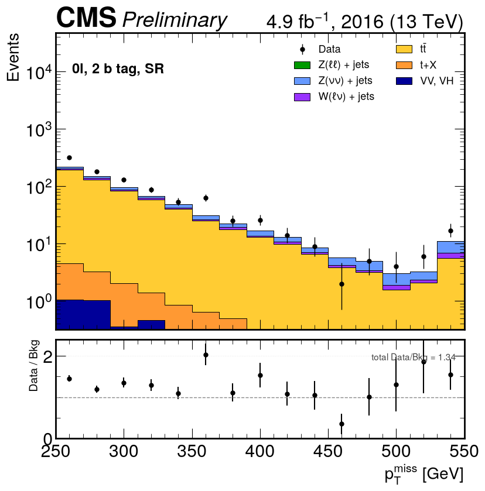
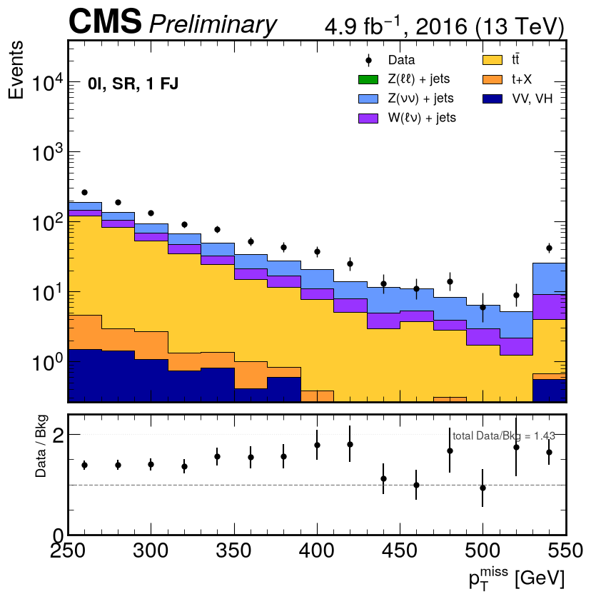
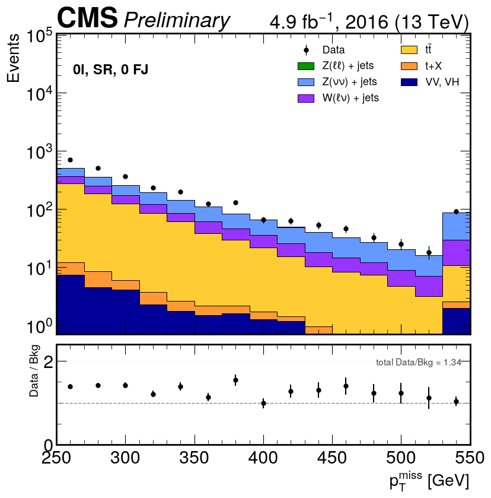
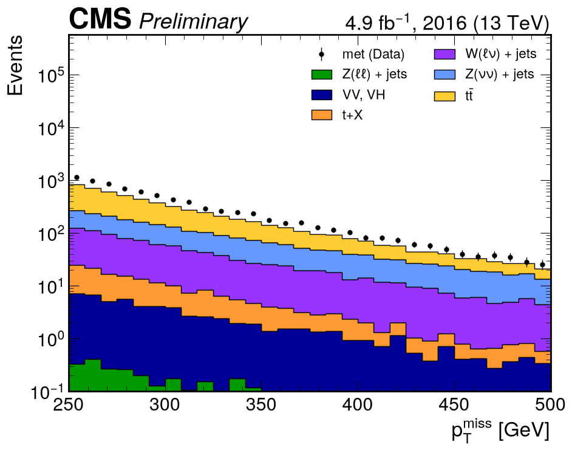
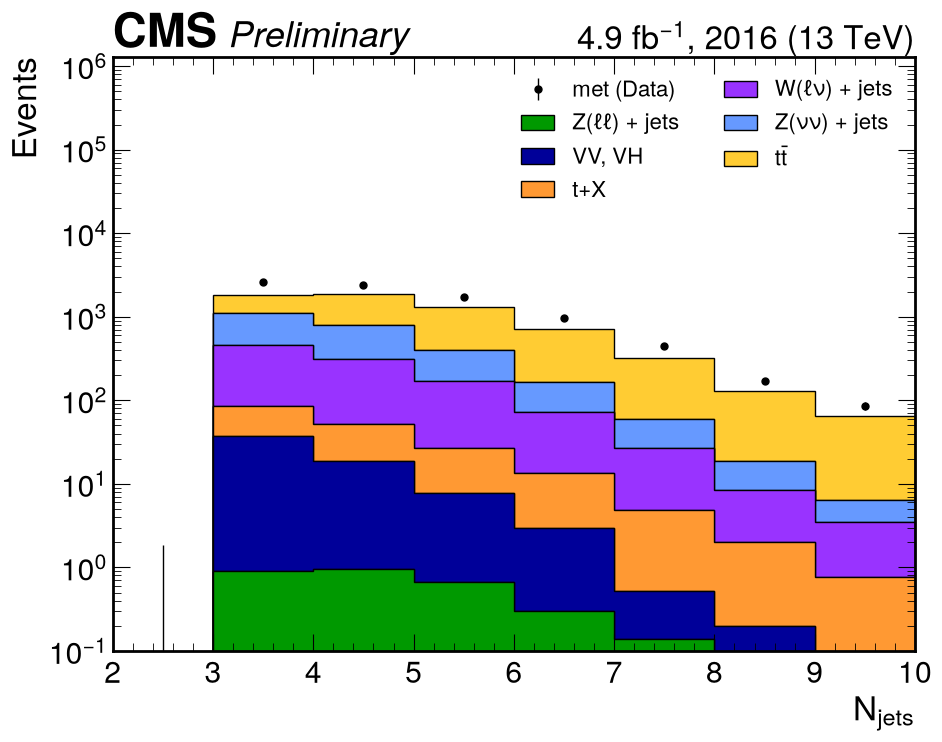
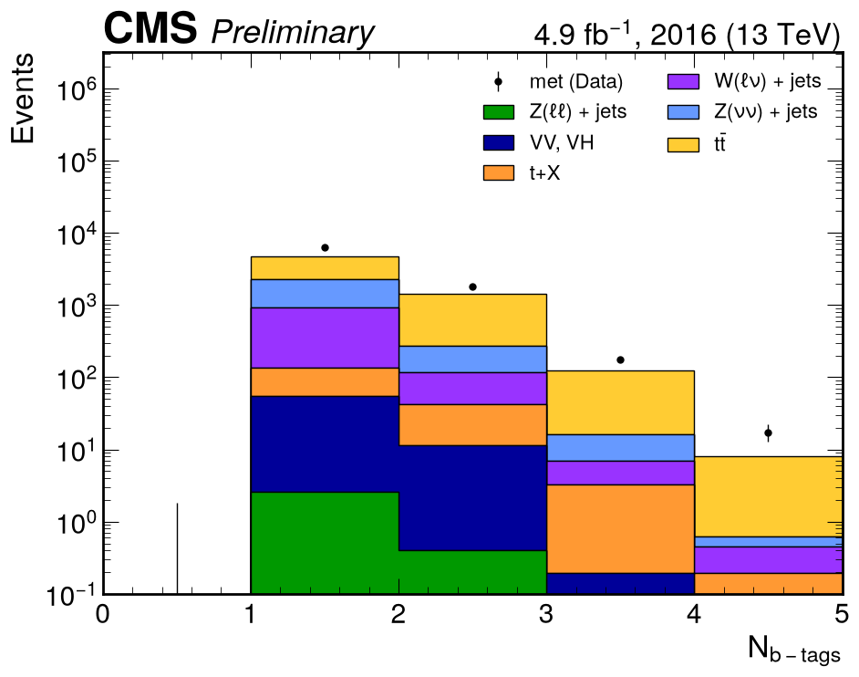

# All-hadronic channel (0 leptons)

**Data:** MET primary dataset, Run2016H, 20 of 32 files = 0.5514 of the record by bytes →
**$L$ = 4907 pb⁻¹**. **MC:** 20 datasets, 20 files each (fewer where the record has fewer).

## Selection

| Stage | Cut | Source |
|---|---|---|
| Quality | MET noise filters (7, plus `eeBadScFilter` on data) and golden-JSON luminosity mask | note §2.1 |
| Baseline | 0 isolated leptons, $n_{\text{jet}} \ge 3$, $n_b \ge 1$ (CSVv2 medium, 0.8484) | note Table 10 |
| Baseline | $p_T^{\text{miss}} \ge 250$ GeV, $\min\Delta\phi(j_{1,2}, p_T^{\text{miss}}) > 0.4$ | note Table 10 |
| Signal region | $\min\Delta\phi(j_{1,2}, p_T^{\text{miss}}) \ge 1.0$, $m_T^b \ge 180$ GeV | note Table 13 |
| Signal region, $n_b \ge 2$ | $p_T(j_1)/H_T \le 0.5$ | note Table 13 |
| Categories | $n_b = 1$ with 0 forward jets · $n_b = 1$ with ≥ 1 forward jet · $n_b \ge 2$ | paper Table 1 |

MC weight: $w = \sigma \cdot L \cdot w_{\text{gen}} / \sum w_{\text{gen}} \times w_{\text{top }p_T}$,
where the top-$p_T$ weight applies to tt̄ only ([PHYS-14](../changes/physics.md#phys-14-top-pt-reweighting)).

## Signal regions — $p_T^{\text{miss}}$

Binning 250–550 GeV in 15 bins of 20 GeV, last bin holds the overflow, as in paper Figure 5.

<figure markdown>

<figcaption>0ℓ, SR, nb ≥ 2 — paper Fig. 5 (right)</figcaption>
</figure>

<figure markdown>

<figcaption>0ℓ, SR, nb = 1, ≥ 1 forward jet — paper Fig. 5 (centre)</figcaption>
</figure>

<figure markdown>

<figcaption>0ℓ, SR, nb = 1, 0 forward jets — paper Fig. 5 (left)</figcaption>
</figure>

## Baseline distributions

<figure markdown>

<figcaption>pTmiss after the baseline selection</figcaption>
</figure>

<figure markdown>

<figcaption>Jet multiplicity</figcaption>
</figure>

<figure markdown>

<figcaption>b-tag multiplicity (CSVv2 medium)</figcaption>
</figure>

## Background composition

| Group | Events | Share | Note Table 12 |
|---|---:|---:|---:|
| tt̄ | 3698.8 | **59.1 %** | 45.5 % |
| Z(νν) + jets | 1508.4 | **24.1 %** | 29.7 % |
| W(ℓν) + jets | 870.0 | **13.9 %** | 15.1 % |
| t + X | 116.8 | 1.9 % | — |
| VV, VH | 64.1 | 1.0 % | 2.7 % |
| Z(ℓℓ) + jets | 3.1 | 0.0 % | — |
| **data/MC** | 8392 / 6261.0 | **1.340** | **1.06** |

## Reading the result

- **Every composition row moved toward Table 12** as the corrections were applied, and none moved
  away. Z(νν) went from ~0 % (the upstream notebook read an unrelated signal sample) to 24.1 %.
- **data/MC rose from 1.217 to 1.340 with the last correction**, and that is expected: top-$p_T$
  reweighting only *removes* tt̄ events, while the corrections that would *add* events back —
  the V+jets NLO/LO k-factors and the VH sample — are exactly the ones not available.
  Composition responds to what was fixed; normalisation waits on what is missing.
- **The ratio panel is flat** across $p_T^{\text{miss}}$. A calibration difference (UL2016 vs the
  paper's legacy reprocessing) would distort the shape; a flat ratio means the shape is right.
- The remaining gap per process is quantified in the [convergence log](../changes/convergence.md#where-the-remaining-gap-is-per-process).

!!! note "No control-region plots for this channel"
    The upstream 0-lepton "control region" `AH0lWR` does not exist in the paper: every AH control
    region in note Table 14 requires one or two leptons and needs the SingleMuon/SingleElectron
    datasets. See [PHYS-09](../changes/physics.md#phys-09-the-all-hadronic-control-region-is-not-in-the-paper).
