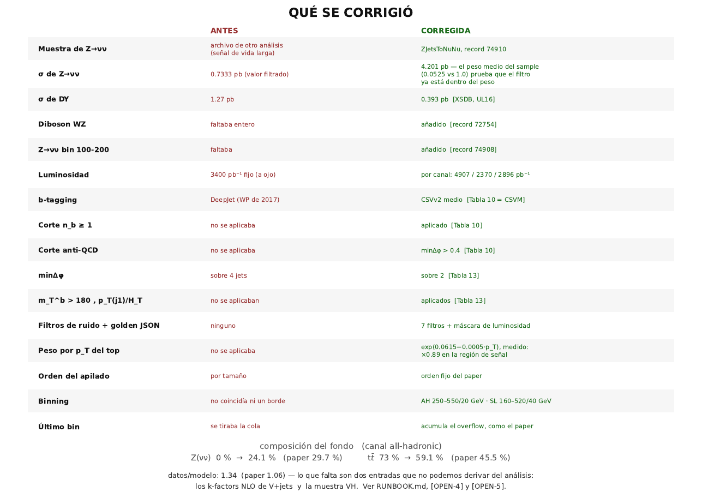
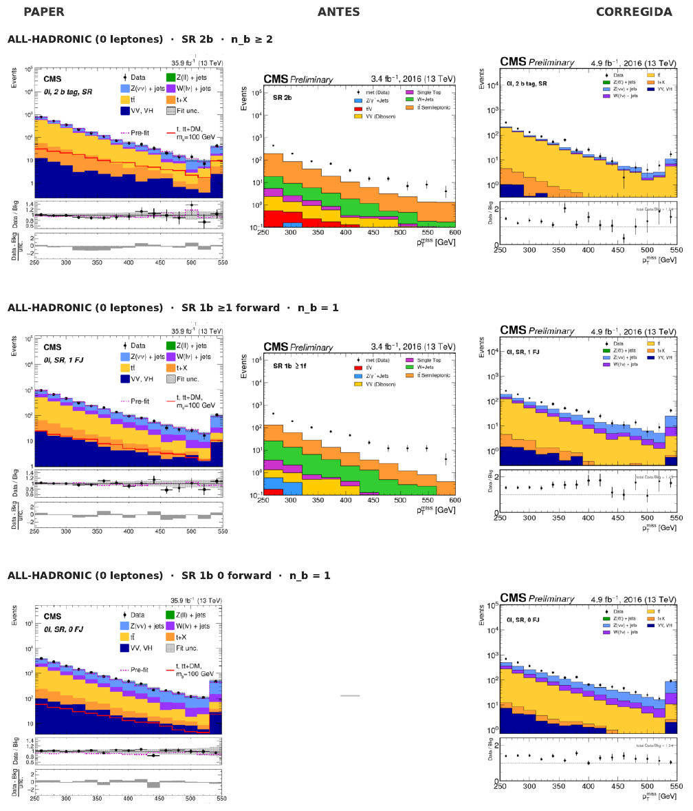
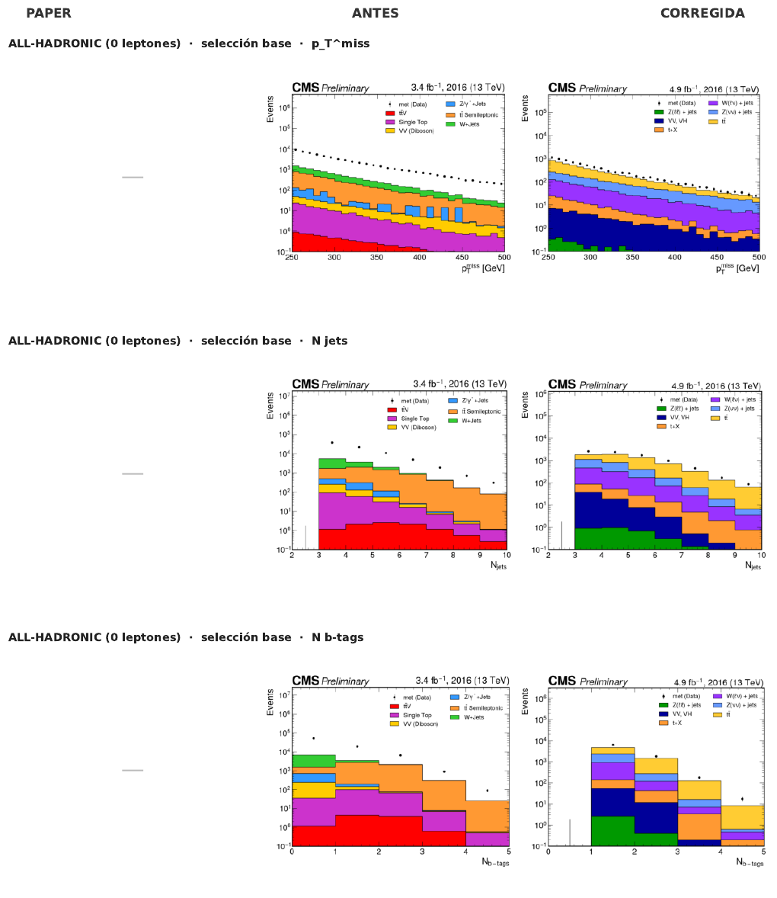
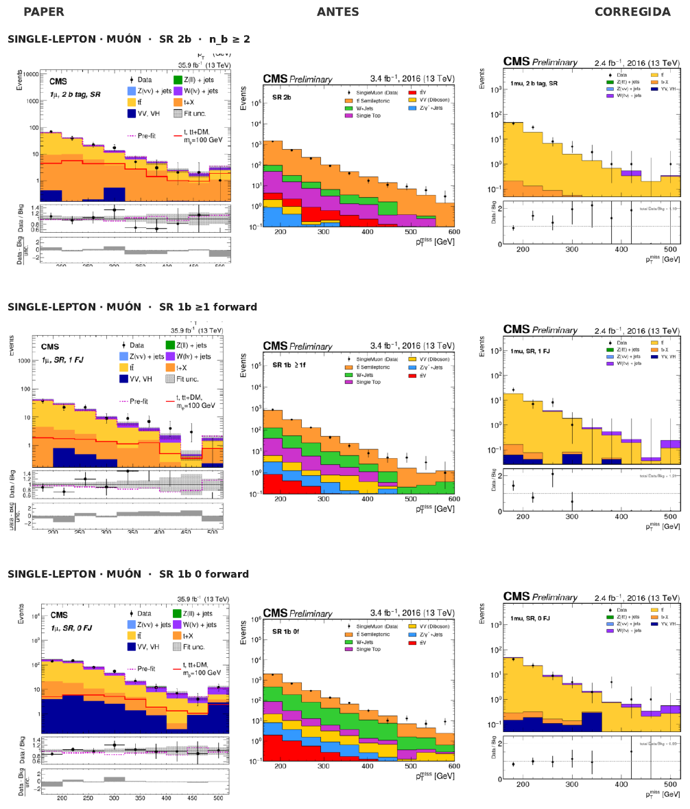
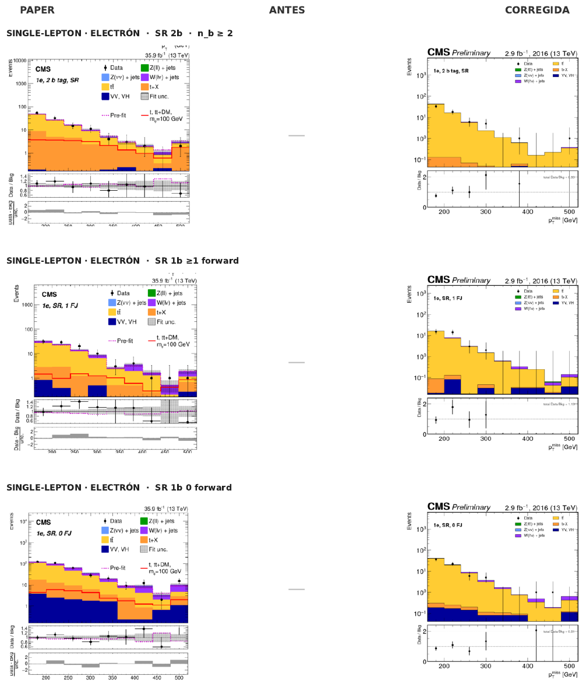
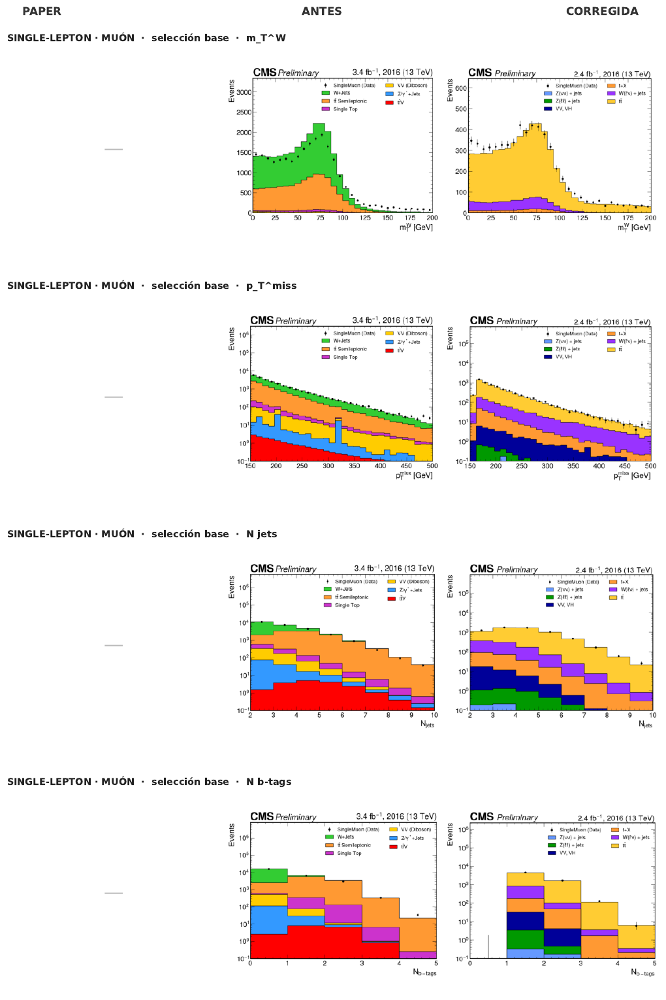
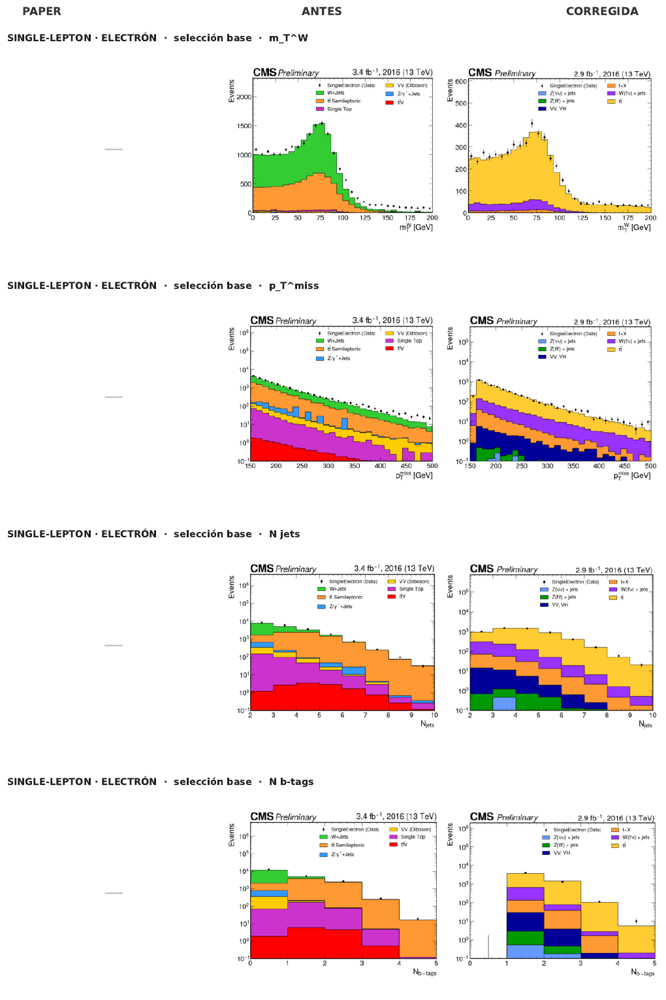

# Paper vs. before vs. corrected

This is the comparison CERN/DPOA reviewed and approved. Each row puts three plots side by side:

| Column | What it is |
|---|---|
| **PAPER** | The corresponding panel of the paper's Figure 4 (single lepton) or Figure 5 (all hadronic), 35.9 fb⁻¹, post-fit |
| **ANTES** (before) | The same plot from the original DPOA notebooks, as published in the earlier version of this site |
| **CORREGIDA** (corrected) | The same plot after every change in [Changes](../changes/index.md), 2.4–4.9 fb⁻¹, pre-fit |

A dash (—) means that plot does not exist in that version: the paper shows only the signal
regions, and the original notebooks never produced some of the regions.

[:material-file-pdf-box: Download the full comparison (PDF, 1.8 MB)](files/comparison.pdf){ .md-button }

## What was corrected

## All hadronic

### Signal regions

### Baseline

## Single lepton

### Muon — signal regions

### Electron — signal regions

### Muon — baseline

### Electron — baseline

## What changed visually, and why

| Visible difference in "before" | Cause | Fix |
|---|---|---|
| Spiky, near-empty blue Z/γ* band in AH | `Zvv` pointed at a long-lived-particle **signal** sample | [PHYS-01](../changes/physics.md#phys-01-zvv-points-at-an-unrelated-signal-sample), [PHYS-13](../changes/physics.md#phys-13-zvv-cross-section-use-the-unfiltered-value) |
| Data ~10× above MC in AH | missing baseline cuts, wrong luminosity, missing Z(νν) | [PHYS-02](../changes/physics.md#phys-02-luminosity-derived-per-channel), [PHYS-03](../changes/physics.md#phys-03-baseline-selection-missing-cuts) |
| tt̄ at the bottom of the SL stack | processes sorted by yield | [PLOT-01](../changes/plots.md#plot-01-stacking-order) |
| No bin edge shared with the paper | different binning | [PLOT-02](../changes/plots.md#plot-02-binning) |
| Rightmost bin falls away instead of rising | overflow was dropped | [PLOT-03](../changes/plots.md#plot-03-the-last-bin-is-an-overflow-bin) |
| No ratio panel | never drawn | added; it shows the ratio is **flat** |
