# Single-lepton channel (1 muon or 1 electron)

| Channel | Data | Files | Fraction of Run2016H (bytes) | $L$ |
|---|---|---:|---:|---:|
| Muon | SingleMuon, record 30563 | 20/82 | 0.2663 | **2370 pb⁻¹** |
| Electron | SingleElectron, record 30562 | 20/80 | 0.3254 | **2896 pb⁻¹** |

Upstream used 3400 pb⁻¹ for both, which overestimated the MC by 43 % (muon) and 17 % (electron).

## Selection

| Stage | Cut | Source |
|---|---|---|
| Baseline | exactly 1 isolated lepton, $n_{\text{jet}} \ge 2$, $n_b \ge 1$ (CSVv2 medium) | note Table 10 |
| Baseline | $p_T^{\text{miss}} \ge 160$ GeV | note Table 10 |
| Signal region | $m_T \ge 160$ GeV, $\min\Delta\phi(j_{1,2}, p_T^{\text{miss}}) \ge 1.2$, $m_T^b \ge 180$ GeV | note Table 13 |
| Signal region | $M_{T2}^W \ge 200$ GeV — **not implemented** | note Table 13, [OPEN-3](../changes/open-questions.md#open-3-mt2w-the-largest-cut-in-the-sl-selection) |
| Categories | $n_b = 1$ with 0 forward jets · $n_b = 1$ with ≥ 1 forward jet · $n_b \ge 2$ | paper Table 1 |

!!! warning "Read the signal-region normalisation with $M_{T2}^W$ in mind"
    $M_{T2}^W$ alone removes **84 %** of the single-lepton background in note Table 11, and 9.3× of
    dileptonic tt̄ specifically. Without it our signal regions hold several times more background
    than the paper's, overwhelmingly tt̄(2ℓ). This is expected and quantified, not a new
    discrepancy. The **shape** of $p_T^{\text{miss}}$ remains meaningful; the normalisation does not.

## Signal regions — $p_T^{\text{miss}}$

Binning 160–520 GeV in 9 bins of 40 GeV, last bin holds the overflow, as in paper Figure 4.

=== "Muon"

    

    <figure markdown>
    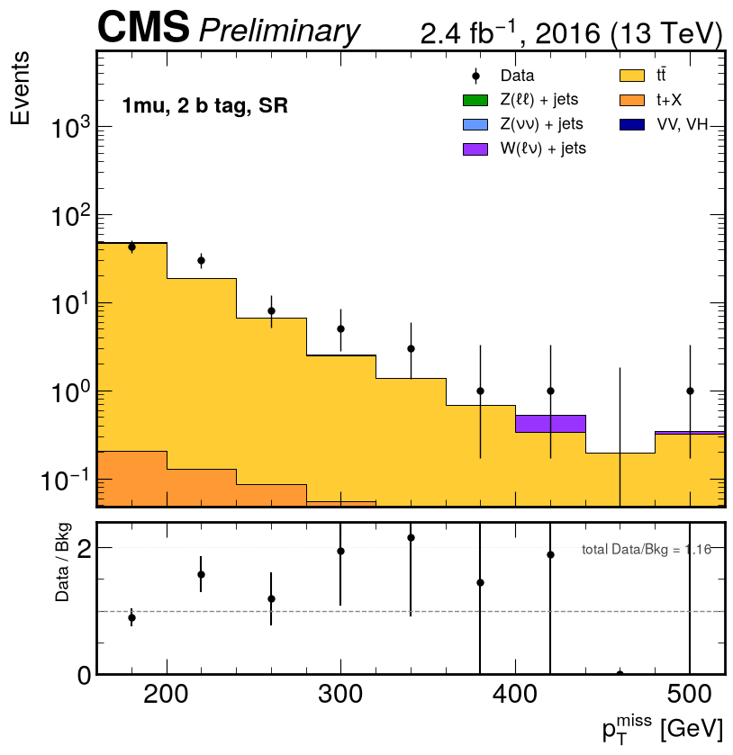
    <figcaption>1μ, SR, nb ≥ 2</figcaption>
    </figure>

    <figure markdown>
    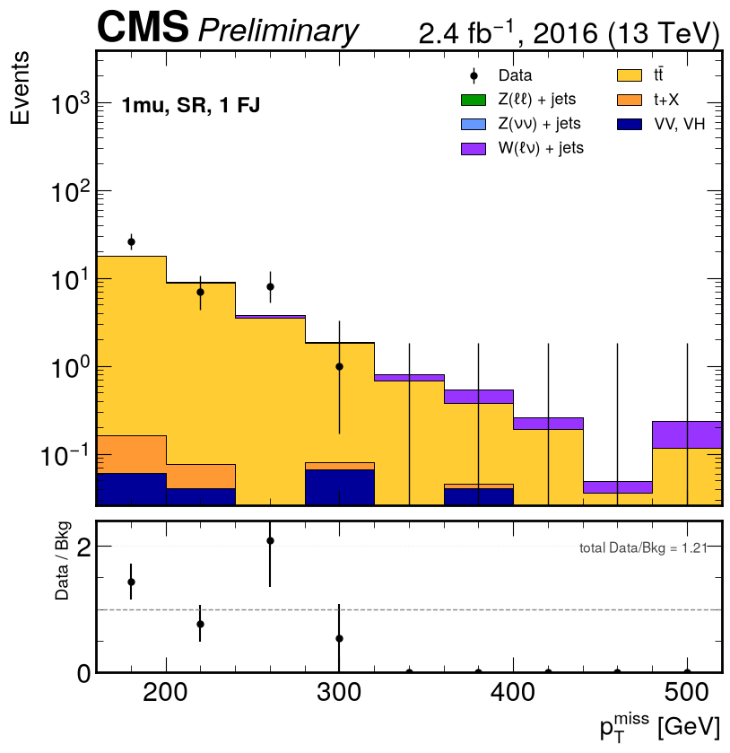
    <figcaption>1μ, SR, nb = 1, ≥ 1 forward jet</figcaption>
    </figure>

    <figure markdown>
    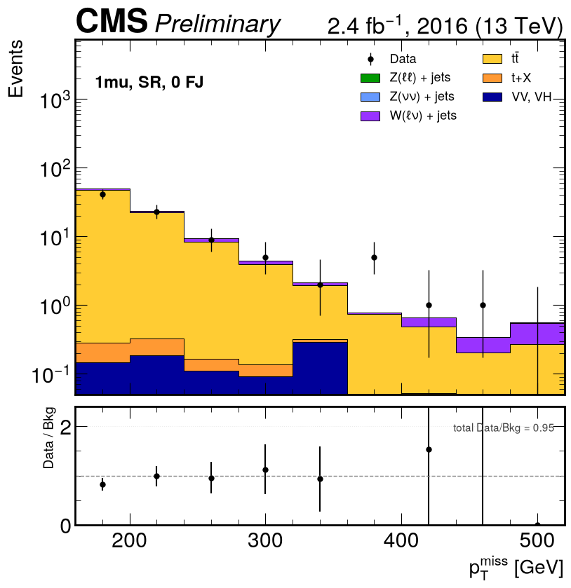
    <figcaption>1μ, SR, nb = 1, 0 forward jets</figcaption>
    </figure>

    

=== "Electron"

    

    <figure markdown>
    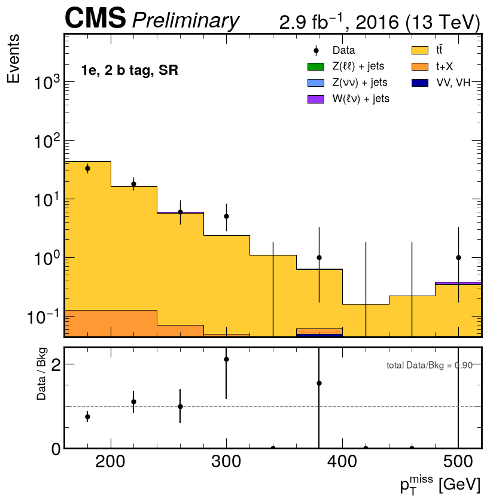
    <figcaption>1e, SR, nb ≥ 2</figcaption>
    </figure>

    <figure markdown>
    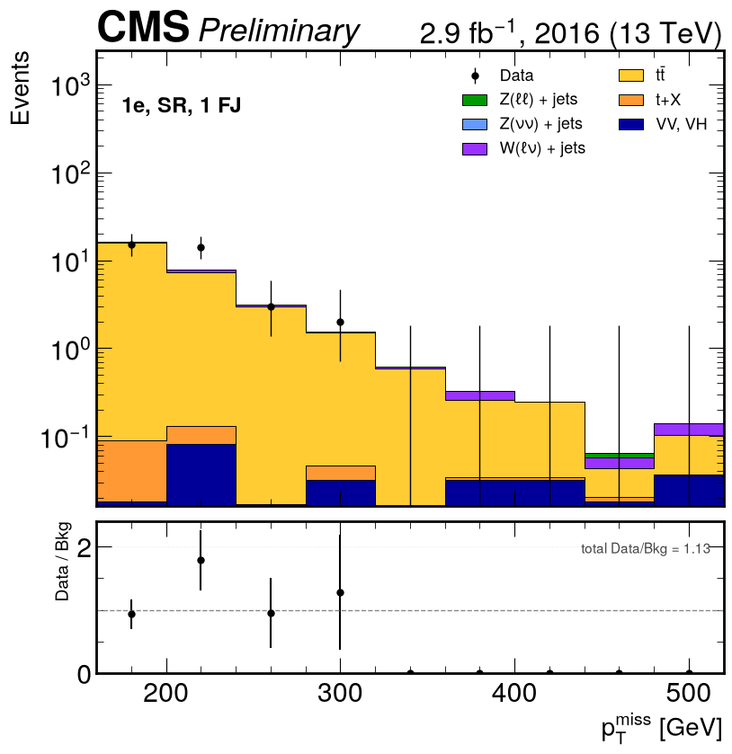
    <figcaption>1e, SR, nb = 1, ≥ 1 forward jet</figcaption>
    </figure>

    <figure markdown>
    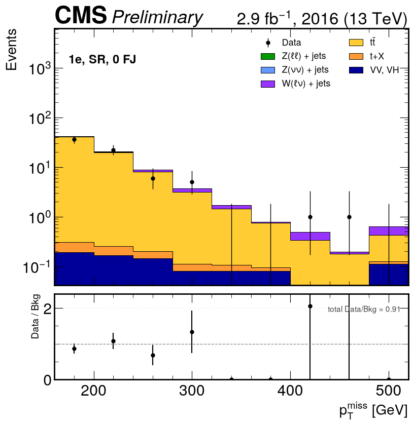
    <figcaption>1e, SR, nb = 1, 0 forward jets</figcaption>
    </figure>

    

## Baseline distributions

=== "Muon"

    

    <figure markdown>
    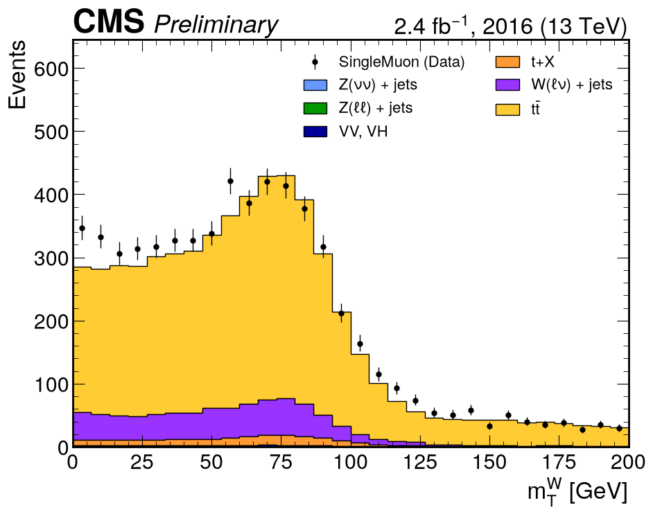
    <figcaption>mTW — the Jacobian peak at the W mass is visible in data and MC</figcaption>
    </figure>

    <figure markdown>
    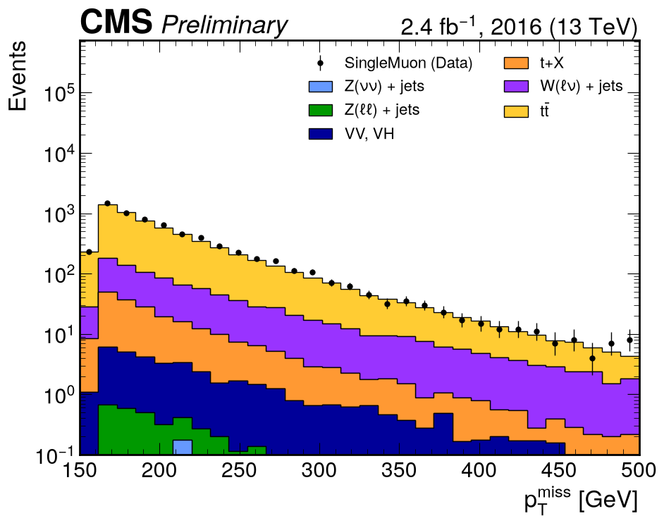
    <figcaption>pTmiss</figcaption>
    </figure>

    <figure markdown>
    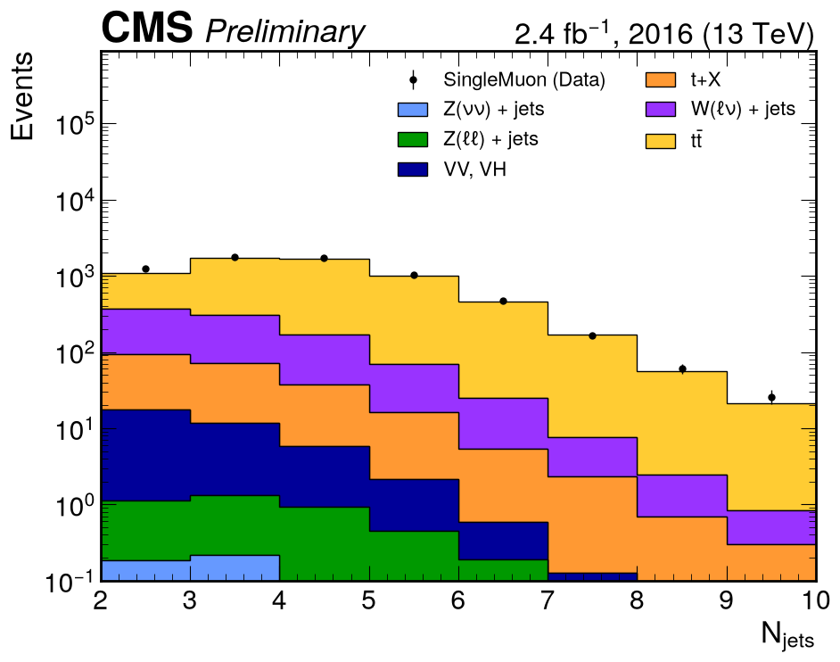
    <figcaption>Jet multiplicity</figcaption>
    </figure>

    <figure markdown>
    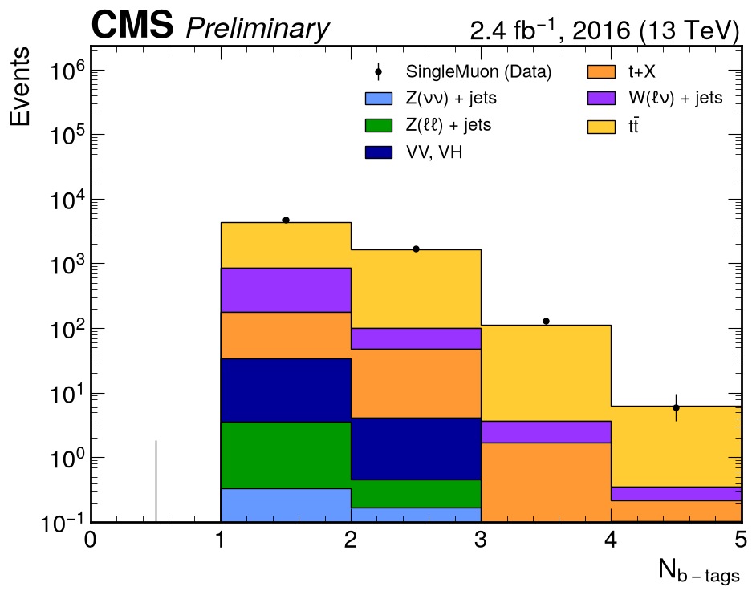
    <figcaption>b-tag multiplicity</figcaption>
    </figure>

    

=== "Electron"

    

    <figure markdown>
    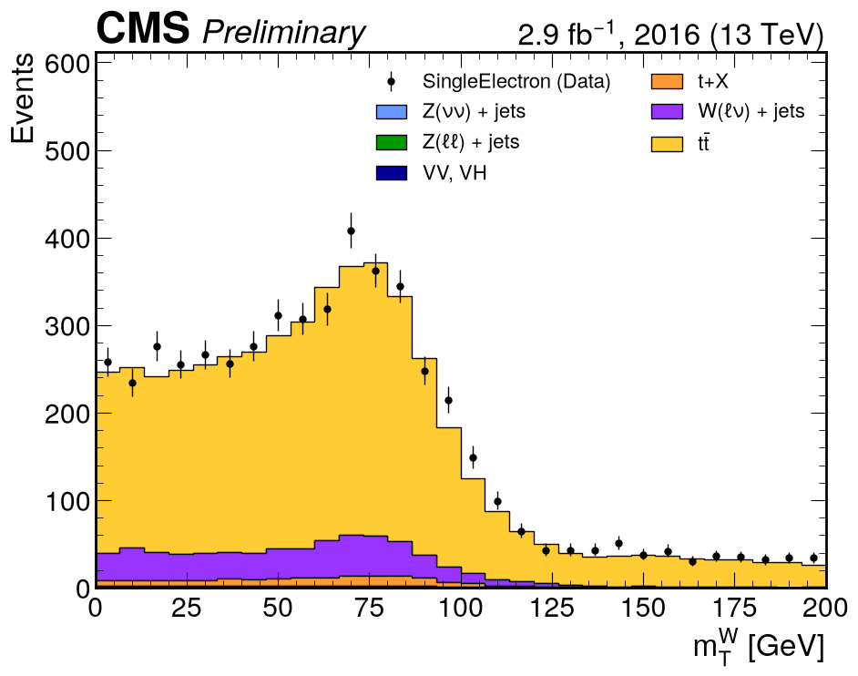
    <figcaption>mTW</figcaption>
    </figure>

    <figure markdown>
    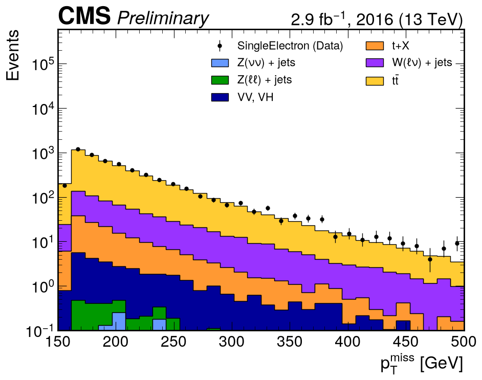
    <figcaption>pTmiss</figcaption>
    </figure>

    <figure markdown>
    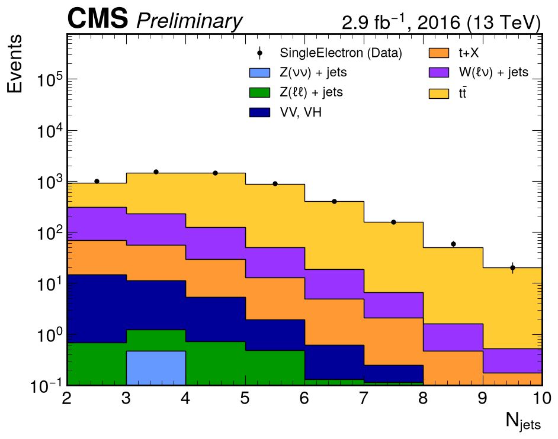
    <figcaption>Jet multiplicity</figcaption>
    </figure>

    <figure markdown>
    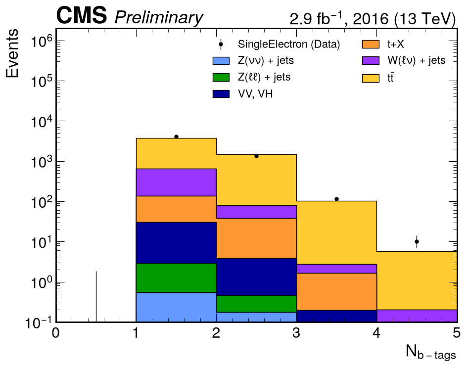
    <figcaption>b-tag multiplicity</figcaption>
    </figure>

    

## Background composition in the signal region

After the complete signal selection, $M_{T2}^W$ excepted:

| Process | Muon (events) | Muon | Electron (events) | Electron | Note Table 11 |
|---|---:|---:|---:|---:|---:|
| tt̄ (2ℓ) | 191.6 | 93.3 % | 168.9 | 94.2 % | 61.4 % |
| W(ℓν) + jets | 8.0 | 3.9 % | 5.9 | 3.3 % | 14.8 % |
| tt̄ (1ℓ) | 3.3 | **1.6 %** | 2.3 | 1.3 % | **1.7 %** |
| VV, VH | 1.3 | 0.6 % | 1.2 | 0.7 % | 3.5 % |
| t + X | 1.1 | **0.5 %** | 0.9 | 0.5 % | **14.1 %** |
| Z(νν) + jets | 0.1 | **0.1 %** | 0.1 | 0.1 % | **0.1 %** |
| Z(ℓℓ) + jets | 0.0 | 0.0 % | 0.0 | 0.0 % | 0.2 % |
| **Total MC / data** | 205.5 / 221 | | 179.3 / 169 | | 1257.7 / 1406 |
| **data/MC** | | **1.075** | | **0.942** | **1.118** |

## Reading the result

- **Two rows land essentially exactly**: tt̄(1ℓ) at 1.6 % against 1.7 %, and Z(νν) at 0.1 %
  against 0.1 %. Both only come out right if the selection, the cross sections and the
  normalisation are all correct.
- **The dominant background is dileptonic tt̄**, in the paper too (61.4 %). The $m_T > 160$ GeV
  cut removes genuine one-lepton tt̄ at the W Jacobian edge; what survives is tt̄ where a second
  lepton was lost. It sits at 93 % here instead of 61 % because $M_{T2}^W$ is missing.
- **The outlier is t + X: 0.5 % against 14.1 %, a factor of 28.** The registry has only
  t-channel single top, which the $m_T$ cut removes for the same reason as tt̄(1ℓ). The paper's
  t + X here is mostly **tW**, which has two W bosons and survives — and we have no tW sample.
  See [PHYS-15](../changes/physics.md#phys-15-single-top-tw-s-channel-and-ttv-samples-missing).
- **W+jets is short** (3.9 % vs 14.8 %) in the same direction as in the all-hadronic channel:
  the missing V+jets NLO/LO k-factors ([OPEN-4](../changes/open-questions.md#open-4-vjets-nlolo-k-factors)).

!!! note "Control region — empty by construction"
    The W(ℓν) control-region cell runs but selects no events in either channel
    (`No events passed CR W(lν)`), so it produces no plot. This is structural, not statistical:
    the control region requires $n_b = 0$ (note Table 14), while the event processors apply the
    baseline $n_b \ge 1$ **before** writing the parquet cache, so no $n_b = 0$ event is ever
    stored. Building this region needs the $n_b \ge 1$ cut moved from processing time to analysis
    time, and a reprocess of the single-lepton datasets.
